# Design: AI Chat Agent for the SPA

Companion to [PRD.md](./PRD.md), [CONTEXT.md](./CONTEXT.md), and
[ADR 0001](./docs/adr/0001-agent-is-a-ui-not-a-trust-boundary.md). The PRD
covers *what* we are building and *why*. This document covers *how*.

Domain terms (`[[Term]]`) are defined in CONTEXT.md.

---

## 1. Goals & non-goals

**Goals**

- Let users accomplish goals in the SPA by chatting with an AI agent that
  can navigate the site and propose backend API calls on their behalf.
- Preserve the existing security model: the user's access token never
  leaves the browser; the LLM is never in the authorization trust path.
- Make the agent maintainable: the catalog of API operations comes from
  Smithy (no schema drift), and procedural knowledge ([[Runbook|runbooks]])
  is reviewed via PR.

**Non-goals (v1)** — see PRD §"Out of Scope" for the full list. Key
omissions: cross-device transcript persistence, per-user rate limits and
cost budgets, product/policy Q&A, macro-tools, model-evaluation suite.

---

## 2. System architecture

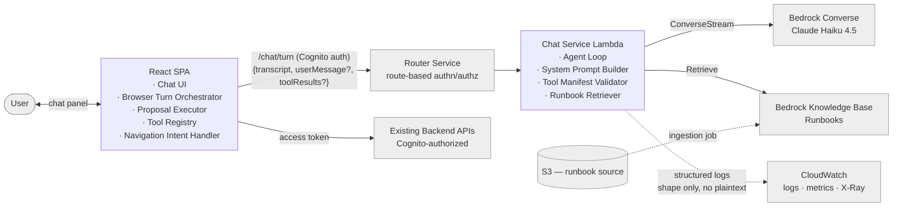

**The flow of authority**: the user's access token lives only in the SPA
and is attached only to direct calls to the existing Backend APIs. The
chat service never sees it. The LLM never sees it. See [ADR 0001](./docs/adr/0001-agent-is-a-ui-not-a-trust-boundary.md).

---

## 3. Components

### 3.1 SPA components

| Component | Responsibility | Notes |
|---|---|---|
| Chat UI | Message list, streaming text renderer, input box, interleaved approval cards and navigation toasts. | Stateless visual layer. |
| Browser Turn Orchestrator | State machine driving the turn cycle: send turn → render reply → collect approvals → execute → send results → next turn. Holds the in-memory transcript. | Deep, tested as a reducer. |
| Proposal Executor | Validates [[Tool-Call Proposal]] args against the [[Tool Manifest]], dispatches via [[Tool Registry (Browser)]], applies response projection / 4KB truncation, normalizes results. | Deep, tested with mocked SDK. |
| Tool Registry (Browser) | Static `toolName → (args) => existingSdk.foo.bar(args)` map. | Shallow, data. The seam that lets us reuse the SDK rather than build a parallel HTTP client. |
| Approval Card UI | Per-proposal card. Renders tool name, args (IDs prominent), risk class, approve/decline. Destructive variants add a confirmation gate. | Shallow UI; design-reviewed (issue 08). |
| Navigation Intent Handler | Auto-executes [[Navigation Intent|navigation intents]]: SPA router push + "Taking you to …" toast with undo. | Shallow. |

### 3.2 Chat Service components

| Component | Responsibility | Notes |
|---|---|---|
| Conversation Turn Handler | Lambda entry. Parses request, invokes Agent Loop, streams response via Lambda response streaming. | Shallow, covered transitively by Agent Loop tests. |
| Agent Loop | Calls Bedrock Converse with the composed system prompt + tool definitions + transcript. Parses the model response into `{ assistantText, proposals, navigationIntents }`. On tool-result feedback, continues the loop. | Deep, tested with mocked Bedrock. |
| System Prompt Builder | Composes system prompt: agent role + navigation/scope rules + always-on runbook title index + per-turn user identity context. | Deep, pure. Snapshot-tested. |
| Tool Manifest Validator | Verifies any tool-use block the model emits references an allowlist entry and the args conform. Rejects malformed proposals before they reach the browser. | Sanity, not authz. Deep, table-driven tests. |
| Runbook Retriever | Wraps Bedrock KB `Retrieve` for the `lookupRunbook` tool. | Shallow. |
| Bedrock Client Wrapper | Thin `ConverseStream` wrapper with error normalization. | Shallow. |

### 3.3 Build pipeline

| Component | Responsibility | Notes |
|---|---|---|
| Smithy → Manifest Generator | Build-time tool: consumes Smithy model + allowlist + description overrides, emits the [[Tool Manifest]] consumed by both the chat service and the SPA. Validates allowlist entries exist in Smithy and have descriptions + risk classes. | Deep, fixture-tested. |
| Runbook sync CI | On merge: uploads `/runbooks/*.md` to S3, triggers Bedrock KB ingestion. Validates frontmatter and `tools-referenced`. | Shallow. |

### 3.4 Module dependency map

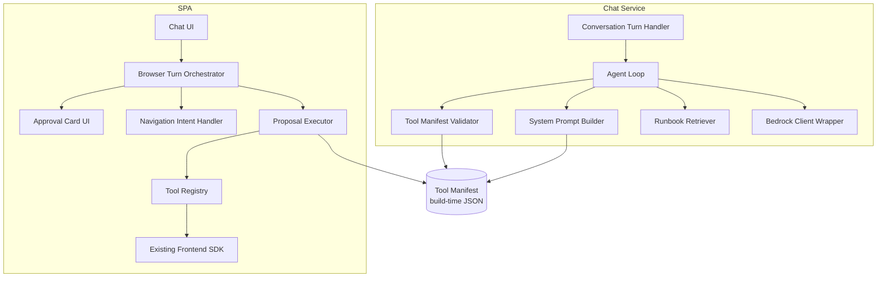

---

## 4. Sequence flows

### 4.1 Text-only turn (no tools)

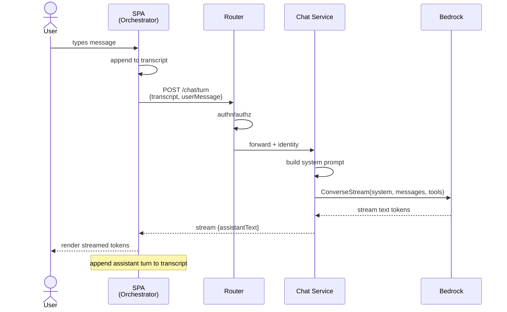

### 4.2 Turn with a single tool call (the core HITL flow)

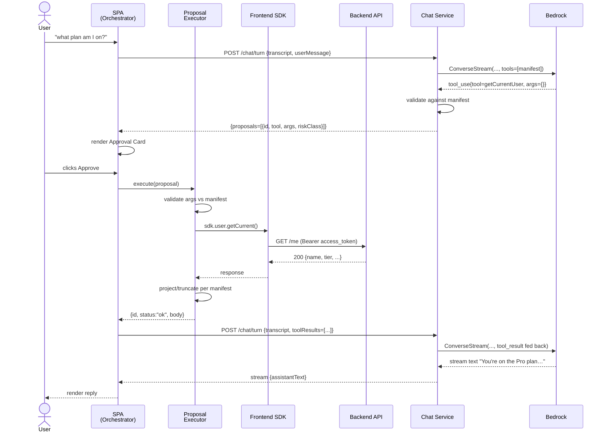

The "suspend / resume" between the proposal emission and the tool-result
feedback is **just two HTTP calls**, not anything exotic. The chat service
is stateless; the browser holds the transcript and replays it each turn.

### 4.3 Turn with a decline

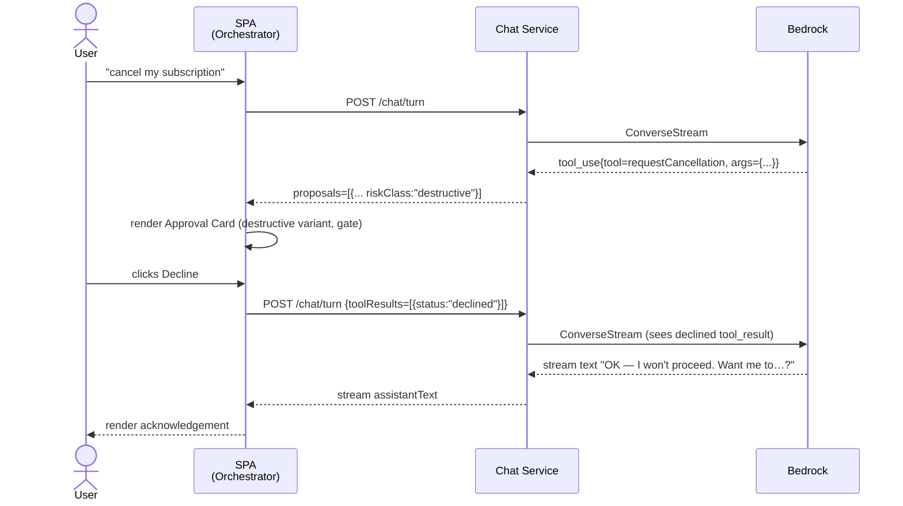

No silent retry. The model is prompted by the system rules to acknowledge
and suggest alternatives or stop — never re-emit the same proposal
unprompted.

### 4.4 Turn with a runbook lookup + multi-step plan

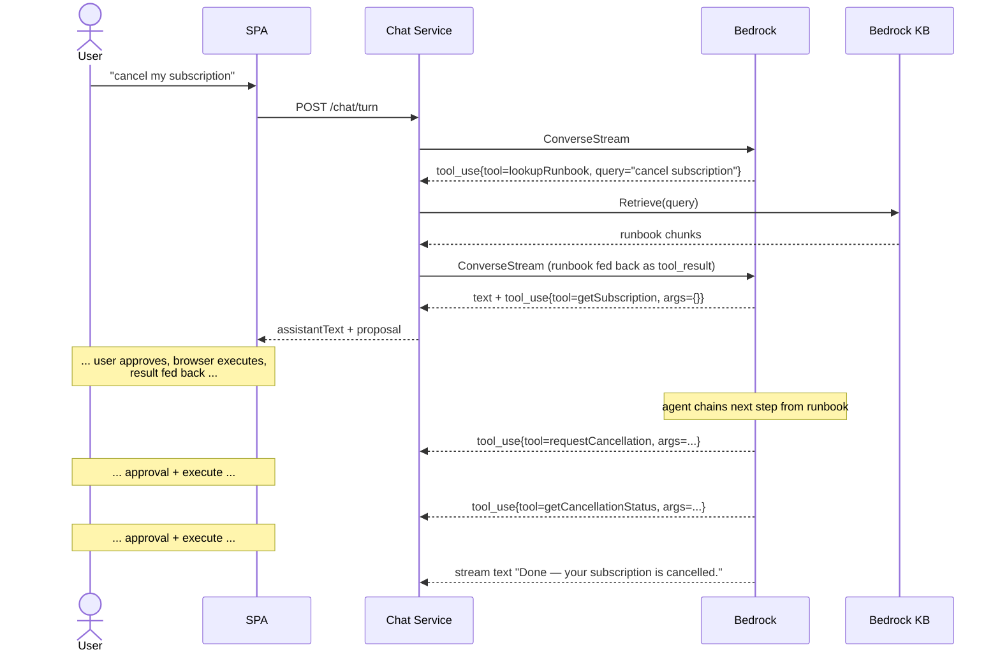

`lookupRunbook` is **server-executed** (no token needed, no side effect) so
no per-call approval. Every subsequent API call is browser-executed and
individually approved.

### 4.5 Turn with a navigation intent (no tools)

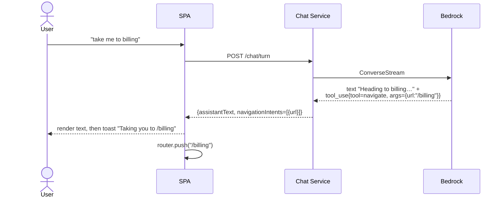

Navigation intents auto-execute (no approval) because they mutate only
client state and require no access token.

### 4.6 Turn with an out-of-scope question

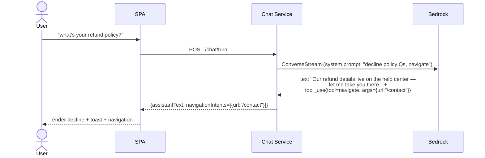

---

## 5. Browser turn orchestrator state machine

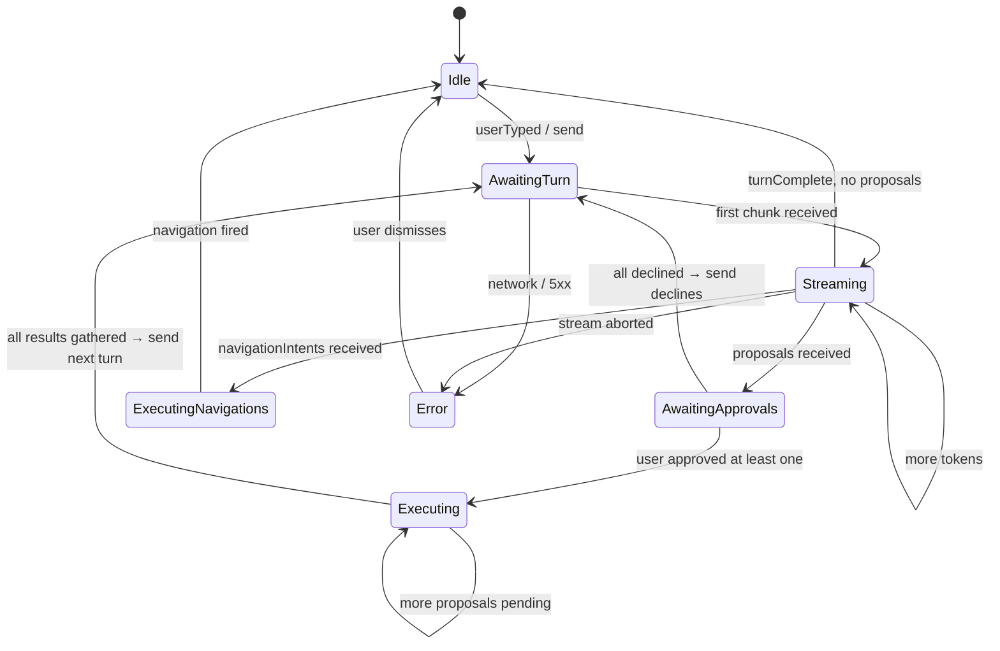

States are tested as reducer transitions (deep module). The state machine
is what makes the orchestrator straightforward to test in isolation — no
DOM, no network, just state + events.

---

## 6. Data shapes (contract surface)

These are the contracts between subsystems. Field names are stable; exact
serialization is an implementation detail.

### 6.1 Browser ⇄ Chat Service

**Request** (`POST /chat/turn`)
```
{
  transcript:    Message[]              // full prior conversation
  userMessage?:  string                 // if user just typed
  toolResults?:  ToolResult[]           // if browser just executed proposals
}
```

**Response** (streamed)
```
{
  assistantText:      string            // streamed in chunks
  proposals:          Proposal[]        // emitted whole, after text
  navigationIntents:  NavigationIntent[]
}
```

### 6.2 Proposal & ToolResult

```
Proposal {
  id:        string                     // unique per turn
  tool:      string                     // allowlist entry name
  args:      object                     // conforms to manifest argSchema
  riskClass: "read" | "write" | "destructive"
}

ToolResult {
  id:      string                       // matches Proposal.id
  status:  "ok" | "error" | "declined"
  body?:   unknown                      // projected/truncated tool response
  error?:  { kind: "client" | "server" | "network", message: string, statusCode?: number }
}
```

### 6.3 NavigationIntent

```
NavigationIntent {
  url: string                           // internal path only
}
```

### 6.4 Tool Manifest (build-time JSON)

```
ToolManifestEntry {
  name:              string
  description:       string             // LLM-tuned
  riskClass:         "read" | "write" | "destructive"
  argSchema:         JSONSchema
  responseProjection?: PathSelector[]   // applied before truncation
  maxResponseBytes?: number             // default 4096
}
```

### 6.5 Runbook frontmatter

```
---
name:             string                # kebab-case slug, unique
title:            string                # human-readable
tools-referenced: string[]              # must exist in allowlist
tags:             string[]
last-reviewed:    YYYY-MM-DD
---

<body — short, LLM-tuned procedural prose>
```

---

## 7. Build & sync pipelines

### 7.1 Tool Manifest generation (build time)

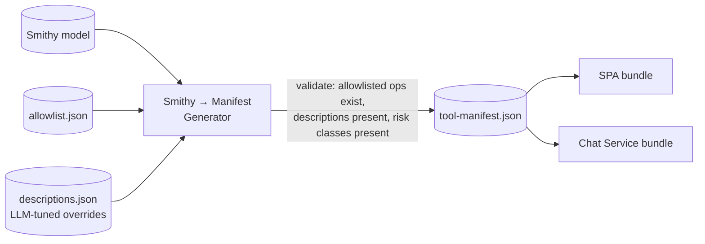

Single source of truth for the agent's catalog. Build fails if validation
fails — no silent drift.

### 7.2 Runbook KB sync (on merge to main)

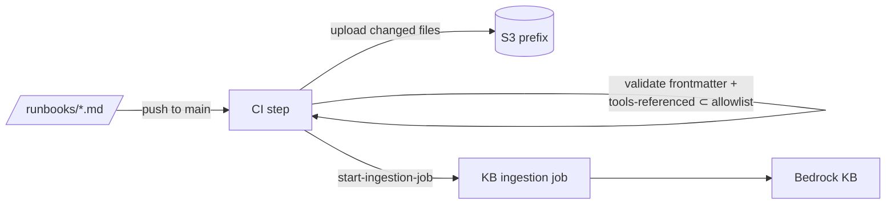

KB ingestion takes minutes. Runbook updates are not real-time; the
authoring tempo (PR → review → merge → ingest) is acceptable for v1.

---

## 8. Security model

The full reasoning is in [ADR 0001](./docs/adr/0001-agent-is-a-ui-not-a-trust-boundary.md). Summary:

- **The access token never leaves the browser.** It is attached only when
  the SPA's Proposal Executor invokes the existing frontend SDK, exactly
  as the SPA does for any user-initiated click. The chat service does not
  receive it; Bedrock does not receive it.
- **The agent is a UI, not a trust boundary.** The backend API's existing
  per-call authz checks are the sole authorization gate. Anything the user
  can do via clicks, they can do via the agent; anything they can't do
  via clicks, the API will reject when the agent tries.
- **HITL is defense-in-depth against social engineering**, not against
  privilege escalation. The user can be tricked (e.g., via a prompt-injected
  tool result) into approving something they could legitimately do but
  shouldn't. The approval card UX is the mitigation: IDs prominent, risk
  class shown, destructive operations gated.
- **No server-side re-validation of proposals against user permissions.**
  Duplicating the API's checks would be a parallel authz system that can
  drift — a *worse* posture than relying on the API.

### 8.1 What the LLM sees vs doesn't see

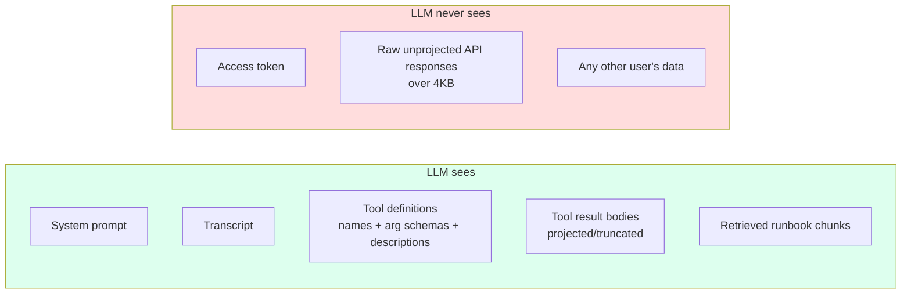

---

## 9. Failure modes & their handling

| Failure | Detection | Handling |
|---|---|---|
| Model emits a tool name not in allowlist | Tool Manifest Validator (server) | Reject before sending to browser; log; the Agent Loop tells the model "that tool doesn't exist" and continues. |
| Model emits args that violate the manifest schema | Tool Manifest Validator (server) | Same as above. |
| User declines a proposal | Browser Orchestrator | Send `{status:"declined"}` back; model is prompted to acknowledge and suggest alternatives or stop. |
| Backend API returns 4xx | Proposal Executor | Normalize to `{status:"error", error:{kind:"client", ...}}`; fed back; model may propose differently. **No auto-retry.** |
| Backend API returns 5xx | Proposal Executor | Same as 4xx with `kind:"server"`. **No auto-retry.** |
| Network/timeout in browser | Proposal Executor | Surface in chat UI with "try again" affordance; user must re-approve to retry. |
| Tool response exceeds 4KB | Proposal Executor | Apply per-tool `responseProjection` first; if still over, truncate with `…truncated, N more bytes` note. |
| Bedrock returns an error | Bedrock Client Wrapper | Surface to user as "something went wrong with the assistant"; no auto-retry; turn ends. |
| Lambda response stream interrupted | Browser Orchestrator | Mark partial turn as failed; user can resend. |
| Runbook KB retrieval fails | Runbook Retriever | Return empty result + log; model is told "no runbook found" and proceeds without one. |
| Conversation grows past comfortable token count | (Logged, not enforced in v1) | No action in v1. Watch logs; revisit if real conversations exceed ~50K tokens. |

---

## 10. Deployment

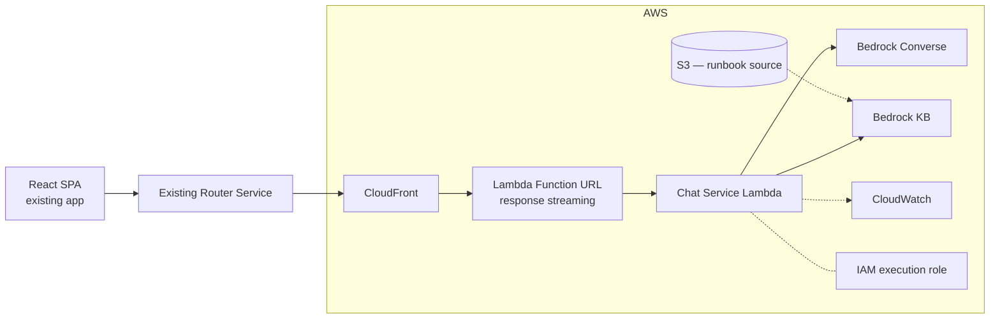

- **Lambda** with response streaming via Function URL, fronted by
  CloudFront for caching headers and a stable hostname. The existing
  Router Service forwards authenticated traffic to CloudFront.
- **IAM**: Lambda role allows `bedrock:InvokeModelWithResponseStream`,
  `bedrock-agent-runtime:Retrieve`, and CloudWatch Logs writes. No other
  AWS API access. No access to user data stores — by construction, the
  chat service does not need them.
- **CDK app** is the source of truth for all of the above; one stack per
  environment.

---

## 11. Open trade-offs and known risks

| Trade-off | Decision | Future revisit signal |
|---|---|---|
| Browser-held transcript | Accepted; ships v1 fast | Users ask for cross-device resume; or support requests transcript access |
| No rate limits / cost budgets | Accepted; bounded risk via Cognito-only access | First abuse incident; or any non-trivial public rollout |
| No transcript persistence | Accepted | Support needs to review user sessions; compliance requires retention |
| Single model (Haiku 4.5) | Cost-first start | Quality complaints on multi-step tasks → escalate to Sonnet 4.6 |
| No model-evals | Accepted; small v1 surface area | Runbook count grows past ~20 or retrieval quality drops |
| No macro-tools | Accepted; primitive chaining + per-call HITL | Approval fatigue measured in user research |
| No product-docs KB | Accepted; navigate-and-handoff | If a significant fraction of user queries are declined, build the KB |
| Out-of-scope = decline-and-navigate | Accepted | Liability cost of one wrong answer ≫ inconvenience of navigation |

Each of these has a tracked deferral in PRD §"Out of Scope." None are
oversights.
