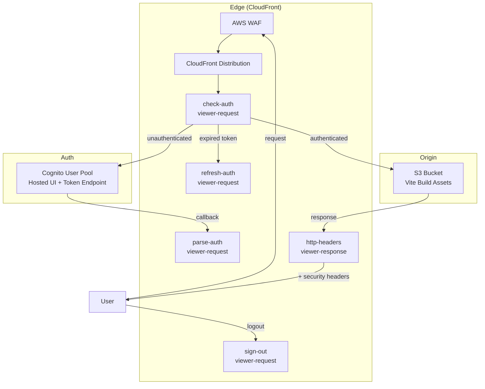
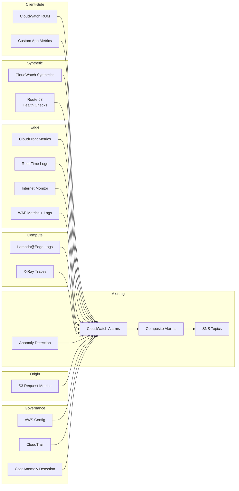
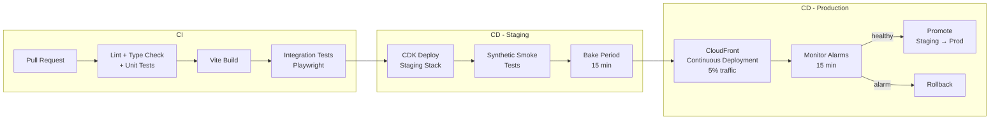

# AWS-Native Frontend Operational Excellence

Comprehensive operational strategy for a **Vite/React SPA** served via **CloudFront + S3** with **Lambda@Edge Cognito auth** (viewer-request token validation on every request).

Team context: ~8 engineers with on-call rotation. Backend is a separate team/service.

## Priority Legend

| Tag | Meaning | Criteria |
|-----|---------|----------|
| `[P0]` | **Critical** | Without this, outages go undetected or recovery is impossible. Direct user impact. |
| `[P1]` | **High** | Significantly improves detection speed, reduces MTTR, or prevents incidents. |
| `[P2]` | **Medium** | Improves operational maturity, catches edge cases, reduces noise. |
| `[P3]` | **Low** | Optimization, deeper analysis, governance polish. Valuable but not urgent. |

## Architecture Overview

---

## 1. Observability Stack

### The Full Picture

### 1.1 CloudWatch RUM (Real User Monitoring) `[P0]`

**What it captures:** Page load performance, Web Vitals (LCP, FID, CLS), unhandled JS errors with stack traces, HTTP errors, session-level correlation.

**Setup:**
- Create an App Monitor in CloudWatch RUM
- Add the RUM web client snippet to the React app's entry point
- Configure **100% sampling** for a team holding to a high standard (adjust down if cost is a concern)
- Enable **session tracking** to correlate errors to specific user journeys
- Send RUM data to a CloudWatch Log Group for retention beyond 30 days

**Key metrics to alarm on:**
- LCP p75 > 2.5s (poor user experience)
- JS error rate > threshold (broken deployment)
- HTTP 4xx/5xx rate from client perspective

**Source maps:** `[P1]`
- Upload Vite-generated source maps to RUM so JS errors show original file/line instead of minified output
- Add source map upload as a CI/CD pipeline step after `vite build`
- Do NOT serve source maps to users (security risk) — upload to RUM only

**Cost:** ~$1 per 100K RUM events. Free tier: 1M events/month.

### 1.2 CloudWatch Synthetics (Canary Monitoring) `[P0]`

Synthetic canaries catch outages *before* users report them. Create canaries for:

| Canary | What it tests | Schedule |
|--------|--------------|----------|
| **Homepage load** | Full page load, assert key DOM elements render | Every 5 min |
| **Auth flow** | Navigate to protected route, verify redirect to Cognito, complete login, verify app loads | Every 10 min |
| **Critical user journeys** | Key workflows in the SPA (navigation, API calls) | Every 10 min |
| **Multi-region probes** | Same homepage canary from 3+ regions | Every 5 min |

- Use **multi-step blueprints** to bundle up to 10 checks per canary
- Canaries auto-create CloudWatch alarms on failure
- Enable **automatic retries** to reduce false positives
- Store screenshots and HAR files in S3 for debugging

### 1.3 CloudFront Monitoring `[P0]`

**Standard Logs (free):** `[P1]`
- Delivered to S3, 5-30 min delay, 100% coverage
- Use for compliance, historical analysis, Athena queries
- Retain indefinitely in S3 with lifecycle policies

**Real-Time Logs (paid):** `[P1]`
- Streamed to Kinesis Data Stream within seconds
- Configurable sampling rate and field selection
- Use for operational alerting and live debugging
- Route: Kinesis Data Stream -> Kinesis Firehose -> S3 + CloudWatch Logs

**CloudFront native metrics to alarm on:**
- `5xxErrorRate` > 1%
- `4xxErrorRate` > 5% (may indicate broken asset paths after deploy)
- `CacheHitRate` drop (origin overload risk)
- `OriginLatency` p99

**CloudWatch Internet Monitor:** `[P2]`
- Enable for the CloudFront distribution
- Monitors internet path quality to edge locations
- Surfaces ISP-level and geography-level issues (not your fault, but your users still feel it)
- Useful for distinguishing "our app is broken" vs "Comcast is having issues in Ohio"

### 1.4 Lambda@Edge Logging `[P0]`

**Critical gotcha:** Lambda@Edge executes in the region closest to the viewer. Logs historically went to CloudWatch Logs in *that* region, not your deployment region. This made log aggregation painful.

**Solution — Advanced Logging (2025+):**
- Configure a custom CloudWatch Log Group at the function level
- Lambda@Edge now supports specifying log destinations, enabling centralized logging without subscription filter pipelines
- Set this in CDK when defining the Lambda@Edge function

**What to log:**
- Auth failures (invalid/expired tokens, Cognito errors)
- Token refresh events
- Request latency within the function
- Cognito endpoint response times (your auth depends on Cognito availability)

**What to alarm on:**
- Lambda@Edge `5xxError` rate
- Lambda@Edge `Duration` p99 approaching timeout (viewer-request has a 5s limit)
- Lambda@Edge `Throttles` (concurrent execution limits at edge)
- Cognito token endpoint errors (from Lambda@Edge logs)

### 1.5 Dashboards `[P1]`

Create **three CloudWatch dashboards:**

| Dashboard | Audience | Contents |
|-----------|----------|----------|
| **Executive** | Leadership, stakeholders | SLO burn rate, availability %, Web Vitals trends, incident count |
| **Operational** | On-call engineer | All alarms in one view, error rates, latency, cache hit rate, Lambda@Edge health |
| **Debug** | Engineer investigating an issue | RUM session details, Lambda@Edge logs, CloudFront real-time logs, canary screenshots |

### 1.6 X-Ray Tracing `[P2]`

Enable X-Ray on Lambda@Edge functions to trace the auth flow end-to-end:

- Trace `check-auth` → Cognito token validation (identify if latency is JWT parsing vs network call)
- Trace `parse-auth` → Cognito token endpoint (exchange code for tokens)
- Trace `refresh-auth` → Cognito refresh endpoint
- Visualize latency breakdown: Lambda cold start vs execution vs downstream calls
- Correlate traces with RUM sessions for full client-to-edge visibility

**Setup:** Enable active tracing on each Lambda@Edge function in CDK. X-Ray SDK adds ~few ms overhead.

**Limitation:** X-Ray doesn't trace CloudFront itself — only the Lambda@Edge functions. No trace continuity from viewer request through CloudFront to origin.

### 1.7 WAF Monitoring `[P1]`

**WAF Metrics (CloudWatch):**
- `AllowedRequests` / `BlockedRequests` / `CountedRequests` per rule and WebACL
- Alarm on sudden spike in `BlockedRequests` (possible attack or false-positive blocking real users)
- Alarm on drop in `AllowedRequests` (WAF might be blocking legitimate traffic)

**WAF Logs:**
- Enable full logging to CloudWatch Logs, S3, or Kinesis Firehose
- Log sampled requests at minimum; full logging for investigation capability
- Use CloudWatch Logs Insights to query blocked requests by rule, IP, URI, country

**Key things to monitor:**
- Rate-based rule triggers (DDoS or scraping)
- Managed rule group matches (which rules are firing and on what)
- False positives — legitimate users hitting WAF blocks (auth callbacks, API paths)
- Geographic blocking patterns

### 1.8 S3 Origin Monitoring `[P2]`

Enable **S3 request metrics** (not on by default) for the origin bucket:

- `4xxErrors` — broken asset paths, missing files after deploy
- `5xxErrors` — S3 service issues
- `TotalRequestLatency` — slow origin responses
- `FirstByteLatency` — time to first byte from S3

**Alarm on:**
- `5xxErrors` > 0 sustained (S3 issues are rare but impactful)
- `4xxErrors` spike after deploy (missing assets = broken build pushed)

### 1.9 CloudWatch Anomaly Detection & Logs Insights `[P2]`

**Anomaly Detection:**
- Applies ML-based dynamic baselines instead of static thresholds
- Use for metrics with natural variance: request count, cache hit rate, latency percentiles
- Catches subtle regressions a fixed threshold would miss (e.g., LCP drifts from 1.2s to 1.8s over weeks)
- Set anomaly detection on: CloudFront `Requests`, `CacheHitRate`, RUM `LCP`, Lambda@Edge `Duration`
- Alarm when metric exits the anomaly detection band for > 2 data points

**CloudWatch Logs Insights — saved queries:**

| Query | Purpose |
|-------|---------|
| Auth failures by error type | Identify broken auth flow (expired certs, Cognito issues) |
| Lambda@Edge p99 latency over time | Track performance trends |
| Top blocked WAF rules | Tune WAF, identify false positives |
| 4xx by URI path after deploy | Find broken asset references |
| Token refresh rate over time | Detect session duration issues |

### 1.10 Custom Application Metrics `[P3]`

Emit metrics from the React app itself via the RUM web client or CloudWatch PutMetricData:

- **Client-side API latency** — time from frontend to backend API calls (even though backend is a separate team, you feel the latency)
- **Feature usage** — which routes/features are active (informs what to cover with canaries)
- **Client-side errors by category** — network errors vs render errors vs auth errors
- **Time to interactive** — custom measurement beyond standard Web Vitals
- **Bundle load timing** — individual chunk load times (detect CDN/caching issues)

### 1.11 Route 53 Health Checks `[P2]`

If using a custom domain in front of CloudFront:

- Create Route 53 health checks against the CloudFront domain
- Checks from multiple AWS regions simultaneously
- Alarm when health check fails (catches DNS, certificate, and edge-level issues that synthetics might miss)
- Faster detection than Synthetics canaries (10-second check intervals vs 5-minute canary)
- Use as an input to composite alarms

---

## 2. SLOs and Error Budgets `[P0]`

Even without a formal SLA, define internal SLOs to measure against:

| SLO | Target | Measurement |
|-----|--------|-------------|
| **Availability** | 99.95% (21.9 min/month downtime) | Synthetic canary success rate |
| **LCP (p75)** | < 2.5s | CloudWatch RUM |
| **FID (p75)** | < 100ms | CloudWatch RUM |
| **CLS (p75)** | < 0.1 | CloudWatch RUM |
| **JS Error Rate** | < 0.1% of sessions | CloudWatch RUM |
| **Auth Latency (p99)** | < 1s | Lambda@Edge duration metric |
| **Time to Detect (TTD)** | < 5 min | Synthetic canary interval |
| **Time to Engage (TTE)** | < 15 min | On-call tooling metrics |

**Error budget policy:**
- Track SLO burn rate over 30-day rolling windows
- If error budget is exhausted: freeze feature deployments, focus on reliability
- Use CloudWatch metric math to compute burn rates on dashboards

---

## 3. Release Management

### 3.1 Pipeline Architecture `[P0]`

### 3.2 CloudFront Continuous Deployment `[P1]`

Use CloudFront's native staging distribution for canary deployments:

1. **Staging distribution** mirrors production config
2. **Continuous deployment policy** routes 5% of traffic (weight-based) to staging
3. **Session stickiness** ensures users stay on the same distribution during their session
4. **Monitor** composite alarms (RUM errors, synthetic failures, 5xx rate) for 15 min
5. **Promote** staging to production via `update-distribution-with-staging-config` (no DNS change, no cache loss)
6. **Auto-rollback** if alarms fire during bake period

**Limitations to know:**
- Traffic weight caps at 15%
- CDK only has L1 support (`CfnDistribution`) — no L2 constructs yet
- Staging distribution incurs separate costs during testing

### 3.3 Rollback Strategy `[P0]`

| Scenario | Rollback method | Time to recover |
|----------|----------------|-----------------|
| Bad JS bundle deployed | Re-deploy previous S3 assets + CloudFront invalidation | 2-5 min |
| CloudFront config regression | CloudFront continuous deployment — don't promote, disable policy | < 1 min |
| Lambda@Edge regression | CDK deploy previous Lambda version | 5-15 min (edge propagation) |
| Cognito configuration issue | Restore Cognito settings (separate from frontend deploy) | Varies |

**Note:** Lambda@Edge rollback is slow because edge replicas take time to update globally. This makes canary deployment *especially* important for Lambda@Edge changes.

### 3.4 Cache Invalidation Strategy `[P1]`

- Vite produces content-hashed filenames (`assets/index-a1b2c3.js`) — these are immutable and cache-safe
- Only `index.html` and service worker files need short TTLs or invalidation
- After deploy: invalidate `/index.html` and `/` only (not `/*`)
- Use `Cache-Control: no-cache` on `index.html`, `max-age=31536000,immutable` on hashed assets

---

## 4. Infrastructure Resilience

### 4.1 CloudFront Origin Failover `[P1]`

Configure an **origin group** with primary and failover origins:

- **Primary:** S3 bucket in deployment region
- **Failover:** S3 bucket in a second region (cross-region replication enabled)
- CloudFront automatically fails over on 5xx or connection timeout from primary
- Failover is per-request, not a permanent switch — primary recovers automatically

**Setup in CDK:** Use `OriginGroup` with `fallbackStatusCodes: [500, 502, 503, 504]`.

### 4.2 CloudFront Origin Shield `[P3]`

Adds an additional caching layer between edge locations and the origin:

- Reduces origin load by collapsing duplicate requests from multiple edge locations
- Improves cache hit ratio
- Pick the Origin Shield region closest to your S3 origin
- Particularly valuable during cache invalidation (thundering herd to origin)

**Cost:** Per-request charge on top of standard CloudFront pricing. Worth it at scale.

### 4.3 Content Freshness Monitoring `[P1]`

After every deploy, verify users are actually getting the new `index.html`:

- Add a build-time `<meta name="build-id" content="...">` tag with commit SHA or timestamp
- Synthetic canary checks that the build-id matches the expected deployed version
- Alarm if build-id mismatch persists > 10 min after deploy (stale cache, invalidation failure)
- RUM custom attribute with build-id to correlate errors to specific deployments

---

## 5. Operational Governance

### 5.1 AWS Config `[P2]`

Detect infrastructure drift — changes made outside CDK:

| Config Rule | What it catches |
|-------------|----------------|
| `cloudfront-origin-access-control-enabled` | OAC disabled on distribution |
| `cloudfront-associated-with-waf` | WAF removed from distribution |
| `cloudfront-default-root-object-configured` | Default root object removed |
| `s3-bucket-public-access-prohibited` | Origin bucket made public |
| `lambda-function-settings-check` | Lambda@Edge runtime/timeout/memory changed |

- Auto-remediation: trigger SSM Automation to revert non-compliant changes
- Alarm on any non-compliant evaluation

### 5.2 CloudTrail `[P2]`

Audit who changed what in the infrastructure:

- Ensure CloudTrail is logging CloudFront, Lambda, S3, WAF, and Cognito API calls
- Create CloudWatch Logs metric filters for sensitive actions:
  - `UpdateDistribution` — CloudFront config change
  - `UpdateWebACL` — WAF rules modified
  - `PublishVersion` / `UpdateFunctionCode` — Lambda@Edge code change
  - `DeleteBucketPolicy` — S3 origin security change
- Alarm on any manual console changes (all changes should flow through CDK/pipeline)

### 5.3 Cost Monitoring `[P3]`

CloudFront + Lambda@Edge + observability stack costs can creep:

| Service | Cost driver | What to watch |
|---------|-------------|---------------|
| CloudFront | Requests + data transfer | Anomaly detection on daily cost |
| Lambda@Edge | Invocations + duration | Scales with every viewer request |
| CloudWatch RUM | Events ingested | Scales with user traffic |
| CloudWatch Synthetics | Canary runs | Fixed cost, scales with canary count |
| CloudFront Real-Time Logs | Kinesis shard hours | Scales with log volume |
| WAF | Requests evaluated | Scales with traffic |
| X-Ray | Traces sampled | Configure sampling rate |

**Setup:**
- Enable **AWS Cost Anomaly Detection** for these services
- Set **AWS Budgets** with threshold alerts (80%, 100%, 120%)
- Review cost dashboard monthly in on-call review

### 5.4 Athena for Deep Log Analysis `[P3]`

Query CloudFront standard logs in S3 with Athena for analysis beyond real-time dashboards:

- Top requested paths and cache behavior
- Geographic traffic distribution
- User-Agent analysis (browser/device breakdown)
- Error rate by edge location
- Bandwidth usage patterns over time

Create a Glue table over the CloudFront standard log bucket, then run SQL queries on demand.

### 5.5 Performance Budgets (CI) `[P2]`

Catch performance regressions *before* they deploy:

- **Bundle size check:** Fail CI if total JS bundle exceeds threshold (e.g., 500KB gzipped)
- **Chunk count check:** Alert if code splitting produces too many or too few chunks
- **Lighthouse CI:** Run Lighthouse in CI against the built app, fail on score regression
- Track these metrics over time (store in CloudWatch custom metrics or S3)

Vite's `build.rollupOptions` can enforce chunk size limits. Add a CI step that parses the Vite build output and compares against the budget.

---

## 6. Operational Readiness Review (ORR)

### 6.1 ORR Checklist

Adapted from the AWS Well-Architected ORR framework for this frontend architecture:

#### Dependencies

- [ ] All dependencies documented (Cognito, S3, CloudFront, Lambda@Edge, backend API)
- [ ] Each dependency has a health check or alarm
- [ ] Cognito endpoint availability is monitored from Lambda@Edge logs
- [ ] Backend API dependency is isolated (frontend degrades gracefully if backend is down)
- [ ] Third-party scripts (analytics, etc.) loaded async and don't block rendering

#### Alarms & Monitoring

- [ ] Every component has at least one alarm (CloudFront, each Lambda@Edge function, S3 origin, RUM, Synthetics)
- [ ] Composite alarms configured to reduce noise
- [ ] Dashboards exist for executive, operational, and debug audiences
- [ ] CloudWatch RUM configured with appropriate sampling
- [ ] Synthetic canaries cover homepage, auth flow, and critical user journeys
- [ ] CloudFront real-time logs enabled and flowing to Kinesis
- [ ] Lambda@Edge logs centralized via advanced logging
- [ ] Internet Monitor enabled for the distribution
- [ ] X-Ray tracing enabled on Lambda@Edge functions
- [ ] WAF metrics and logs monitored, false positives reviewed
- [ ] S3 origin request metrics enabled
- [ ] Anomaly detection configured for key metrics
- [ ] Logs Insights saved queries created for common investigations
- [ ] Route 53 health checks configured (if custom domain)
- [ ] Source maps uploaded to RUM in CI/CD pipeline

#### Runbooks & Response

- [ ] Every SEV1/SEV2 alarm has a runbook
- [ ] Runbooks are tested (run through them in staging)
- [ ] On-call rotation defined with primary + secondary
- [ ] On-call engineers have permissions to deploy, rollback, and invalidate cache

#### Release & Deployment

- [ ] CI/CD pipeline with staging environment
- [ ] CloudFront continuous deployment (canary) configured
- [ ] Automated rollback on alarm during bake period
- [ ] Cache invalidation strategy documented and automated
- [ ] Lambda@Edge deployment tested (edge propagation delay understood)
- [ ] No manual steps in the deployment process
- [ ] Performance budget enforced in CI (bundle size, Lighthouse score)
- [ ] Content freshness verified post-deploy (build-id check)

#### Infrastructure Resilience

- [ ] Origin failover configured (S3 cross-region replication + origin group)
- [ ] Origin Shield enabled
- [ ] Content freshness monitoring in place (build-id meta tag)

#### Failure Modes

- [ ] Cognito outage: users can't authenticate — what happens to already-authenticated users? (Cookie-based, so existing sessions survive)
- [ ] S3 origin outage: CloudFront serves stale cache — how long? (Depends on TTL config)
- [ ] Lambda@Edge timeout: viewer gets 502 — is there a static fallback?
- [ ] Cache invalidation failure: users see stale `index.html` — recovery plan?
- [ ] Region-specific edge failure: Internet Monitor alerts, but is there action to take?
- [ ] Certificate expiry: automated renewal via ACM? Alarm on days-to-expiry?

#### Load & Scale

- [ ] Lambda@Edge concurrent execution limits understood (regional limits at edge)
- [ ] CloudFront request rate limits documented
- [ ] Cognito token endpoint rate limits understood
- [ ] Load testing performed against staging (not production CloudFront)
- [ ] Behavior under cache-miss thundering herd documented

#### Security & Compliance

- [ ] Lambda@Edge security headers configured (CSP, HSTS, X-Frame-Options)
- [ ] JWT validation logic reviewed for edge cases (clock skew, algorithm confusion)
- [ ] Cookie attributes correct (HttpOnly, Secure, SameSite)
- [ ] CloudFront access logs retained for compliance period
- [ ] WAF rules reviewed and false positives addressed
- [ ] WAF logging enabled

#### Governance

- [ ] AWS Config rules enabled for CloudFront, S3, Lambda, WAF
- [ ] CloudTrail logging all relevant API calls
- [ ] Metric filters on sensitive CloudTrail events (manual console changes)
- [ ] Cost Anomaly Detection enabled
- [ ] AWS Budgets set with threshold alerts
- [ ] Athena table created over CloudFront standard logs

### 6.2 ORR Review Process

1. **Self-assessment**: Team fills out checklist (above) with evidence links
2. **Peer review**: Another team reviews and challenges assumptions
3. **Failure mode walkthrough**: Team walks through each failure mode live, demonstrating monitoring and response
4. **Game day**: Simulate a failure (e.g., break auth in staging, watch alarms fire, execute runbook)
5. **Sign-off**: ORR approved when all critical items are green

---

## 7. Implementation Priority

Recommended order based on "do it right" while being pragmatic:

### Phase 1 — Foundation (Week 1-2)
1. `[P0]` Centralize Lambda@Edge logs (advanced logging config)
2. `[P2]` Enable X-Ray on Lambda@Edge functions
3. `[P0]` Define SLOs and create CloudWatch metric math for burn rates
4. `[P0]` Set up CloudWatch RUM with 100% sampling + source map uploads
5. `[P2]` Enable S3 origin request metrics

### Phase 2 — Detection (Week 3-4)
6. `[P0]` Deploy synthetic canaries (homepage, auth flow, critical paths)
7. `[P1]` Enable CloudFront real-time logs via Kinesis
8. `[P2]` Enable Internet Monitor
9. `[P1]` Enable WAF logging, review managed rule matches
10. `[P2]` Set up Route 53 health checks (if custom domain)
11. `[P0]` Create alarms for all components (individual + composite + anomaly detection)
12. `[P1]` Create the operational dashboard

### Phase 3 — Resilience (Week 5-6)
13. `[P1]` Configure S3 cross-region replication + CloudFront origin failover
14. `[P3]` Enable Origin Shield
15. `[P1]` Add content freshness monitoring (build-id meta tag + canary check)
16. `[P2]` Add performance budgets to CI pipeline

### Phase 4 — Release Safety (Week 7-8)
17. `[P1]` Implement CloudFront continuous deployment (staging distribution)
18. `[P0]` Add automated rollback on alarm during canary bake
19. `[P1]` Automate cache invalidation in the pipeline

### Phase 5 — Governance (Week 9-10)
20. `[P2]` Enable AWS Config rules for CloudFront, S3, Lambda, WAF
21. `[P2]` Set up CloudTrail metric filters for manual changes
22. `[P3]` Enable Cost Anomaly Detection + Budgets
23. `[P3]` Create Athena table over CloudFront standard logs
24. `[P2]` Build Logs Insights saved queries for common investigations

### Phase 6 — Validation (Week 11-12)
25. `[P0]` Write runbooks for all SEV1/SEV2 alarms
26. `[P0]` Complete ORR checklist
27. `[P1]` Run game day (simulated incident)
28. `[P1]` Tune alarms and WAF rules based on false positive rate
