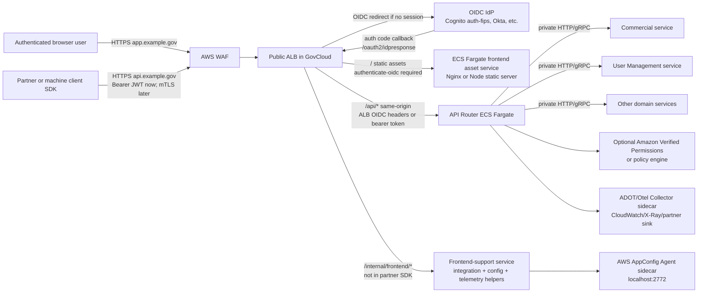
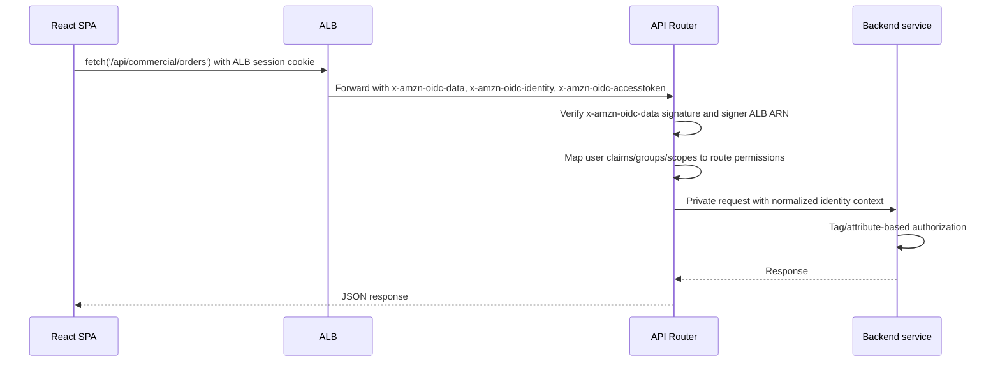
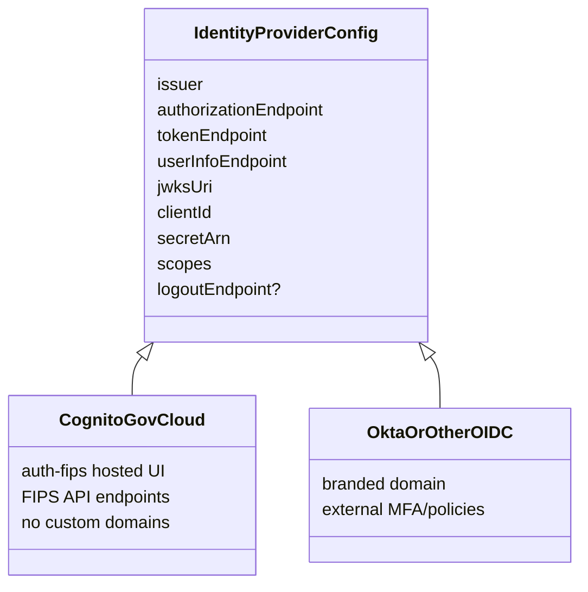
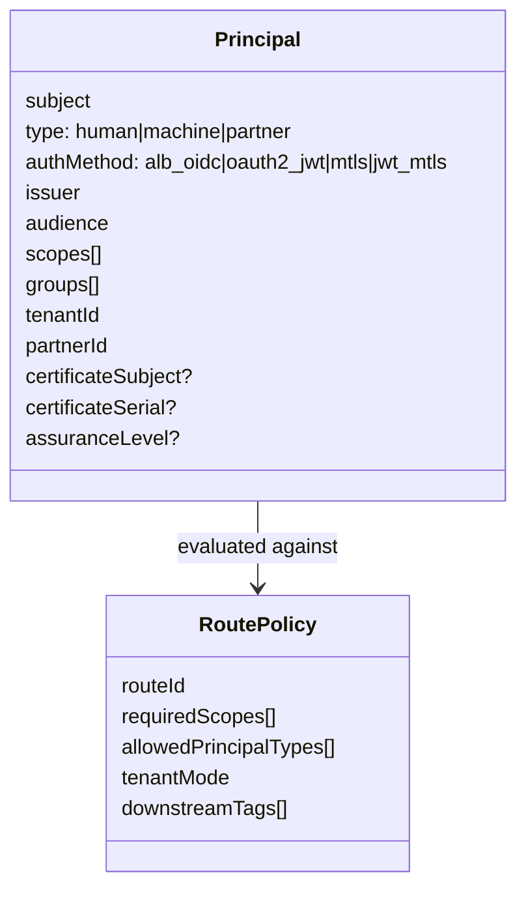
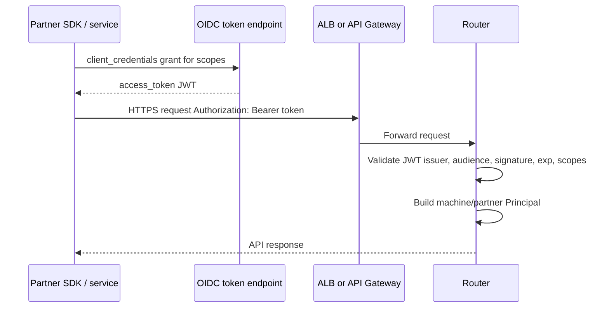
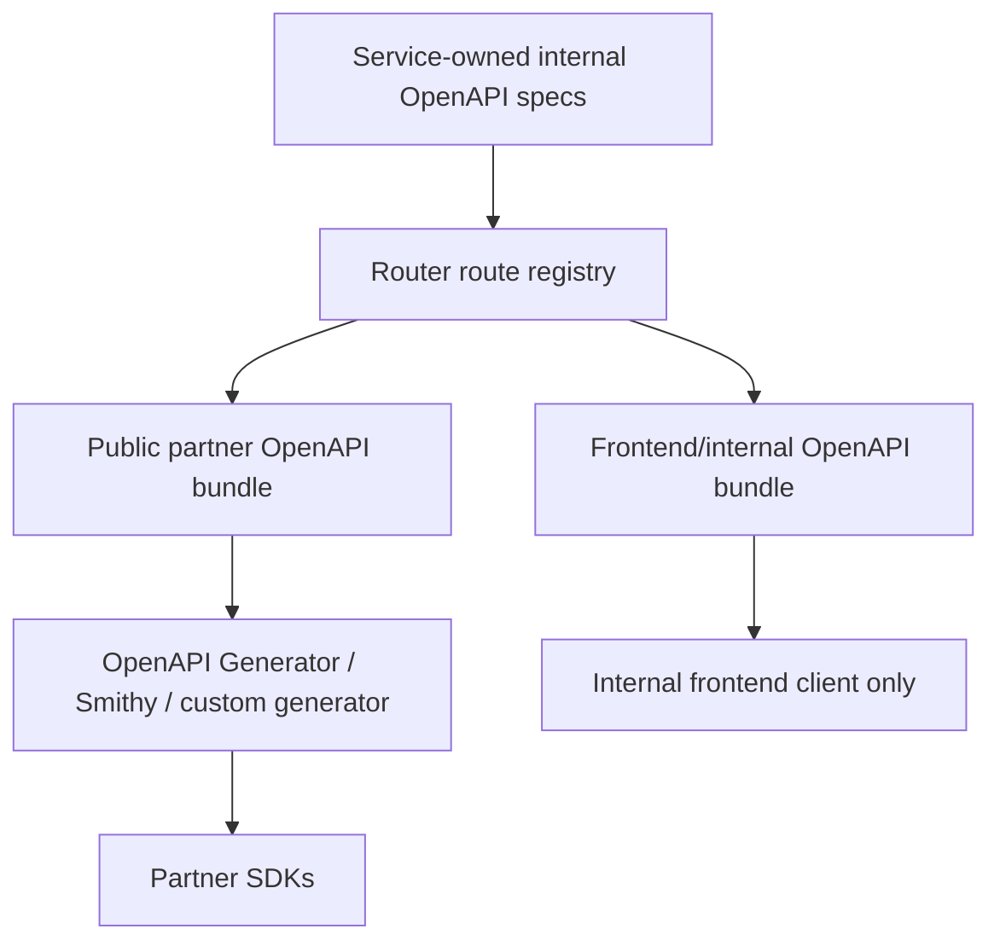
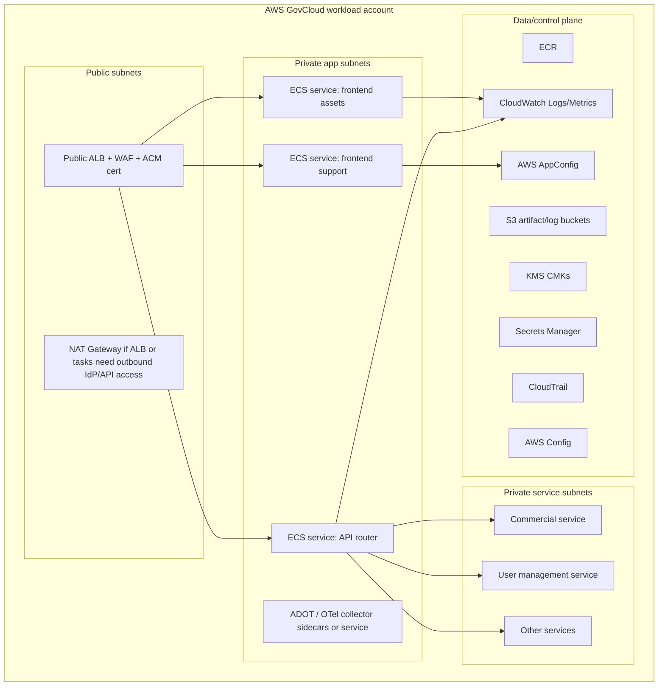
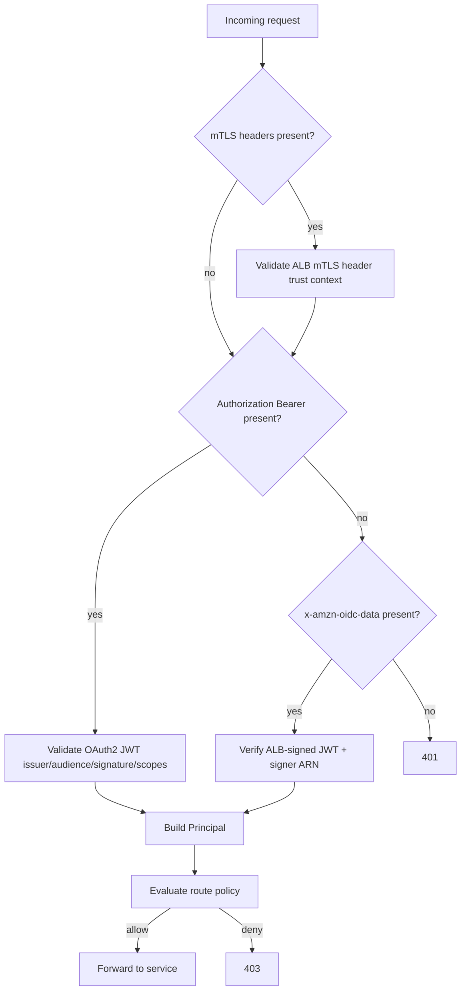

# AWS GovCloud Authenticated SPA and API Router Architecture

## Executive recommendation

Use an **AWS GovCloud (US) regional, ALB-fronted container architecture**:

- **Public HTTPS Application Load Balancer (ALB)** as the single browser entry point for `app.example.gov`.
- **ALB `authenticate-oidc`** for all SPA asset routes, backed by a generic OIDC provider. Cognito can be the first IdP, but Okta, Entra ID, or another OIDC IdP can replace it without changing the app or router contract.
- **React SPA served from an ECS Fargate frontend/static-assets service**, not directly from public S3. This keeps frontend assets unreachable unless the ALB authentication session exists.
- **API router service on ECS Fargate** behind the same ALB for same-origin browser calls and partner API calls.
- **Router-owned authn/authz policy** for APIs: browser identities come from signed ALB OIDC headers; partner and machine clients use OAuth2 client-credentials JWTs now, with a path to ALB/API Gateway mTLS later.
- **Backend services remain private** behind internal ALBs, Cloud Map, or service-to-service discovery. The router is the only public API ingress.
- **OpenAPI generated from the router’s external API contract**, then SDKs are generated only from the public/partner operations. Frontend-only integration, AppConfig, and telemetry endpoints are excluded from the partner spec.

This path favors **hard asset protection and IdP portability** over CDN convenience. CloudFront is not the primary recommendation because AWS notes that CloudFront is not available from GovCloud Regions in a GovCloud web-app reference, and CloudFront is listed for FedRAMP Moderate but not FedRAMP High/GovCloud in the AWS services-in-scope table. If a program authorizing official approves a commercial-region CloudFront component, it can be added later as an optimization, but it complicates the “GovCloud deployment” and protected-assets requirements.

## Research findings that shape the design

| Finding | Architectural impact |
|---|---|
| AWS GovCloud is a FedRAMP High-oriented partition; the FedRAMP Marketplace lists AWS GovCloud as certified with a High class, and AWS lists API Gateway, Cognito, ECS, ECR, ALB-adjacent EC2/VPC, S3, CloudWatch, X-Ray, WAF, ACM, Private CA, Secrets Manager, KMS, AppConfig-adjacent Systems Manager services, and Verified Permissions as in-scope for FedRAMP High/GovCloud. | Use GovCloud-native regional services as the baseline. Validate final service list against the current AWS Artifact package for the customer boundary. |
| Amazon Cognito is available in AWS GovCloud, uses FIPS endpoints, has GovCloud hosted UI URL formats, and does **not** support Cognito custom domains in GovCloud. | Treat Cognito as an OIDC IdP, not as a domain-branding dependency. Expect a Cognito `auth-fips` hosted UI domain unless an external IdP owns the branded login domain. |
| ALB user authentication supports generic OIDC IdPs and redirects unauthenticated users to the IdP. ALB direct `authenticate-cognito` region list does not include GovCloud, but generic `authenticate-oidc` is the portable mechanism. ALB OIDC requires publicly resolvable IdP endpoints and HTTPS listeners. | Configure ALB with `authenticate-oidc` rather than `authenticate-cognito`. This keeps Okta/Cognito/other IdP swap simple. |
| ALB auth sends a secure session cookie, redirects unauthenticated app users, and forwards identity to targets in `x-amzn-oidc-*` headers. AWS says targets must verify signed `x-amzn-oidc-data` and validate the expected ALB ARN signer; GovCloud public-key endpoints are S3 URLs. | The router/frontend must verify ALB identity headers before making authorization decisions. Targets should only accept traffic from the ALB security group. |
| ALB mTLS supports verify and passthrough modes, trust stores, revocation lists, and forwards client certificate data in `X-Amzn-Mtls-*` headers. | ALB is a good long-term front door if partner mTLS becomes mandatory. Add a dedicated partner listener/domain when mTLS is introduced. |
| API Gateway in GovCloud is FIPS-compliant by default, supports regional APIs and mTLS custom domains, but has GovCloud differences: no edge-optimized APIs; HTTP API private integrations are not supported in GovCloud East; mTLS endpoints do not support ECDSA server certificates; mTLS is not supported for private APIs. | API Gateway is viable for a later dedicated partner edge, especially for JWT authorizers and mTLS, but do not depend on HTTP API private integrations in all GovCloud Regions. If used, integrate to the router with Lambda, public/internal ALB patterns validated per Region, or VPC Link capabilities available in the target Region. |
| API Gateway JWT authorizers validate OIDC/OAuth2 JWTs using issuer JWKS, audience/client_id, expiry, nbf/iat, and route scopes. AWS recommends requiring authorization scopes to avoid accepting unintended ID tokens. | For partner SDK and machine-to-machine access, use scoped OAuth2 access tokens and route-level scopes. This can be enforced at API Gateway later or directly in the router now. |
| AWS AppConfig Agent can run as an ECS/EKS sidecar, uses the task role to call AppConfig, caches config locally, and serves config to the app on localhost port 2772. | Keep AppConfig access server-side in the frontend-support service or router, not in the browser SDK. |
| AWS GovCloud reference architectures commonly host SPAs in S3 and use API Gateway/Lambda, but their example makes S3 website content accessible through CloudFront patterns and does not guarantee “no frontend assets unless authenticated.” | For this requirement, serve static assets from a private ECS/Nginx service behind ALB auth, or use a purpose-built authenticated asset service. |

## Target architecture



### Logical domains

| Domain | Audience | Front door behavior | Target |
|---|---|---|---|
| `app.example.gov` | Human browser users | ALB OIDC login required for `/`, `/assets/*`, SPA fallback routes. | Frontend asset service. |
| `app.example.gov/api/*` | SPA runtime | Same-origin calls. Router accepts signed ALB user headers for browser identity. | API router. |
| `api.example.gov` or `app.example.gov/partner-api/*` | Partners, SDK users, service accounts | No interactive redirects. Require OAuth2 access token; add mTLS on dedicated listener/domain when ready. | Same API router, partner route group. |
| `app.example.gov/internal/frontend/*` | SPA support only | ALB authenticated, but excluded from partner OpenAPI. | Frontend-support service or router private route group. |

## Why not S3 static website hosting as the primary model?

S3 + CloudFront is excellent for public or tokenized static delivery, but this requirement says frontend assets themselves must be unavailable unless authenticated. Common S3 website hosting patterns either make objects public, protect them by origin headers, or rely on CloudFront/Lambda@Edge OIDC. That creates two problems:

1. **GovCloud/FedRAMP boundary complexity**: AWS’s GovCloud SPA reference explicitly uses CloudFront from a standard Region because CloudFront is not available from GovCloud Regions. AWS’s FedRAMP services table lists CloudFront for Moderate but not High/GovCloud.
2. **Authentication semantics**: protecting every asset with OIDC is simpler and more auditable at ALB than at S3 website endpoints.

Recommended asset hosting options, in priority order:

1. **ECS Fargate static asset service behind ALB OIDC** — preferred. Build React once, package `/dist` into a minimal Nginx image, run read-only root filesystem, and serve only through ALB.
2. **Lambda web adapter/static handler behind ALB** — acceptable for lower traffic; simpler operations but less natural for large asset sets.
3. **Private S3 + application asset proxy** — the frontend service fetches from S3 using task role and streams assets; useful if asset artifacts must remain in S3/KMS, but adds proxy complexity.
4. **CloudFront + OIDC at edge** — only if the compliance boundary permits commercial-region CloudFront and the team accepts Lambda@Edge/custom auth logic.

## Browser authentication and request model

### Initial page load

```mermaid
sequenceDiagram
  participant B as Browser
  participant A as ALB
  participant I as OIDC IdP
  participant F as Frontend asset service

  B->>A: GET https://app.example.gov/
  A->>A: Listener rule requires authenticate-oidc
  A-->>B: 302 to IdP authorization endpoint
  B->>I: Login / MFA / federation
  I-->>B: 302 https://app.example.gov/oauth2/idpresponse?code=...
  B->>A: Callback with authorization code
  A->>I: Token endpoint exchange
  A->>I: UserInfo request
  A-->>B: Set secure ALB auth session cookie; 302 original URL
  B->>A: GET / with ALB auth cookie
  A->>F: Forward request with x-amzn-oidc-* headers
  F-->>B: index.html and assets
```

The React bundle is never fetched until the ALB has established an authenticated session.

### SPA API calls



The frontend should use **relative same-origin URLs** (`/api/...`) and `credentials: 'same-origin'` or default browser cookie behavior. Avoid CORS for first-party SPA calls.

### Auth-expired AJAX behavior

ALB has three unauthenticated modes: `authenticate`, `allow`, and `deny`. Use:

- **SPA asset routes**: `authenticate` so users are redirected to login.
- **XHR/API routes for browser calls**: prefer a router-owned `/api/session` check and return JSON `401` for expired sessions. If ALB auth is applied directly, AWS notes `deny` returns 401 for AJAX calls without auth, but expired auth can still redirect. The frontend must handle both `401` and unexpected HTML/redirect responses by navigating to a login/start URL.
- **Partner API routes**: do not use interactive `authenticate`; require bearer/mTLS and return machine-readable `401/403`.

## IdP abstraction

Model the IdP as an OIDC issuer, not as Cognito-specific code.



Cognito-specific GovCloud caveats:

- API endpoints are FIPS endpoints.
- Hosted UI domains use `auth-fips` GovCloud formats.
- Cognito custom domains are not supported in GovCloud.
- Cognito metadata may leave GovCloud in limited cases per AWS GovCloud documentation, so avoid export-controlled data in pool domain names, custom attribute names, resource server identifiers, and custom scopes.

## API router responsibilities

The router is a product boundary, not just a reverse proxy.

### Required router modules

| Module | Responsibility |
|---|---|
| Route registry | Own `/api/{domain}/{version}/...` mappings to services. |
| Identity normalization | Convert ALB OIDC headers, partner JWTs, and future mTLS cert subjects into one internal `Principal`. |
| Route-based access control | Enforce scopes/roles/tenant entitlements before forwarding. |
| Service dispatch | Resolve target service by route and call private service endpoint. |
| Request shaping | Normalize headers, correlation IDs, tenant IDs, and user context. |
| Response shaping | Stable public error model; hide service internals. |
| OpenAPI aggregation | Generate public OpenAPI from exposed routes; exclude internal/frontend routes. |
| Audit logging | Log principal, route, auth method, decision, service target, status, trace ID. |
| Policy hooks | Integrate with Amazon Verified Permissions or a local policy engine if needed. |

### Principal model



Browser users and partners should end up in the same policy engine with different `type` and `authMethod` values.

## Authorization model

Recommended path from the prompt:

1. **Route-based access control in the router**
   - Route examples:
     - `GET /api/commercial/v1/orders` requires `commercial:orders:read`.
     - `POST /api/user-management/v1/users` requires `user-management:users:write`.
     - `GET /internal/frontend/v1/config` requires `frontend:runtime:read` and `principal.type == human`.
   - Store route policies with the route registry and publish them alongside OpenAPI.

2. **Tag/attribute-based authorization in services**
   - Router decides whether the caller can invoke the operation.
   - Service decides whether the caller can access the specific object based on tenant, agency, partner, data classification, record owner, or resource tags.

3. **No direct service exposure**
   - Security groups and route tables prevent public access to backend services.
   - Services reject requests without router-signed internal identity context or mTLS/service mesh identity.

## Machine-to-machine and partner SDK auth

### Near-term: OAuth2 client credentials



Token rules:

- Use access tokens, not ID tokens, for API authorization.
- Require scopes per route.
- Use dedicated audiences/resource servers for partner APIs.
- Use short token lifetimes and client secret/certificate rotation.
- If Cognito is used, define resource servers and custom scopes, but avoid sensitive names in scope identifiers because AWS notes Cognito metadata can leave GovCloud in limited cases.

### mTLS path

Two viable paths:

| Path | When to choose | Notes |
|---|---|---|
| **ALB mTLS on `api.example.gov`** | You want one ALB front door for browser + partner traffic. | Use ALB verify mode with AWS Private CA or approved partner CA trust bundles. Router reads `X-Amzn-Mtls-*` headers and combines cert identity with JWT scopes. |
| **API Gateway regional custom domain with mTLS** | You want gateway-native JWT authorizers, usage plans/throttling, or separate partner edge controls. | GovCloud API Gateway supports mTLS custom domains, but mTLS is not supported for private APIs and GovCloud has integration differences. Validate private integration support in chosen Region. |

Recommended future state: **JWT + mTLS** for partners. mTLS proves possession of partner-issued/client cert; JWT conveys client identity, scopes, tenant/partner entitlement, and revocable authorization.

## SDK generation strategy

The SDK should represent the **router’s public contract**, not every backend service’s native API.



### Rules

- Router owns externally visible paths, versioning, errors, pagination, idempotency, and auth scopes.
- Service teams may own internal specs, but the router publishes the partner-facing composition.
- Mark endpoints with visibility:
  - `public-partner`: included in SDK.
  - `frontend-only`: used by React app, excluded from partner SDK.
  - `internal`: not reachable from public ingress.
- Publish SDKs with:
  - OAuth2 client credentials helper.
  - Retry/backoff policy aligned with router idempotency rules.
  - Request ID/correlation header propagation.
  - Optional mTLS client certificate configuration once enabled.
- Keep generated clients thin. Do not embed business authorization logic in the SDK.

## Frontend-support service

The prompt calls out a frontend service for an integration, AppConfig, and OTel telemetry that should not be in the SDK. Treat this as a separate **frontend-support route group**.

### Responsibilities

| Capability | Recommended implementation |
|---|---|
| Integration helper | Server-side ECS service behind `/internal/frontend/v1/integration/*`; receives ALB-authenticated user context. |
| Runtime config | AppConfig Agent sidecar in the support service; browser calls `/internal/frontend/v1/config`, service reads `localhost:2772`. |
| Telemetry bootstrap | Endpoint returns non-secret OTel config: collector URL, environment, sampling flags. |
| Browser telemetry ingestion | Use `/internal/frontend/v1/telemetry` or a dedicated collector endpoint, authenticated by ALB session and rate-limited. |
| Exclusion from SDK | Tag OpenAPI operations as `x-visibility: frontend-only`; public SDK generator ignores them. |

Do **not** put AppConfig credentials, AppConfig data-plane calls, or privileged integration secrets in the React bundle.

## Deployment topology



### Network controls

- ALB security group allows inbound `443` only from approved internet ranges or public as required.
- Target security groups allow inbound only from the ALB security group.
- Backend service security groups allow inbound only from router task security group or internal mesh/load balancer.
- ECS tasks run in private subnets.
- Use VPC endpoints for supported AWS APIs to reduce internet egress.
- If ALB OIDC must call public IdP endpoints, ensure outbound IPv4 connectivity as AWS requires ALB to reach token and user-info endpoints. For internal ALBs or no public IPv4, AWS notes NAT can be required.

## Security and compliance controls

| Area | Control |
|---|---|
| Transport | TLS 1.2+ everywhere; ACM certificates; HTTPS target groups if forwarding ALB OIDC headers; future mTLS for partner domain. |
| Asset protection | SPA files served only by private ECS tasks behind ALB `authenticate-oidc`. No public S3 website endpoint. |
| Header trust | Router verifies `x-amzn-oidc-data` signature and `signer` ALB ARN; target SG only permits ALB. |
| Secrets | OIDC client secret in Secrets Manager; task roles least privilege. |
| Encryption | KMS CMKs for S3 logs/artifacts, ECS secrets, application data. |
| Audit | CloudTrail, ALB access and connection logs, router authorization decision logs, service audit events. |
| WAF | AWS WAF on ALB for common web exploits, rate-based rules, bot controls as permitted. |
| Observability | CloudWatch Logs/Metrics, X-Ray/ADOT, trace ID propagated from ALB/router to services. |
| Configuration | AWS Config rules, Security Hub CSPM, IAM Access Analyzer where available/approved. |
| FedRAMP boundary | Validate service-by-service inclusion using AWS Artifact and customer SSP. Avoid export-controlled data in AWS service metadata called out by GovCloud docs. |

## Key implementation details

### ALB listener rules

Recommended priority order:

1. `/oauth2/*` — ALB-managed callback paths.
2. `/healthz` — unauthenticated or restricted health endpoint for ALB only.
3. `/api/partner/*` — forward to router without interactive ALB OIDC; router validates bearer token; future dedicated mTLS listener/domain.
4. `/api/*` — either:
   - `authenticate-oidc` + forward to router for browser-only APIs, or
   - `allow`/no ALB auth and router accepts either ALB headers or bearer token, depending on how partner and browser APIs share paths.
5. `/internal/frontend/*` — `authenticate-oidc` + forward to frontend-support service.
6. `/*` — `authenticate-oidc` + forward to frontend asset service, with SPA fallback to `index.html`.

For clean semantics, prefer **separate partner path/domain** so browser API auth can use ALB OIDC without breaking machine clients.

### Router identity validation order



### Logout

ALB documentation says applications should expire ALB authentication cookies and redirect to the IdP logout endpoint if supported. Implement `/logout` in the frontend-support service to:

1. Set ALB auth cookie shards to expired.
2. Redirect to the IdP logout endpoint with post-logout redirect back to an unauthenticated landing page.
3. Keep the logout landing page outside authenticated ALB rules, as AWS notes logout landing pages are unauthenticated.

## Alternatives considered

| Alternative | Pros | Cons | Recommendation |
|---|---|---|---|
| S3 + CloudFront + Lambda@Edge OIDC | CDN performance; common SPA pattern. | CloudFront not GovCloud regional; FedRAMP High/GovCloud boundary concern; custom edge auth; asset auth complexity. | Not primary. Use only with AO approval. |
| API Gateway for all frontend and API traffic | JWT authorizers, mTLS, throttling, OpenAPI import/export. | Does not serve protected SPA assets as naturally; GovCloud private integration differences; still needs static asset origin. | Good optional partner API edge, not SPA asset gate. |
| ALB + ECS for frontend and router | Strong protected-assets story; GovCloud regional; generic OIDC; same-origin browser calls; mTLS path. | Less CDN caching; must operate ECS services. | Recommended. |
| AWS Verified Access for frontend | Policy-rich app access service. | Verify service availability/features and fit for SPA assets/router; may not satisfy SDK/partner API front door alone. | Consider for workforce-only web access, not the baseline. |
| Browser obtains tokens directly and calls APIs with bearer token | Standard SPA OAuth pattern; simpler API gateway JWT validation. | Tokens in browser; duplicate auth logic; asset protection still needs ALB/edge auth. | Possible, but ALB/BFF-style session is cleaner for protected assets. |

## Phased roadmap

### Phase 1 — Protected SPA and browser API foundation

- Deploy ALB, WAF, ACM certificate, ECS cluster, frontend asset service, router service.
- Configure ALB `authenticate-oidc` with Cognito GovCloud or external OIDC IdP.
- Serve React assets only through authenticated ALB route.
- Implement router validation for ALB `x-amzn-oidc-data` signer and claims.
- Frontend uses relative `/api/*` calls.
- Add frontend-support service for config/integration/telemetry bootstrap, excluded from SDK.

### Phase 2 — Partner API and SDK

- Define public route registry and route scopes.
- Add OAuth2 client-credentials validation in router.
- Publish OpenAPI for `public-partner` routes only.
- Generate SDKs from router OpenAPI.
- Add partner onboarding: client registration, scopes, quotas, audit logs, sandbox.

### Phase 3 — Hardened B2B ingress

- Add `api.example.gov` dedicated listener/domain.
- Enable ALB mTLS verify mode or API Gateway mTLS custom domain.
- Bind certificates to partner records and require JWT + mTLS for high-risk routes.
- Add revocation processes and certificate rotation playbooks.

### Phase 4 — Advanced policy and operations

- Integrate Amazon Verified Permissions or policy-as-code if route policies outgrow static configuration.
- Add canary releases at router route level.
- Add contract tests between router OpenAPI and service implementations.
- Add anomaly detection and per-partner rate controls.

## Open questions for final design

1. Which GovCloud Region: `us-gov-west-1`, `us-gov-east-1`, or active/active? This affects API Gateway private integration options and IdP endpoint choices.
2. Is commercial-region CloudFront categorically prohibited, or just not preferred? If allowed, it can be an optional CDN layer, but it should not weaken asset auth.
3. Will Cognito be authoritative or only a broker to agency/enterprise IdPs?
4. Are partner SDK users external internet clients, private network clients, or both?
5. Are partners required to use FIPS endpoints and mTLS from day one?
6. What is the expected SPA asset size and traffic profile? This determines whether lack of CDN is acceptable.
7. Does the FedRAMP boundary allow telemetry egress to third-party observability tools, or must all OTel data stay in GovCloud CloudWatch/X-Ray/OpenSearch?

## Source notes

- [AWS GovCloud FedRAMP Marketplace entry](https://www.fedramp.gov/marketplace/products/F1603047866/) lists AWS GovCloud as certified and describes it as intended for sensitive government workloads and ITAR-aligned use.
- [AWS services in scope for FedRAMP](https://aws.amazon.com/compliance/services-in-scope/FedRAMP/) lists current service scope, including API Gateway, Cognito, ECS, ECR, S3, CloudWatch, X-Ray, WAF, ACM, KMS, Secrets Manager, Private CA, and others under FedRAMP High/GovCloud; CloudFront is listed under Moderate, not High/GovCloud, as of the fetched page.
- [Amazon Cognito in AWS GovCloud](https://docs.aws.amazon.com/govcloud-us/latest/UserGuide/govcloud-cog.html) documents FIPS endpoints, hosted UI URL format, lack of custom domains, and export-controlled metadata considerations.
- [ALB user authentication](https://docs.aws.amazon.com/elasticloadbalancing/latest/application/listener-authenticate-users.html) documents OIDC authentication, redirects, session cookies, `x-amzn-oidc-*` headers, CloudFront forwarding caveats, and GovCloud public key endpoints for header signature verification.
- [ALB mutual TLS](https://docs.aws.amazon.com/elasticloadbalancing/latest/application/mutual-authentication.html) documents verify/passthrough mTLS modes and `X-Amzn-Mtls-*` headers.
- [API Gateway in GovCloud](https://docs.aws.amazon.com/govcloud-us/latest/UserGuide/govcloud-abp.html) documents GovCloud differences, FIPS default APIs, no edge-optimized APIs, mTLS ECDSA server certificate limitation, and HTTP API private integration differences.
- [API Gateway HTTP API mTLS](https://docs.aws.amazon.com/apigateway/latest/developerguide/http-api-mutual-tls.html) documents custom domain and truststore requirements, mTLS behavior, and the note that mTLS is not supported for private APIs.
- [API Gateway JWT authorizers](https://docs.aws.amazon.com/apigateway/latest/developerguide/http-api-jwt-authorizer.html) documents issuer/audience/signature/expiry/scope validation and recommends scopes for API authorization.
- [AWS AppConfig Agent for ECS/EKS](https://docs.aws.amazon.com/appconfig/latest/userguide/appconfig-integration-containers-agent.html) documents sidecar caching, localhost port 2772 retrieval, and required IAM actions.
- [AWS Public Sector GovCloud serverless web app reference](https://aws.amazon.com/blogs/publicsector/how-improve-government-customer-experience-building-modern-serverless-web-application-aws-govcloud-us/) provides a GovCloud SPA reference and explicitly notes CloudFront is deployed in a standard Region because it is not available from GovCloud Regions.
