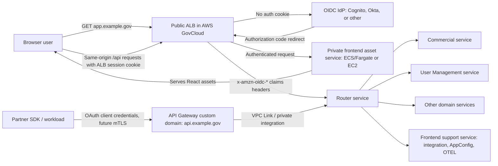
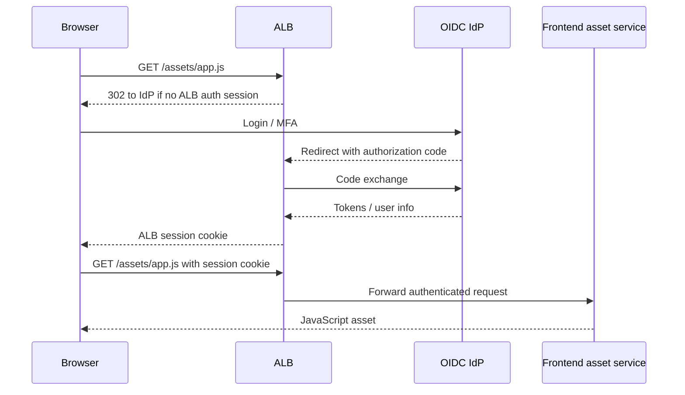
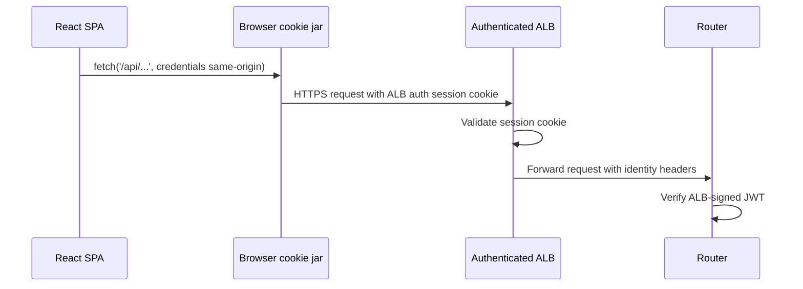
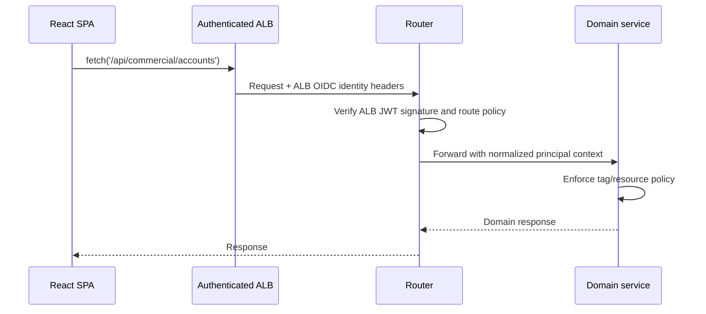
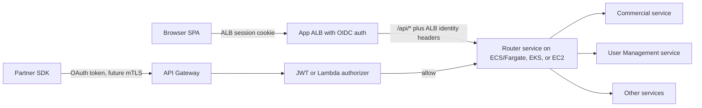
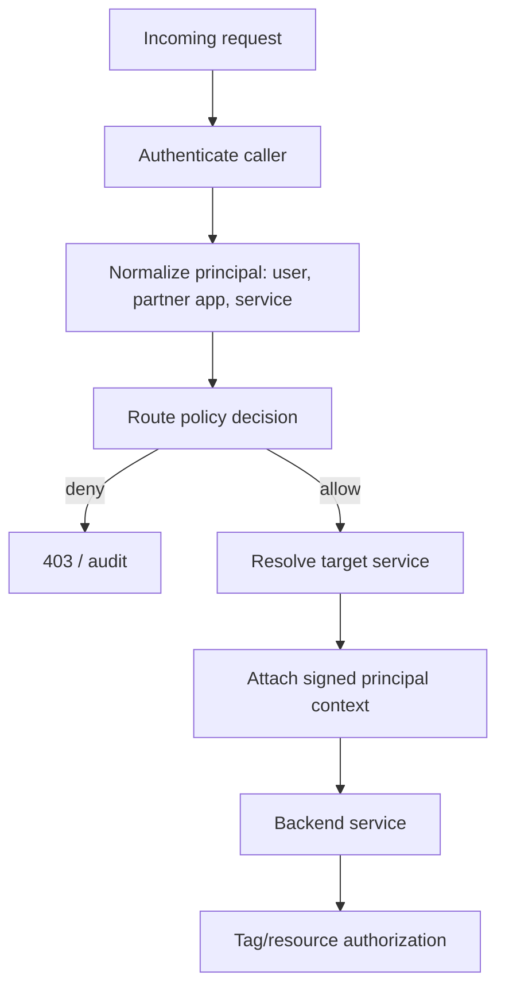
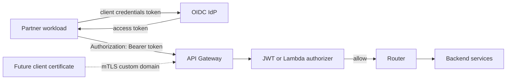
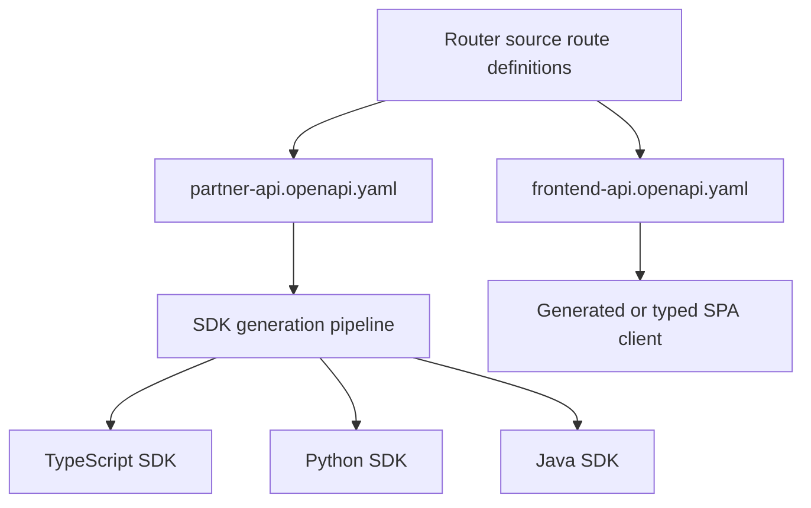

# AWS GovCloud Authenticated SPA and API Router

## Recommendation

Use a **regional AWS GovCloud architecture** with:

- **Application Load Balancer (ALB) OIDC authentication** in front of the React SPA so unauthenticated users cannot fetch `index.html`, JavaScript bundles, CSS, images, or other frontend assets.
- A **private frontend asset service** on ECS/Fargate or EC2 that serves the built React artifacts only after the ALB authenticates the browser session.
- A shared **router service** as the front door to backend domains such as Commercial, User Management, and future services.
- A separate partner/API domain on **Amazon API Gateway** that forwards to the same router and supports machine-to-machine OAuth, partner SDK distribution, throttling, usage controls, and a later move to mTLS.
- **OIDC/OAuth as the identity abstraction**, so Cognito can be the first IdP while Okta or another OIDC provider can replace it without changing the router or frontend contract.

This avoids public S3 website hosting and avoids requiring the SPA itself to hold privileged credentials just to fetch its own static assets.



## Why This Shape Fits

AWS GovCloud is intended for workloads that need FedRAMP High-aligned architectures, and AWS publishes which services are in scope for FedRAMP High in GovCloud. Amazon Cognito is available in GovCloud with FIPS endpoints, and ALB supports OIDC authentication and redirects unauthenticated users to an IdP before forwarding traffic to targets. API Gateway supports custom domains, private integrations through VPC links, generated SDKs for REST APIs, and mTLS on custom domains.

CloudFront can restrict content with signed URLs and signed cookies, but AWS currently describes CloudFront compliance as FedRAMP Moderate in its CloudFront overview. For a strict GovCloud/FedRAMP High posture, prefer regional GovCloud services for the protected SPA path unless the compliance team explicitly approves CloudFront for the boundary and data type.

## Frontend Delivery

The React SPA should be built into immutable static artifacts, but not published as anonymously readable S3 website content.

Recommended path:

1. Build the React app in CI.
2. Store artifacts in a private S3 bucket with S3 Block Public Access enabled, or bake them into a minimal Nginx container image.
3. Run a private frontend asset service in ECS/Fargate or EC2.
4. Put a public ALB in front of it.
5. Configure every app route, including `/*`, with `authenticate-oidc`.
6. Forward only authenticated requests to the frontend target group.

This means:

- `GET /` requires authentication.
- `GET /assets/app.js` requires authentication.
- Deep links such as `/commercial/orders/123` require authentication and then fall back to the SPA entry point.
- The browser receives normal static files after login, but the origin is never public.



## Frontend API Calls

Do not require the SPA to directly manage long-lived API credentials. Prefer a same-origin request model:

- Browser loads `https://app.example.gov`.
- Browser calls `https://app.example.gov/api/...`.
- ALB enforces the browser login session on `/api/*`.
- ALB forwards identity headers such as OIDC claims to the router.
- The router verifies the ALB-signed JWT before trusting claims.
- The router applies route-based authorization and forwards to internal services.

This keeps the frontend simple and avoids leaking access tokens into browser storage. If the product later needs direct browser bearer-token calls, add Authorization Code with PKCE in the SPA, but treat that as a deliberate tradeoff rather than the default.

### Browser Request Contract

In the recommended model, the frontend does **not** add an `Authorization: Bearer ...` header for normal first-party API calls.

The request looks like this from the SPA:

```ts
const response = await fetch("/api/commercial/accounts", {
  method: "GET",
  credentials: "same-origin",
  headers: {
    "Accept": "application/json",
    "X-Request-Id": crypto.randomUUID()
  }
});
```

The browser automatically includes the ALB session cookie for same-origin requests. JavaScript should not read or write that cookie. The ALB owns the login redirect, token exchange, session cookie, session refresh behavior, and logout behavior.



The ALB forwards identity context to the router using AWS-managed headers. The important headers are:

| Header | Who sets it | Used by router? | Purpose |
| --- | --- | --- | --- |
| `Cookie` | Browser | No direct authorization use | Contains the ALB-managed session cookie; opaque to the SPA and router |
| `x-amzn-oidc-data` | ALB | Yes | ALB-signed JWT containing user claims from the IdP user info endpoint |
| `x-amzn-oidc-identity` | ALB | Optional | Subject identity shortcut |
| `x-amzn-oidc-accesstoken` | ALB | Usually no | Access token from the IdP; avoid using it as the primary router trust object |
| `X-Request-Id` or `traceparent` | SPA | Yes for tracing | Correlation and telemetry, not authentication |

The router must trust only requests that arrive from the ALB security boundary. It should verify `x-amzn-oidc-data` before using any identity claims:

1. Parse the JWT header.
2. Verify the signature using the ALB public key endpoint for the GovCloud region.
3. Validate the `signer` field against the expected ALB ARN.
4. Validate expiration.
5. Map claims such as `sub`, `email`, `groups`, `tenant`, or custom claims into an internal principal.
6. Apply route policy.

The SPA can include non-security headers such as `Accept`, `Content-Type`, `X-Request-Id`, `traceparent`, and idempotency keys. It should not include user id, tenant id, roles, groups, or scopes as trusted headers. Any user-controlled header must be ignored or overwritten by the router.

For unsafe methods such as `POST`, `PUT`, `PATCH`, and `DELETE`, add CSRF protection because the browser uses cookies:

- Prefer `SameSite` protections where compatible with the ALB and IdP flow.
- Add a CSRF token endpoint such as `GET /internal/frontend/csrf`.
- Return a server-generated CSRF token after authentication.
- Require the SPA to send it in a header such as `X-CSRF-Token`.
- Bind the token to the ALB session or a backend session record.

Example write request:

```ts
await fetch("/api/commercial/accounts", {
  method: "POST",
  credentials: "same-origin",
  headers: {
    "Accept": "application/json",
    "Content-Type": "application/json",
    "X-CSRF-Token": csrfToken,
    "Idempotency-Key": crypto.randomUUID(),
    "traceparent": currentTraceparent
  },
  body: JSON.stringify(payload)
});
```

This makes frontend requests work like a traditional authenticated web app while the router still gets structured identity for API authorization.



## Router Responsibilities

The router is the canonical API front door for all backend services. It should be a real service, not only ALB listener rules, because the requirements include SDK generation, partner use, route authorization, machine-to-machine auth, and future mTLS.

Recommended implementation: run the router as a private application service on **ECS/Fargate, EKS, or EC2**, with ALB and API Gateway in front of it. API Gateway is the managed API edge for partner and machine-to-machine traffic. The Lambda authorizer is only an authentication/authorization plug-in at that edge. It is not the router.



The router can be implemented with any normal web service stack, for example Go, Java/Spring, .NET, Node.js, Rust, or Python/FastAPI. The important point is that it owns the platform API behavior, not just request forwarding.

Router responsibilities:

- Normalize identity from browser sessions, OAuth access tokens, service tokens, and future mTLS client certificates.
- Enforce route-based access control at the edge of the backend platform.
- Add a standard principal context header or signed internal token for downstream services.
- Route to backend services by path and version, for example `/v1/commercial/*` and `/v1/users/*`.
- Emit audit logs with subject, client id, route, decision, downstream service, request id, and correlation id.
- Own the externally supported OpenAPI contract used for SDK generation.
- Keep frontend-only support endpoints separate from the partner SDK surface.

Downstream services should still enforce tag-based or resource-level authorization. The router answers "can this caller access this route?"; services answer "can this caller access this tenant, account, record, or tagged resource?"

### Why Not Only API Gateway

API Gateway should be used as an edge service, especially for partners, but it should not be the whole router if the route layer needs product semantics, custom policy, cross-service composition, OpenAPI ownership, SDK lifecycle control, audit normalization, and multiple identity modes.

API Gateway is good at:

- Custom domains.
- TLS and mTLS termination.
- Request throttling and quotas.
- JWT or Lambda authorizers.
- Basic request validation and transformation.
- Usage plans and API keys where appropriate.
- Private integration into the VPC.

The router service is better at:

- Mapping several identity sources into one internal principal model.
- Enforcing route policy using product concepts.
- Producing one stable public API contract across multiple backend services.
- Hiding backend service topology from partners and the SPA.
- Adding signed internal principal context for services.
- Handling cross-service workflows and response shaping where needed.
- Keeping frontend-only endpoints out of partner SDKs.

### Why Not Only Lambda Authorizer

A Lambda authorizer can answer "is this request allowed to enter API Gateway?" It should not become the router because it is invoked in the authorization phase, not as the main application handler. It is not the right place to compose backend calls, own API versioning, normalize responses, emit full application audit events, or generate SDK contracts.

Use a Lambda authorizer only when API Gateway's native JWT authorizer is not enough, such as:

- Custom token introspection.
- Non-standard claims mapping.
- Partner-specific policy lookup.
- Certificate-to-principal mapping alongside mTLS.

### When Lambda Could Be the Router

The router could technically be a Lambda function behind API Gateway if the backend surface is small and request volume, latency, connection reuse, and operational requirements fit Lambda well.

For this architecture, prefer a long-running service because the router is expected to become a central platform component. A service is usually a better fit for:

- Many backend integrations.
- Shared connection pools.
- More predictable low latency.
- Rich routing and policy code.
- Larger OpenAPI surface area.
- Internal service discovery.
- More conventional local development and load testing.



## Partner and Machine-to-Machine API

Expose partners through `https://api.example.gov`, not through the browser app domain.

Recommended path:

- Use API Gateway as the managed API edge.
- Use OAuth 2.0 client credentials from Cognito or another OIDC IdP for machine-to-machine access.
- Validate tokens with a JWT or Lambda authorizer.
- Forward valid requests to the router through a private integration/VPC Link.
- Add usage plans, throttling, WAF, request logging, and per-partner observability.
- Enable mTLS on the API Gateway custom domain when certificate-based partner authentication is required.

API Gateway REST APIs have native SDK generation, and AWS documents that the SDK must be regenerated after API updates. For a partner SDK program, the better long-term source of truth is the router's OpenAPI document, then generate SDKs in the supported languages from that contract. If AWS-native generation is mandatory, keep the partner-facing API on API Gateway REST API and generate from the deployed stage.



## Frontend Support Service

Create a separate frontend support service for capabilities that should not appear in the partner SDK:

- Integration-specific frontend helper endpoints.
- AppConfig bootstrap or feature flag evaluation needed by the SPA.
- OpenTelemetry browser telemetry intake or telemetry configuration.
- Session/user display metadata that is not part of the partner API.

Preferred placement:

- Put it behind the router under an internal namespace such as `/internal/frontend/*` if it benefits from the same identity normalization, audit, throttling, and route policy engine.
- Exclude `/internal/frontend/*` from the public OpenAPI/SDK contract.
- If the service has very different scaling, ingestion, or telemetry needs, expose it as a separate ALB target behind the same authenticated app ALB and keep it off `api.example.gov`.

AWS AppConfig is available in GovCloud, and AWS announced FedRAMP High authority to operate for AppConfig in GovCloud regions. For browser telemetry, use OTEL-compatible browser instrumentation, but avoid sending unauthenticated telemetry directly to internal collectors. Route it through the authenticated frontend support endpoint or a purpose-built telemetry ingestion endpoint with abuse controls.

## Identity Abstraction

Use OIDC/OAuth interfaces everywhere:

- Browser login: OIDC authorization code flow handled by ALB.
- Partner M2M: OAuth client credentials.
- Future enterprise IdP: Okta or another OIDC provider.
- Cognito first path: Cognito User Pools and hosted UI/domain where appropriate.

The router should not contain Cognito-specific assumptions. It should depend on:

- Issuer allowlist.
- JWKS discovery or configured public keys.
- Audience/client id validation.
- Scopes and claims mapped to internal permissions.
- Tenant and subject normalization.

That lets Cognito be replaced by Okta with a metadata/configuration change and policy migration, not a router rewrite.

## API and SDK Contract

Maintain two OpenAPI contracts:

- `partner-api.openapi.yaml`: public, versioned, SDK-generating, stable, no frontend-only endpoints.
- `frontend-api.openapi.yaml`: internal browser-facing contract for the SPA and frontend support service.

The router can implement both, but the SDK pipeline must only package the partner API.



SDK rules:

- Generate clients from the public OpenAPI contract.
- Treat the router path and auth scheme as the stable partner interface.
- Do not generate SDK methods for `/internal/frontend/*`.
- Version partner APIs explicitly, for example `/v1`.
- Keep route deprecations and compatibility policy in the SDK release process.

## Route and Service Authorization

Recommended authorization split:

- Router: route-based access control.
- Services: tag-based and resource-level authorization.

Example:

| Layer | Decision | Example |
| --- | --- | --- |
| API Gateway | Is the request structurally acceptable and authenticated? | Valid client credentials token, rate limit not exceeded |
| Router | Can this caller invoke this route? | Partner A can call `GET /v1/commercial/accounts` |
| Service | Can this caller access this resource? | Partner A can read account tagged `partner=A` |
| Data layer | Is the query constrained? | Tenant id or resource tags are mandatory predicates |

This avoids putting all authorization in the router while still giving the platform one central policy point for exposed routes.

## Deployment Notes

Use these as baseline deployment constraints:

- Deploy to AWS GovCloud regions.
- Use ACM certificates on ALB and API Gateway custom domains.
- Keep frontend S3 buckets private with S3 Block Public Access enabled if S3 is used for artifact storage.
- Keep frontend and router targets in private subnets.
- Restrict target security groups to accept traffic only from the ALB or private integration path.
- Validate ALB-signed user claims in the router before making authorization decisions.
- Log ALB, API Gateway, router, and service decisions to CloudWatch Logs or the approved FedRAMP logging stack.
- Use AWS WAF where supported and required by the boundary.
- Keep CloudTrail enabled for management events and data events where needed.

## Service Choice Summary

| Concern | Recommended service | Reason |
| --- | --- | --- |
| Authenticated SPA assets | ALB OIDC + private ECS/Fargate or EC2 asset service | Prevents unauthenticated asset fetches without public S3 |
| Browser login | OIDC IdP through ALB | Generic IdP path; Cognito or Okta can fit |
| Browser API calls | Same-origin `/api/*` through ALB to router | Avoids exposing API tokens to SPA by default |
| Partner API | API Gateway custom domain to router | M2M auth, throttling, SDK path, future mTLS |
| Router | ECS/Fargate, EKS, or EC2 service | Central route policy, identity normalization, OpenAPI ownership |
| SDK generation | OpenAPI generator pipeline; API Gateway REST SDK if required | Keeps SDK tied to supported public contract |
| AppConfig / OTEL / frontend integrations | Frontend support service | Excluded from partner SDK, still authenticated |
| Future mTLS | API Gateway custom domain mTLS | AWS-supported path for partner cert authentication |

## Main Tradeoffs

### ALB-Protected SPA vs CloudFront/S3

ALB-protected SPA is more regional and compliance-friendly for GovCloud/FedRAMP High, and it cleanly blocks unauthenticated asset access. It gives up CDN edge caching. For most authenticated federal business apps, that is usually acceptable.

### Same-Origin Browser API vs SPA-Held Access Tokens

Same-origin calls keep tokens out of browser JavaScript and let ALB own the login session. The tradeoff is that the router must understand ALB identity headers. If the SPA needs to call APIs from multiple domains or third-party APIs directly, add PKCE later.

### API Gateway as Edge vs Router as Edge

API Gateway is valuable for partner traffic because of managed auth integration points, throttling, custom domains, mTLS, logging, and SDK support. The router should still own product routing semantics and public API contracts so the backend architecture is not trapped in API Gateway configuration.

## Sources

- [AWS GovCloud compliance overview](https://docs.aws.amazon.com/govcloud-us/latest/UserGuide/govcloud-compliance.html)
- [AWS services in scope for FedRAMP](https://aws.amazon.com/compliance/services-in-scope/FedRAMP/)
- [Amazon Cognito in AWS GovCloud](https://docs.aws.amazon.com/govcloud-us/latest/UserGuide/govcloud-cog.html)
- [Authenticate users using an Application Load Balancer](https://docs.aws.amazon.com/elasticloadbalancing/latest/application/listener-authenticate-users.html)
- [Amazon S3 Block Public Access](https://docs.aws.amazon.com/AmazonS3/latest/userguide/access-control-block-public-access.html)
- [Amazon API Gateway mTLS announcement](https://aws.amazon.com/about-aws/whats-new/2020/09/amazon-api-gateway-supports-mutual-tls-authentication/)
- [API Gateway private integrations and VPC links](https://aws.amazon.com/blogs/compute/understanding-vpc-links-in-amazon-api-gateway-private-integrations/)
- [Generate a JavaScript SDK for API Gateway REST API](https://docs.aws.amazon.com/apigateway/latest/developerguide/generate-javascript-sdk-of-an-api.html)
- [AWS AppConfig FedRAMP High ATO in GovCloud](https://aws.amazon.com/about-aws/whats-new/2022/11/aws-appconfig-fedramp-high-authority-to-operate/)
- [CloudFront documentation overview](https://aws.amazon.com/documentation-overview/cloudfront/)
