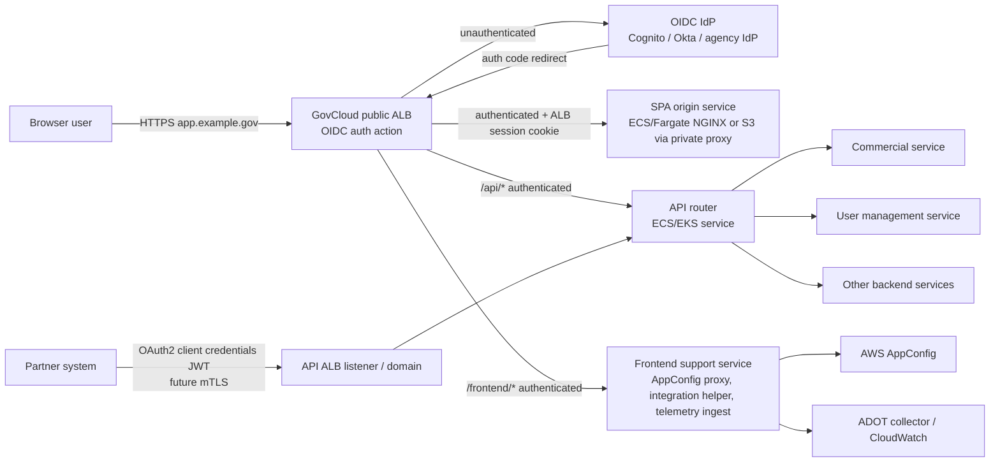
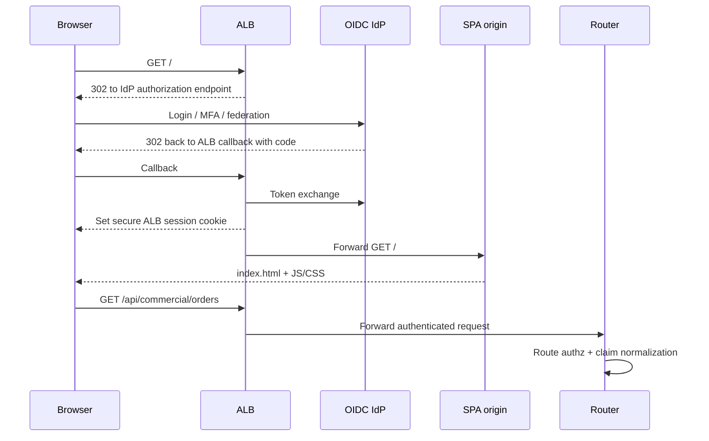
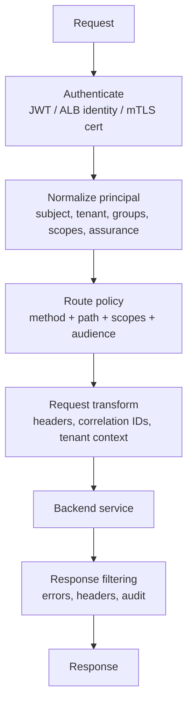
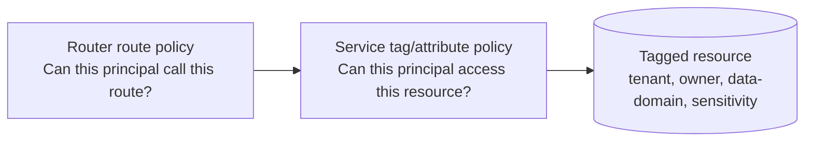
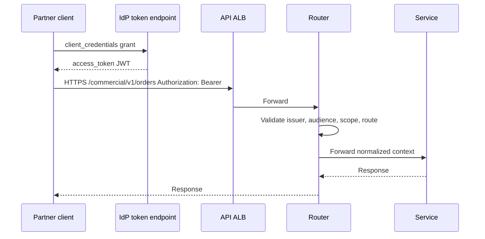
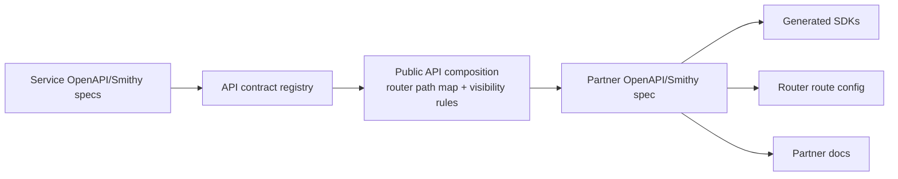

# AWS GovCloud Authenticated SPA and API Router Architecture

## Executive recommendation

Use a **GovCloud-only regional front door** centered on **Application Load Balancer (ALB) + a router service on ECS Fargate or EKS**, with an **OIDC-compatible IdP boundary** and **OpenAPI/Smithy as the SDK contract source**.

The likely path:

1. **Serve the React SPA from a private GovCloud origin behind ALB authentication** rather than a public S3 website or unauthenticated CDN.
2. **Terminate browser authentication at ALB using `authenticate-oidc`** so Cognito, Okta, or another OIDC IdP can be swapped with limited blast radius. ALB natively supports OIDC authentication actions for HTTPS listeners, and ELB is supported in GovCloud. [AWS ALB auth docs](https://docs.aws.amazon.com/elasticloadbalancing/latest/application/listener-authenticate-users.html), [ELB GovCloud docs](https://docs.aws.amazon.com/govcloud-us/latest/UserGuide/govcloud-elb.html)
3. **Forward authenticated requests to an application router** that performs route-based authorization, token normalization, request shaping, audit logging, rate limiting, and service routing.
4. **Have backend services enforce tag/attribute-based authorization** using claims/context propagated by the router; the router is a policy decision/enforcement aggregation point, not the only security boundary.
5. **Generate partner SDKs from canonical API contracts**, not from router implementation code. Prefer OpenAPI 3.0 for broad partner compatibility, or Smithy if AWS-style multi-language SDK generation and model-first governance are desired. API Gateway can export OpenAPI and generate some REST SDKs, while Smithy has TypeScript client code generation. [API Gateway SDK docs](https://docs.aws.amazon.com/apigateway/latest/developerguide/how-to-generate-sdk.html), [API Gateway OpenAPI export](https://docs.aws.amazon.com/apigateway/latest/developerguide/api-gateway-export-api.html), [Smithy TypeScript](https://github.com/awslabs/smithy-typescript/)
6. **Add machine-to-machine auth through the same router** using OAuth2 client credentials/JWT validation initially, with a path to ALB mTLS or API Gateway regional mTLS for higher-assurance partner access. ALB supports mutual TLS; API Gateway HTTP APIs support mTLS on custom domains, but private API Gateway mTLS has limitations and may require ALB termination. [ALB mTLS docs](https://docs.aws.amazon.com/elasticloadbalancing/latest/application/mutual-authentication.html), [API Gateway mTLS docs](https://docs.aws.amazon.com/apigateway/latest/developerguide/http-api-mutual-tls.html), [private API Gateway mTLS blog](https://aws.amazon.com/blogs/compute/consuming-private-amazon-api-gateway-apis-using-mutual-tls/)

## Important constraints discovered

| Area | Finding | Architecture impact |
|---|---|---|
| FedRAMP High / GovCloud | AWS GovCloud is designed for FedRAMP High workloads, but authorization depends on selected services and customer configuration. AWS publishes services in scope by compliance program. [GovCloud compliance](https://docs.aws.amazon.com/govcloud-us/latest/UserGuide/govcloud-compliance.html), [services in scope](https://aws.amazon.com/compliance/services-in-scope/FedRAMP/) | Keep all application, asset, token, log, and telemetry processing inside the GovCloud authorization boundary unless explicitly accepted by compliance. |
| CloudFront | CloudFront is a global service that can be used with GovCloud resources. [CloudFront with GovCloud](https://docs.aws.amazon.com/govcloud-us/latest/UserGuide/setting-up-cloudfront.html) | For strict “GovCloud deployment” and “no frontend assets unless authenticated,” do **not** make CloudFront the default. Consider it only after compliance approval, and protect assets with edge auth or signed cookies if used. |
| Cognito | Amazon Cognito is available in GovCloud and supports user pools and identity pools. [Cognito GovCloud docs](https://docs.aws.amazon.com/govcloud-us/latest/UserGuide/govcloud-cog.html) | Cognito is viable, but design against OIDC/OAuth2 abstractions so Okta or another IdP can replace it. |
| ALB auth | ALB can authenticate users with OIDC-compliant IdPs and then forward to targets. [ALB auth docs](https://docs.aws.amazon.com/elasticloadbalancing/latest/application/listener-authenticate-users.html) | Good fit for protecting the SPA assets before they are downloaded. |
| API Gateway | API Gateway is available in GovCloud, but feature differences exist; for example, HTTP API private integrations have GovCloud regional limitations. [API Gateway GovCloud docs](https://docs.aws.amazon.com/govcloud-us/latest/UserGuide/govcloud-abp.html) | Avoid depending on a feature without region-specific validation. For a rich custom router, ALB + ECS/EKS is more flexible. |
| AppConfig | AWS AppConfig is available in GovCloud, with differences such as CodePipeline resource support limitations in GovCloud US-East. [AppConfig GovCloud docs](https://docs.aws.amazon.com/govcloud-us/latest/UserGuide/govcloud-appc.html) | Use a thin frontend-support service as an authenticated backend-for-frontend endpoint; do not expose AppConfig directly to the browser. |
| OpenTelemetry | AWS Distro for OpenTelemetry is an AWS-supported OpenTelemetry distribution for collecting logs, metrics, and traces. [ADOT docs](https://aws-otel.github.io/docs/introduction) | Run ADOT collectors inside the GovCloud environment; route browser telemetry through the frontend-support service or router. |

## Target architecture



### Domains and paths

Use separate hostnames or listener rules to make policy obvious:

| Host/path | Consumer | ALB action | Target | SDK included? |
|---|---:|---|---|---|
| `https://app.example.gov/` | Browser users | `authenticate-oidc` then forward | SPA origin | No |
| `https://app.example.gov/api/*` | Browser users | `authenticate-oidc` then forward | Router | Browser client uses internal app API client; partner SDK may share route contracts selectively |
| `https://app.example.gov/frontend/*` | Browser users | `authenticate-oidc` then forward | Frontend support service | No |
| `https://api.example.gov/*` | Partners and M2M clients | JWT authorizer in router; future mTLS at ALB | Router | Yes |

This keeps the frontend-only integration/AppConfig/telemetry APIs out of the partner SDK while still allowing them to sit behind the same operational ingress if desired.

## Frontend access model

### Why ALB-authenticated SPA origin is the default

The requirement says users **should not have access to frontend assets unless authenticated**. That rules out the common pattern of public S3 + SPA-side login, because unauthenticated users can still download JavaScript bundles.

Recommended flow:



Implementation notes:

- Configure the ALB HTTPS listener with `authenticate-oidc`, not a Cognito-specific coupling, even if Cognito is the first IdP.
- Use Authorization Code flow with PKCE where the browser owns tokens. If using ALB-managed auth only, the browser may not need direct access tokens for same-origin calls; the router can consume ALB-injected identity headers or validate bearer tokens depending on design.
- Prefer **same-origin API calls** from the SPA (`/api/...`) to avoid CORS complexity and token exposure patterns.
- Set session cookies as `Secure`, `HttpOnly`, and `SameSite=Lax` or stricter where possible.
- Keep `index.html` non-cacheable or short-cache; content-hashed JS/CSS can be cached by the SPA origin/ALB after authentication.

### CloudFront option

CloudFront can be used with GovCloud resources, but it is a global service. If the compliance boundary allows it, two patterns exist:

1. **CloudFront in front of ALB**, with ALB still performing authentication. This improves delivery but does not prevent all unauthenticated edge interaction.
2. **Authorization@Edge** with Lambda@Edge and cookies, an AWS-published pattern for preventing unauthenticated downloads from CloudFront-backed SPA content. [Authorization@Edge blog](https://aws.amazon.com/blogs/networking-and-content-delivery/authorizationedge-using-cookies-protect-your-amazon-cloudfront-content-from-being-downloaded-by-unauthenticated-users/)

For this requirement set, CloudFront should be a later optimization, not the baseline.

## Router architecture

The router is the single front door for backend APIs. It should be a first-class product component rather than only load-balancer rules.



### Router responsibilities

- Validate JWT issuer, audience, expiry, signature, scopes, and token type.
- Support multiple trusted issuers: Cognito, Okta, partner IdPs, or brokered IdP.
- Map external scopes/groups to internal permissions.
- Enforce route-based access control:
  - `GET /commercial/*` requires `commercial:read`.
  - `POST /commercial/*` requires `commercial:write`.
  - `/user-management/admin/*` requires admin group or elevated scope.
- Propagate a normalized identity envelope to services:
  - `x-principal-sub`
  - `x-principal-tenant`
  - `x-principal-auth-method`
  - `x-principal-scopes`
  - `x-request-id`
- Sign or protect propagated identity headers so clients cannot spoof them. At minimum, strip inbound identity headers at the router and only add trusted ones on egress.
- Centralize request logging, audit events, rate limits, and coarse-grained denials.
- Keep fine-grained resource/tag authorization in services.

### Service authorization pattern



This matches the likely path: **route-based access in the router, tag/attribute-based access in services**.

## Browser request model

The SPA should not embed partner SDK credentials. It should call same-origin endpoints:

```ts
// Browser app: same origin; no partner SDK credentials.
await fetch('/api/commercial/v1/orders', {
  method: 'GET',
  credentials: 'include',
  headers: { 'x-request-id': crypto.randomUUID() }
});

await fetch('/frontend/config', {
  credentials: 'include'
});

await fetch('/frontend/telemetry', {
  method: 'POST',
  credentials: 'include',
  body: JSON.stringify(otelPayload)
});
```

Two viable token strategies:

| Strategy | Description | Pros | Cons |
|---|---|---|---|
| ALB session + identity headers | Browser authenticates through ALB; ALB forwards authenticated identity context to targets. | Frontend has fewer token-handling concerns; assets protected before download. | Router must trust and verify ALB-originated context and be reachable only from ALB. |
| SPA-held access token | SPA obtains OIDC access token and sends `Authorization: Bearer`. | Router auth model aligns with partner M2M JWT model. | Browser handles tokens; more XSS/token-storage design work. |

Recommended initial approach: **ALB protects assets and same-origin session**, while the router also supports bearer tokens for `/api/*`. This gives a clean path to partners and M2M without forcing browser token exposure for every call.

## Machine-to-machine auth

Initial M2M design:



Future mTLS path:

- Add a dedicated `api.example.gov` ALB listener/domain with ALB mutual TLS.
- Use ALB trust stores for partner certificate authorities where supported.
- In passthrough mode, ALB forwards client certificate details to the router in headers; in verify mode, ALB validates client certs before forwarding. [ALB mTLS docs](https://docs.aws.amazon.com/elasticloadbalancing/latest/application/mutual-authentication.html)
- Bind certificate identity to OAuth client identity in router policy for high-assurance clients.

## SDK generation model

Do not generate the partner SDK from the live router routes alone. Instead, create a governed API contract pipeline:



Recommendations:

- Use **OpenAPI 3.0** as the partner-facing artifact unless there is a strong reason to use Smithy as the source and export OpenAPI.
- Annotate operations with custom extensions such as:
  - `x-router-upstream`
  - `x-required-scopes`
  - `x-sdk-visibility: partner | internal | frontend-only`
  - `x-audit-event`
- Generate SDKs only from operations marked `partner`.
- Keep `/frontend/*` operations in a separate internal spec so AppConfig, integration-helper, and telemetry endpoints never leak into partner packages.
- Version public contracts independently from backend service versions.

## Frontend support service

Create a separate service for frontend-only concerns:

| Endpoint | Purpose | Behind router? | In partner SDK? |
|---|---|---:|---:|
| `/frontend/config` | Authenticated, user/tenant-aware AppConfig projection | Optional | No |
| `/frontend/integrations/{name}/session` | Browser-safe integration bootstrap | Optional | No |
| `/frontend/telemetry` | Browser telemetry intake, redaction, batching to ADOT/CloudWatch | Optional | No |
| `/frontend/me` | Minimal current-user/session metadata | Optional | No |

Recommendation: put this service **behind the same ALB auth** and either:

- route directly from ALB to the service for simpler separation, or
- route through the router if you want uniform audit/rate-limit/policy behavior.

Do not let the browser call AWS AppConfig directly unless the security model explicitly accepts browser-held AWS credentials. A backend projection service gives better control over tenant filtering, sensitive flags, and audit.

## Baseline AWS services

| Layer | AWS-native choice | Notes |
|---|---|---|
| DNS/TLS | Route 53 + ACM | Validate GovCloud/commercial partition implications for public hosted zones and certificates. |
| Edge/front door | Public ALB in GovCloud | Best default for authenticated SPA assets and OIDC redirect. |
| SPA origin | ECS Fargate NGINX static server, or private S3 accessed only by an origin proxy | Avoid public S3 website hosting. |
| Router | ECS Fargate/EKS service, Envoy-based gateway, or custom service | Custom service gives policy/model control; Envoy gives mature proxy behavior. |
| Auth | OIDC IdP abstraction; Cognito first if desired | Cognito GovCloud available; Okta/other OIDC possible. |
| Service compute | ECS/EKS/Lambda/private ALBs | Choose per service. |
| Config | AWS AppConfig via frontend support service | AppConfig available in GovCloud. |
| Telemetry | ADOT collector + CloudWatch/X-Ray as approved | Keep telemetry inside boundary. |
| Audit | CloudTrail, ALB access logs, app audit logs, CloudWatch Logs/S3 with KMS | Required for FedRAMP evidence. |
| Secrets | Secrets Manager / Parameter Store | Store OIDC client secrets and signing keys. |
| WAF | AWS WAF on ALB if available/approved in target GovCloud region | Add managed rules and rate limits. |

## Security controls checklist

- All public entry points use TLS 1.2+ and approved policies.
- SPA origin is not internet-reachable except through ALB.
- Router and frontend support service security groups only accept traffic from ALB.
- Backend services only accept traffic from router/frontend service security groups.
- Strip all inbound `x-principal-*` headers at router and frontend service boundaries.
- Validate JWT `iss`, `aud`, `exp`, `nbf`, `scope`, and token use.
- Separate browser and partner audiences.
- Use short-lived access tokens and rotate client credentials/certs.
- Encrypt logs and assets with KMS keys inside GovCloud.
- Generate immutable audit logs for authn/authz decisions and admin actions.
- Maintain FedRAMP evidence: service-in-scope mapping, data-flow diagrams, boundary diagrams, logging controls, vulnerability scanning, and incident response procedures.

## Decision summary

| Decision | Recommendation |
|---|---|
| Frontend asset protection | ALB OIDC authentication before SPA origin. |
| IdP dependency | Use OIDC abstraction; Cognito is an implementation, not an architectural dependency. |
| API front door | Router behind ALB; route-based auth in router. |
| Service authz | Tag/attribute-based checks in services using normalized identity context. |
| Frontend calls | Same-origin `/api/*` and `/frontend/*` with `credentials: include`. |
| Partner SDK | Generated from curated public OpenAPI/Smithy contract. |
| M2M | OAuth2 client credentials JWT now; mTLS-capable API domain later. |
| Frontend support | Separate non-SDK service for AppConfig, integrations, and telemetry. |
| CloudFront | Optional later optimization, not baseline for strict GovCloud/authenticated-asset requirement. |
