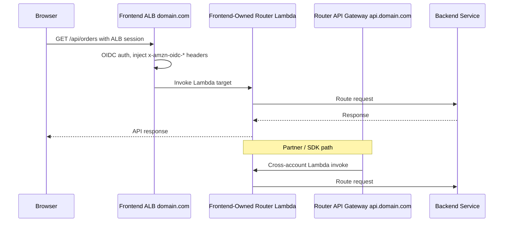
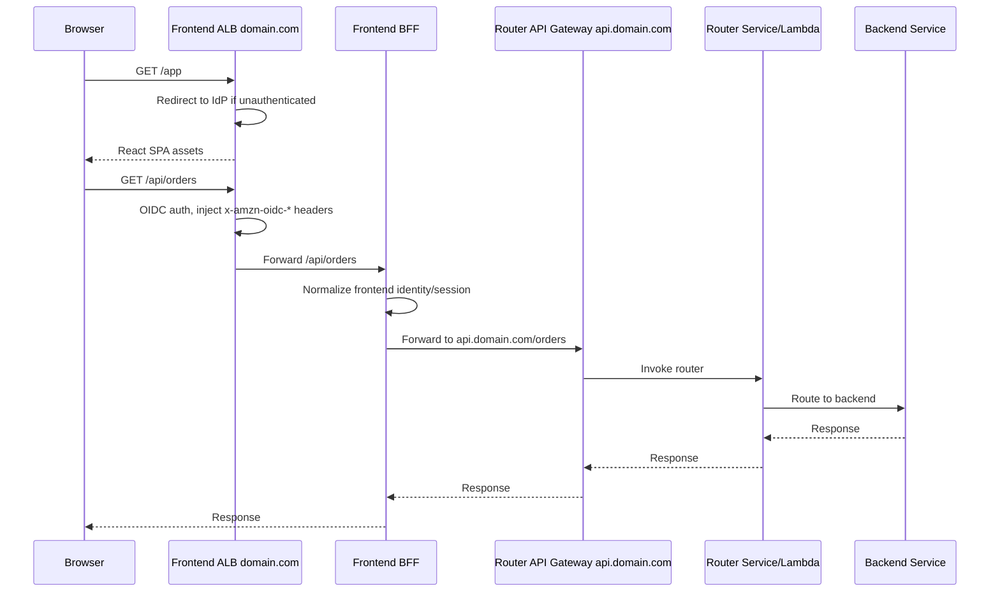
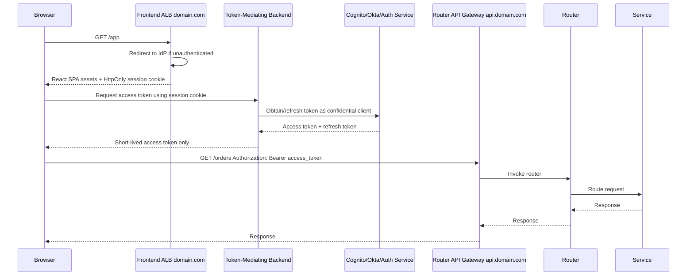
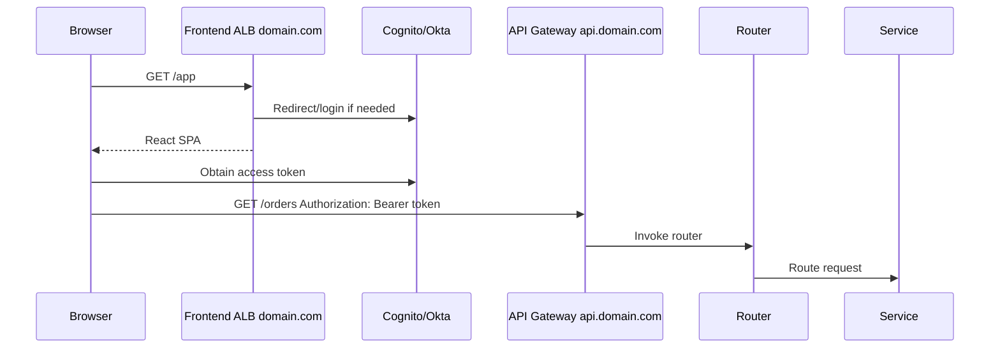
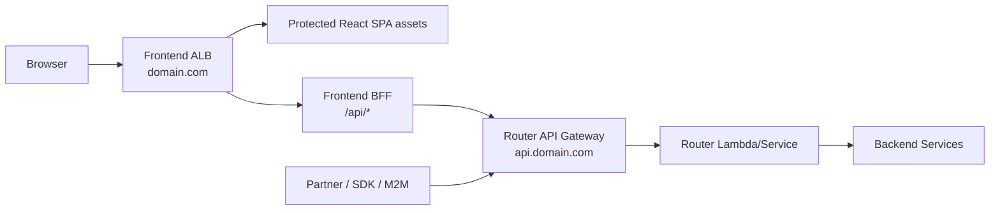

## Context

We need an AWS-native architecture that:

- serves a protected React SPA
- prevents unauthenticated access to frontend assets
- supports Cognito today but can evolve to Okta/other IdPs
- provides a single API front door/router for many backend services
- supports partner SDKs and machine-to-machine auth
- provides a path to API Gateway features like mTLS
- works in GovCloud / FedRAMP High constraints
- keeps frontend-specific integration/config/telemetry concerns out of the public SDK

The key design question is how `domain.com`, `domain.com/api/*`, and `api.domain.com` should interact across frontend-owned and router-owned infrastructure.

---

## Option 1 — Shared frontend-owned router Lambda behind both ALB and API Gateway

In this option, frontend owns the Lambda, consolidates authorizer/router behavior into it, and both frontend ALB and router API Gateway invoke it.

### Good

- Avoids an extra BFF hop for frontend API requests.
- Frontend Lambda can directly access ALB OIDC headers such as `x-amzn-oidc-accesstoken`.
- API Gateway can cross-account invoke the same Lambda.
- Router team can still own `api.domain.com`, throttling, WAF, mTLS, custom domains, etc.

### Bad

- Ownership gets blurry: frontend now owns the real routing/auth behavior.
- API Gateway becomes mostly a shell in front of frontend-owned logic.
- ALB auth context and API Gateway auth context are different; Lambda must support both event/auth models.
- API Gateway mTLS only protects `api.domain.com`, not `domain.com/api/*`.
- Partner-facing SDK behavior depends on frontend-owned Lambda deployments.
- Harder to reason about public API lifecycle if router team does not own the core router implementation.

### Fit

Technically valid, but organizationally risky unless frontend is intended to own the router long-term.

---

## Option 2 — Frontend BFF forwards to router-owned API Gateway

Frontend owns the SPA, ALB, and a small BFF. Router team continues to own API Gateway and routing.

### Good

- Clear ownership boundary:
  - frontend owns frontend experience and frontend-only services
  - router owns public API front door, routing policy, SDK contract, mTLS path
- Keeps partner API and frontend API aligned through one router.
- Frontend can keep same-origin browser calls to `domain.com/api/*`.
- Avoids exposing partner-oriented auth details directly in browser code.
- Frontend-only endpoints can stay out of partner SDKs.
- Router team can evolve mTLS, throttling, WAF, API Gateway policies without frontend needing to own them.
- BFF can translate ALB/OIDC session context into router-compatible auth context.
- Supports future IdP swap by localizing frontend session handling.

### Bad

- Adds one network hop.
- BFF must be operated, monitored, scaled, and secured.
- Need clear contract between BFF and router.
- If implemented as Lambda, cold starts could add latency.
- If BFF performs token introspection or IdP calls per request, latency can grow.

### Latency note

A lightweight warm BFF usually adds approximately **single-digit to low double-digit milliseconds** inside the same AWS region. The bigger latency risks are cold starts, per-request token introspection, NAT/VPC egress, and non-pooled HTTP clients.

### Fit

Best balance of ownership, extensibility, and security.

---

## Option 3 — Token-mediating backend pattern

In this model, the frontend backend handles OAuth responsibilities as a confidential client. It obtains, stores, and refreshes tokens server-side, then gives the browser a short-lived access token when needed. The browser uses that access token to call the router API directly.

This is lighter than a full BFF because the backend does **not** proxy every API request and response. It is also less secure than a full BFF because access tokens are exposed to browser JavaScript, but it still improves on a pure browser OAuth client because refresh tokens and client credentials remain server-side.

### Good

- Lighter than a full BFF because normal API traffic goes directly from browser to router.
- Avoids proxying all requests and responses through frontend infrastructure.
- Refresh tokens and confidential-client credentials stay server-side.
- Prevents browser-side malicious code from directly stealing refresh tokens.
- Preserves the router API as the single front door for both frontend and partner traffic.
- Easier to swap Cognito for Okta later if token handling is centralized in the token-mediating backend.

### Bad

- Less secure than a full BFF because access tokens are still exposed to browser JavaScript.
- XSS can steal the current access token or ask the token-mediating backend for a fresh access token while the user session is valid.
- Requires CORS because the browser calls `api.domain.com` directly.
- Frontend must handle access-token lifetime, retry, and refresh coordination.
- Frontend-only endpoints still need a separate home and should not accidentally enter the partner SDK contract.
- API auth and frontend asset auth remain separate enforcement points.

### Fit

Good when avoiding a BFF proxy hop is important, while still keeping refresh tokens and OAuth confidential-client responsibilities out of the browser. It is a middle ground: more secure than a pure SPA OAuth client, but less secure and less centrally controlled than a full BFF.

---

## Option 4 — Browser calls `api.domain.com` directly

Frontend serves the SPA behind ALB auth, but the React app calls the router API directly with bearer tokens.

### Good

- Simple infrastructure path.
- No BFF hop.
- Router remains the single API front door.
- Good alignment with partner SDK model.

### Bad

- Browser must manage API tokens directly.
- CORS is required.
- Frontend asset auth and API auth become separate flows.
- Harder to hide frontend-only integration/config endpoints.
- Less control over session-to-token mediation.
- More coupling between SPA and IdP/token details.

### Fit

Reasonable for a pure SPA model, but less attractive when frontend already needs a backend service and wants frontend-only integration/config behavior.

---

## Recommendation

Recommend **Option 2: Frontend BFF forwards to router-owned API Gateway**. Consider Option 3 only if the extra BFF proxy hop becomes unacceptable and the team is comfortable exposing short-lived access tokens to browser JavaScript.

### Recommended ownership

#### Frontend team owns

- `domain.com`
- ALB authentication for protected frontend access
- React SPA delivery
- frontend BFF
- frontend-only integration/config/telemetry endpoints
- translation of ALB session/OIDC context into router-compatible requests

#### Router team owns

- `api.domain.com`
- API Gateway
- mTLS configuration
- WAF/throttling/usage plans as needed
- router Lambda/service
- route-based access control
- OpenAPI contract
- generated partner SDKs

#### Backend service teams own

- service implementation
- tag/resource/business authorization
- service-local policies

### Why this recommendation

This keeps the router as the authoritative public API boundary while letting frontend own the user-facing application boundary. It supports authenticated frontend assets, same-origin frontend API calls, partner SDKs, machine-to-machine auth, and future API Gateway mTLS without making frontend own the entire public API routing surface.

The extra BFF hop is usually acceptable if the BFF is lightweight, warm, uses connection pooling, caches IdP metadata/JWKS, and avoids per-request token introspection.
