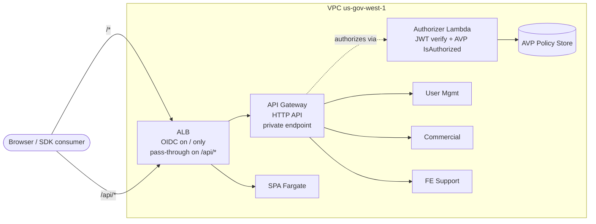
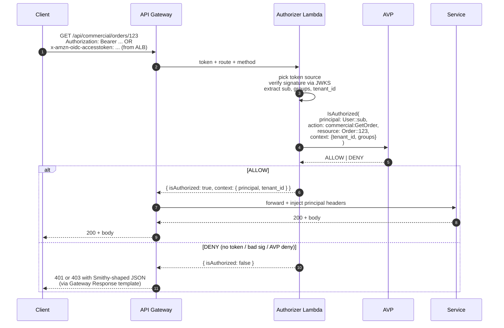

# Centralized API Router

Companion to [index.md](./index.md). Revises the per-service authorizer model into a single API router so we don't duplicate auth, AVP, and error shaping across N services.

## Why the per-service model breaks down

The original design put a shared `authz-lib` inside each service. That works for 3 same-language services in a monorepo, but degrades fast:

- **Duplication.** Every service re-wires JWT verification, AVP calls, and Smithy error shaping. Easy to drift between services.
- **Language lock-in.** A Go or Python service has to re-implement the library.
- **Cross-cutting features get re-solved each time.** Rate limiting, throttling, request validation, partner API keys, structured access logs — every service team owns these or nobody does.
- **SDK error contract is fragile.** If one service emits an `UnauthorizedException` with a slightly different shape, generated SDK clients see schema drift.
- **ALB rule sprawl.** Each new service needs its own `/api/<svc>/*` rule, plus auth-posture decisions baked into the rule.

The fix is to lift auth, authz, and error shaping into **one router** and let services do only business logic.

## Topology

API Gateway HTTP API behind the ALB, owning everything under `/api/*`.



- **`/`** keeps ALB OIDC for browser auth. Cookie gates SPA assets — unchanged.
- **`/api/*`** on the ALB pass-through forwards to API Gateway via a VPC Link (private integration). No ALB auth action on this rule.
- **API Gateway HTTP API** owns API routing, authorization, validation, throttling.
- **Services** receive already-authorized requests with principal context in headers. They enforce business rules only.

## Authorizer Lambda

One Lambda. One AVP call site. One JWT verifier.



**Token source resolution.** The authorizer reads whichever is present:
- `Authorization: Bearer <jwt>` — SDK / machine-to-machine / direct API callers
- `x-amzn-oidc-accesstoken` — SPA → ALB → API Gateway path (injected by ALB OIDC)

Both flow through the same verify+AVP path. One auth model, two transports.

**Action mapping.** Map `(HTTP method, route)` to a Cedar action string. e.g. `GET /api/commercial/orders/{id}` → `commercial:GetOrder`. Keep this mapping in the authorizer (or generated from the Smithy model — see below).

**Caching.** API Gateway authorizer result caching keyed on the identity source. Modest TTL (e.g. 60 s) cuts AVP/JWKS load without making revocation feel slow. Disable on sensitive write paths if needed.

## Smithy-shaped errors via Gateway Responses

API Gateway lets you override default error responses with custom JSON templates. Define them once to match the Smithy error model:

```jsonc
// UNAUTHORIZED (401)
{
  "__type": "UnauthorizedException",
  "message": "$context.error.message",
  "requestId": "$context.requestId"
}

// ACCESS_DENIED (403)
{
  "__type": "ForbiddenException",
  "message": "Not permitted",
  "requestId": "$context.requestId"
}

// MISSING_AUTHENTICATION_TOKEN (401)
// BAD_REQUEST_BODY (400) → ValidationException, etc.
```

Generated SDK clients deserialize these into typed exception classes. Callers write:

```ts
try {
  await client.getOrder({ id: "123" });
} catch (e) {
  if (e instanceof UnauthorizedException) { /* refresh token, retry */ }
  if (e instanceof ForbiddenException)    { /* show "no access" UI */ }
}
```

Define the templates once in the API Gateway CDK construct. Every service inherits them.

## What services look like now

Stripped-down. The handler receives a pre-authorized request with principal context in headers (e.g. `x-principal-sub`, `x-principal-tenant-id`, `x-principal-groups`). It can:

- Trust them, because the only network path in is via API Gateway → VPC Link.
- Use them for tenancy filtering, audit logs, ABAC inside the data layer.
- Not call AVP. Not verify JWTs. Not shape 401/403 errors.

If a service needs *resource-level* AVP checks beyond what the route-level authorizer covers (e.g. "this user can call `GetOrder`, but can they see *this specific* order?"), it can call AVP itself — but only for that finer-grained decision. The coarse gate stays at the router.

## Cross-cutting features you get for free

| Concern | How API Gateway handles it |
|---|---|
| Rate limiting | Per-route throttle settings |
| Burst protection | Built-in token-bucket per route |
| Request validation | Schema validators from OpenAPI (generated from Smithy) |
| Access logs | Structured, configurable, to CloudWatch / S3 / Firehose |
| Tracing | Native X-Ray integration |
| Partner API keys | REST API only (see HTTP vs REST below) |
| WAF | Attach a WebACL at the API Gateway stage |

## HTTP API vs REST API

API Gateway has two flavors. Pick based on whether you need partner API keys.

| | HTTP API | REST API |
|---|---|---|
| Cost | ~70% cheaper | More expensive |
| Latency | Lower | Higher |
| Lambda authorizers | Yes | Yes |
| JWT authorizer (built-in, no Lambda) | Yes | No |
| Usage plans + API keys | **No** | **Yes** |
| Request validation | Limited | Full |
| Caching | No | Yes (per-stage) |

**Default to HTTP API.** Switch to REST API only when you need to issue partner API keys with usage plans, or per-stage response caching. The authorizer/services/Smithy-error patterns are identical either way.

> Note: you could use the **built-in JWT authorizer** on HTTP API to skip the Lambda hop. But we still need a Lambda to call AVP, so the JWT authorizer alone isn't enough. Stick with a Lambda authorizer that does both.

## What this changes vs. [index.md](./index.md)

- **Removes** the `authz-lib` shared library as the per-service auth path. Library still exists but only for the rare in-service fine-grained AVP check.
- **Adds** API Gateway HTTP API as the API-path front door, sitting behind the ALB.
- **Adds** the authorizer Lambda as the one place JWT verification and AVP `IsAuthorized` live.
- **Adds** Gateway Response templates for Smithy-shaped errors.
- **ALB still does** browser OIDC for SPA paths and pass-through for `/api/*`.

## Trade-offs

- **One extra hop** (ALB → APIG → service). Single-digit ms in-region. Acceptable for almost all APIs; punch through ALB → service directly only for a specifically latency-sensitive endpoint.
- **Two systems to operate** (ALB + API Gateway) instead of one. Worth it once you're at 3+ services or expect language diversity.
- **API Gateway HTTP API in GovCloud** is available in both `us-gov-west-1` and `us-gov-east-1`. REST API also available. No GovCloud blockers here.
- **Per-request cost** is small but non-zero. At very high RPS, monitor; not a concern at typical SaaS volumes.

## Action mapping from Smithy

Worth doing once the model stabilizes: generate the `(method, route) → Cedar action` table from the Smithy model so the authorizer's mapping can't drift from the SDK's expectations. A small build step that walks the Smithy operations and emits a JSON map the authorizer reads at cold start.

## Open questions

1. **VPC Link vs public API Gateway endpoint.** Private VPC Link keeps API Gateway off the public internet — strictly better for GovCloud posture. Default to that; only expose publicly if you have a reason (e.g. third-party callers that can't reach via ALB).
2. **Where does fine-grained AVP go?** Coarse: in authorizer. Fine (per-resource): in service. Need a convention to keep teams from re-checking the coarse decision.
3. **Cache TTL on the authorizer.** Tighter = more AVP load, faster revocation. Looser = cheaper, staler. Default 60s, revisit per route as needed.
