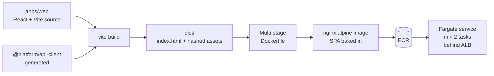

# Frontend Story

Companion to [index.md](./index.md), [api-router.md](./api-router.md), [session-management.md](./session-management.md), [partner-api.md](./partner-api.md). Covers what the React SPA actually is, how it's built, how it talks to APIs, and what's different about doing this in gov.

## Stack

| Concern | Choice | Notes |
|---|---|---|
| Bundler | Vite | Fast HMR, sensible defaults, native ESM |
| Framework | React 18+ | Concurrent features for streaming UX |
| Language | TypeScript (strict) | No `any`, no `!` escape hatches |
| Styling | Tailwind | Utility-first, ships only used classes |
| Components | shadcn/ui | Headless primitives, owned in-repo |
| Router | TanStack Router | Type-safe routes, search-param schemas |
| Server state | TanStack Query | Cache + retry + invalidation for SDK calls |
| Forms | React Hook Form + Zod | Schema-validated, minimal re-renders |
| Client state | Zustand or React Context | Only when needed; default to server state |
| Telemetry | OpenTelemetry web SDK | Spans for nav + fetch; exported via fe-support |
| Testing | Vitest + Playwright | Unit + E2E |
| A11y testing | axe-core in Playwright | Section 508 compliance gate |

## What the SPA *is*

A single Vite-built React app that lives at `https://app.example.gov`. The entire UI is client-side rendered. There is no SSR, no Next.js, no server-rendered shell. nginx serves `index.html` and hashed assets; React boots in the browser and takes over.

This is deliberate:

- SSR adds a Node runtime to the path and pulls server-side state management into the frontend service.
- The auth model already requires an ALB OIDC cookie before the SPA can even *load* — there's no useful "preloaded HTML" to serve unauthenticated users.
- Gov audit posture is simpler when the frontend container is just nginx serving static assets.

If a future page genuinely needs SSR (SEO, share-card previews of public content), peel that page off as a separate small service. Don't promote the whole SPA.

## Build pipeline



- **SDK is a build input**, not a runtime fetch. The TS client is generated from Smithy, published to the internal npm registry, and pinned in `apps/web/package.json`. Type-safe API calls compile against it.
- **`vite build`** emits `dist/` with hashed assets and a single `index.html` referencing them.
- **Dockerfile** is multi-stage: `node:alpine` builder runs `pnpm install && pnpm build`, `nginx:alpine` runtime copies `dist/` into `/usr/share/nginx/html` along with a custom `nginx.conf`.
- **Tagging**: image tag = git SHA. Promote to `prod` by re-tagging.
- **Deploy**: CDK pipeline updates the Fargate service task definition to the new tag. Health checks then rolling replace.

## nginx config (the part that matters)

```nginx
server {
  listen 80;

  # SPA history fallback — every unknown path returns index.html
  location / {
    root /usr/share/nginx/html;
    try_files $uri /index.html;
  }

  # Hashed assets are immutable
  location ~* "\.(?:js|css|woff2|svg|png|jpg|webp|avif)$" {
    root /usr/share/nginx/html;
    add_header Cache-Control "public, max-age=31536000, immutable";
    gzip_static on;
    brotli_static on;
  }

  # index.html never cached
  location = /index.html {
    root /usr/share/nginx/html;
    add_header Cache-Control "no-cache, no-store, must-revalidate";
  }

  # Security headers (more in the section below)
  add_header X-Frame-Options DENY always;
  add_header X-Content-Type-Options nosniff always;
  add_header Referrer-Policy strict-origin-when-cross-origin always;
  add_header Permissions-Policy "geolocation=(), microphone=(), camera=()" always;
  add_header Content-Security-Policy "..." always;  # see CSP section
}
```

Worth noting: ALB has already validated the OIDC session before any request reaches nginx. The container doesn't re-auth.

## SDK consumption from the SPA

The SPA imports the same SDK partners would use, configured for **cookie auth, same-origin**:

```ts
// apps/web/src/lib/api.ts
import { CommercialClient, UserManagementClient } from '@platform/api-client';

const baseConfig = {
  endpoint: '',                  // same-origin → relative paths
  credentials: 'include' as const, // attach ALB session cookie
};

export const commercial = new CommercialClient(baseConfig);
export const users = new UserManagementClient(baseConfig);
```

Wrap in TanStack Query for cache + retry:

```ts
const { data, error } = useQuery({
  queryKey: ['order', id],
  queryFn: () => commercial.getOrder({ id }),
  retry: (failureCount, error) => {
    if (error instanceof UnauthorizedException) return false;
    if (error instanceof ForbiddenException) return false;
    return failureCount < 2;
  },
});
```

Generated SDK errors are typed — the SPA's catch blocks are exhaustive at compile time.

## Auth: what the SPA does and doesn't do

**Doesn't do:**
- Touch tokens. They never enter the JS heap.
- Refresh anything. ALB handles it.
- Track the IdP at all. ALB is the only thing the SPA knows.
- Implement OAuth flows. Logging in = following a redirect.

**Does do:**
- Send `credentials: 'include'` on every fetch so the ALB cookie attaches.
- Catch `UnauthorizedException` from the SDK and trigger re-login (see [session-management.md](./session-management.md)).
- Track idle activity and show the warning modal at T-minus-warning.
- Hit `/api/fe-support/heartbeat` on Continue or periodic interval.
- Coordinate logout — clear app session, then redirect to IdP `end_session_endpoint`.

```ts
// 401 interceptor — installed once in the app shell
queryClient.getQueryCache().subscribe((event) => {
  if (event?.query?.state?.error instanceof UnauthorizedException) {
    showSessionExpiredModal({
      onContinue: () => window.location.reload(),
    });
  }
});
```

## Routing + code splitting

- **TanStack Router** with file-based routes. Each route is a lazy-loaded chunk.
- **Authentication is enforced upstream** (ALB cookie) — the SPA doesn't have "auth gates" on routes. It loads only if the user is signed in.
- **Authorization gates inside the SPA** are UX hints, not security boundaries: hide buttons the user can't use, but trust the API's 403 as truth. AVP is the only authoritative authz; SPA-side checks are stale by design.

## Telemetry (OpenTelemetry)

- **`@opentelemetry/sdk-trace-web`** + auto-instrumentations for `fetch` and document load.
- Spans include `traceparent` header on outbound API calls — backend services continue the trace through ADOT → X-Ray.
- **Sink endpoint**: `POST /api/fe-support/telemetry` (batched). The frontend-support service forwards to ADOT.
- **What we trace**: route navigations, API calls (auto), user-initiated actions worth observing (`click_create_order`).
- **What we don't trace**: every render, every state update — noisy.
- **PII**: scrubbed at the frontend-support service before export. Don't trust client-side scrubbing alone.

```ts
const tracer = trace.getTracer('web');

await tracer.startActiveSpan('user.create_order', async (span) => {
  span.setAttribute('tenant_id', tenant.id);
  try { return await commercial.createOrder(input); }
  finally { span.end(); }
});
```

## Feature flags + config

- SPA boot fetches `/api/fe-support/config` → JSON of flags resolved server-side from AppConfig for the current user.
- Flags are evaluated **once per session** by default. Long-lived sessions can subscribe to refresh.
- **Don't put secrets in flags.** Flags drive UI behavior, not server logic.

```ts
const flags = await api.feSupport.getConfig();
if (flags['commercial.bulk-orders']) { /* show new UI */ }
```

## CSP and security headers

Gov audits look for these. Set at nginx, validated in Playwright tests.

```
Content-Security-Policy:
  default-src 'self';
  script-src 'self';
  style-src 'self' 'unsafe-inline';        # Tailwind requires inline at runtime; tighten if you precompile
  img-src 'self' data: blob:;
  font-src 'self';
  connect-src 'self' https://auth.example.gov;  # API calls + IdP redirect
  frame-ancestors 'none';
  base-uri 'self';
  form-action 'self' https://auth.example.gov;
  upgrade-insecure-requests;
```

- `frame-ancestors 'none'` matches `X-Frame-Options: DENY`. Both for old + new clients.
- `connect-src` allows the IdP for OIDC redirects only.
- **No third-party CDNs.** Self-host everything. Gov auditors flag external `script-src` immediately.
- Headers are part of nginx config; CDK injects environment-specific overrides at deploy.

## Accessibility (Section 508 / WCAG 2.1 AA)

Non-negotiable for gov. Build it in, don't bolt it on.

- **shadcn/ui primitives** are accessible by default (radix-ui under the hood) — keyboard, ARIA, focus management.
- **axe-core in Playwright**: every E2E run scans for violations. CI fails on serious/critical.
- **Manual review**: keyboard-only navigation, screen reader spot checks, color contrast audit.
- **Skip-to-content link**, semantic landmarks, focus-visible styles, `prefers-reduced-motion` support.
- **Forms**: every input has a `<label>`, validation messages are announced via `aria-live`.
- **Document the conformance level** in a VPAT (Voluntary Product Accessibility Template). Required for many gov procurements.

## Local development

The biggest pain: prod requires ALB OIDC, but devs don't want to round-trip Cognito on every hot reload. Three options, pick one:

**Option A (recommended): Dev IdP + local proxy.**

- Run a small dev Cognito User Pool (or `oidc-server-mock` Docker image) with seeded test users.
- Vite dev server proxies `/api/*` to a local `mock-alb` (small Express app that adds `x-amzn-oidc-data` signed with a dev key) → real backend services in a dev AWS account.
- Closest to prod behavior, catches integration bugs early.

**Option B: Auth-bypass dev mode.**

- A `VITE_DEV_USER` env var injects a fake principal at the SDK layer.
- Backend services have a dev-only auth bypass keyed on a header (only enabled in dev environments).
- Faster, lower fidelity. Easy to ship the bypass to prod by mistake — guard rigorously.

**Option C: Real Cognito in a dev account.**

- Vite proxies through a deployed dev ALB.
- Highest fidelity, slowest iteration (each hot reload calls the network).
- Useful for pre-merge testing, not day-to-day.

Use **A** for the main dev loop and **C** for pre-merge.

## Testing

- **Unit (Vitest)**: components, hooks, utilities. JSDOM environment. Mock the SDK at the boundary.
- **Integration (Vitest + MSW)**: components against a mocked SDK with realistic response shapes (derived from Smithy types — no schema drift).
- **E2E (Playwright)**: critical flows against the dev environment. Uses real Cognito with seeded test users. Includes axe-core a11y scans.
- **Visual regression** (optional, Playwright `toHaveScreenshot`): on shadcn components customized for the design system.
- **Smoke tests in prod**: after deploy, a tiny Playwright suite hits a synthetic user account. Page + alert on failure.

## State management

Start with **nothing**. Add as needed, in this order:

1. **TanStack Query** for everything from the server. This handles caching, retries, optimistic updates, invalidation. Most app state is server state.
2. **URL / search params** for shareable UI state (filters, current page, sort).
3. **React Context** for theme, current user, feature flags — global readonly stuff.
4. **Zustand** only when a piece of state is genuinely cross-cutting and client-owned (e.g. command palette open/closed, multi-step wizard draft).

Avoid Redux unless there's a specific reason. The above covers ~95% of needs.

## Performance

- **Code splitting** is automatic per route via TanStack Router + Vite. No manual work.
- **Image optimization**: AVIF + WebP fallback for raster, SVG for icons (preferably as React components via `vite-plugin-svgr`).
- **Bundle budget**: enforce per-route max (e.g. 200 KB compressed). CI fails over budget.
- **Lighthouse CI** on a representative route per PR. LCP < 2.5s, TBT < 200ms on a 4G connection.
- **No edge caching** because GovCloud has no CloudFront — keep total payload small to compensate.

## What this means for the partner SDK story

[partner-api.md](./partner-api.md) covers public partners using the SDK. The frontend uses the **same SDK** in a different configuration:

| | First-party SPA | Partner system |
|---|---|---|
| Endpoint | `app.example.gov` (same-origin, relative) | `api.example.gov/v1` |
| Auth | ALB session cookie (transparent) | OAuth client credentials → Bearer |
| Token in JS heap? | No | Yes (SDK manages) |
| Error types | Same Smithy-generated classes | Same Smithy-generated classes |
| Versioning | Tracks latest internal version | Pinned to a stable major (e.g. v1) |

One generated client. Two configurations. Zero divergence in error shapes or response types.

## Open questions

1. **shadcn vs. a heavier component library** (Material, Ant Design). shadcn gives ownership at the cost of building more in-house. Default to shadcn; switch only if speed-to-market trumps customization.
2. **Monorepo layout**: `apps/web` + `packages/api-client` + `packages/ui` in pnpm workspaces is standard. Worth setting up day one.
3. **Where do generated SDK types live?** Published package (versioned, decoupled) vs. monorepo-local (simpler, tighter coupling). Default to published — the SDK is a product, not an internal helper.
4. **Service worker for offline?** Probably not for a gov internal SaaS; adds complexity and doesn't match typical access patterns.
5. **Theming / multi-brand?** If the same codebase serves multiple gov agencies with different branding, design tokens (CSS variables) configured per tenant at boot. Don't pre-optimize if not in scope.
