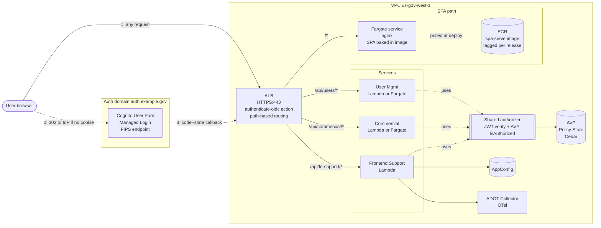
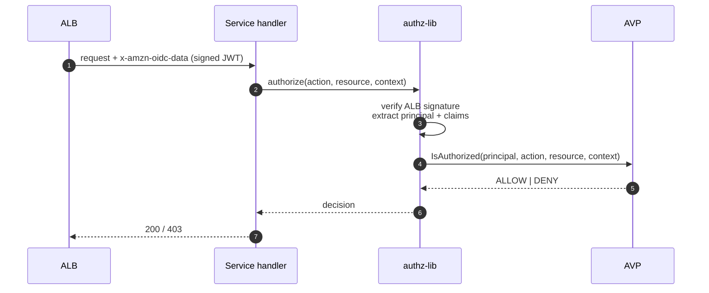
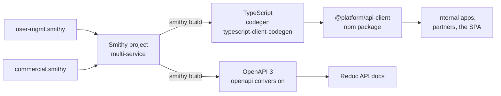

# GovCloud SaaS Platform Architecture

## Requirements summary

| # | Requirement | Design choice |
|---|---|---|
| 1 | GovCloud-deployable | `us-gov-west-1` primary, no commercial-region dependencies |
| 2 | React SPA frontend | S3-hosted bundle, served behind the front door |
| 3 | Pluggable IdP (Cognito → Okta) | OIDC at the boundary; ALB `authenticate-oidc` action |
| 4 | Unified API front door | ALB with path-based routing |
| 5 | Separate user-mgmt + commercial services | Two services, isolated stacks, shared authorizer |
| 6 | Combined SDK for those two services | Smithy multi-service model + one bundled TS client |
| 7 | RBAC on API calls | AVP (Cedar) `IsAuthorized` from each service |
| 8 | Redirect unauth users to managed login | ALB OIDC action — built-in 302 to IdP |
| 9 | Gate frontend assets behind auth | ALB session cookie required for `/*` |
| 10 | Frontend support service (AppConfig, OTel, integrations) | Third service, no SDK emitted |

## GovCloud constraints that drove the design

These eliminate the "obvious" CloudFront + Lambda@Edge pattern:

- **CloudFront is not offered inside GovCloud regions.** You can run commercial CloudFront pointed at a GovCloud origin, but that places the edge layer outside the GovCloud boundary — usually a non-starter for FedRAMP High / IL5. ([CloudFront GovCloud docs](https://docs.aws.amazon.com/govcloud-us/latest/UserGuide/setting-up-cloudfront.html))
- **Lambda@Edge functions deploy only to `us-east-1`,** so they aren't available either. ([Lambda@Edge restrictions](https://docs.aws.amazon.com/AmazonCloudFront/latest/DeveloperGuide/edge-functions-restrictions.html))
- **AVP is available in GovCloud, but identity sources (Cognito pool bindings) are not.** Means policy stores can't use `IsAuthorizedWithToken` against a Cognito pool — call `IsAuthorized` with explicit principal/action/resource/context after verifying the JWT yourself. ([AVP GovCloud docs](https://docs.aws.amazon.com/govcloud-us/latest/UserGuide/govcloud-verifiedpermissions.html))
- **Cognito is in both GovCloud regions and Managed Login is supported,** but only via FIPS endpoints (`*.auth-fips.us-gov-west-1.amazoncognito.com`). ([Managed Login in GovCloud](https://aws.amazon.com/about-aws/whats-new/2025/03/amazon-cognito-managed-login-rich-branding-end-user-journeys-aws-govcloud-us-regions/), [Cognito GovCloud docs](https://docs.aws.amazon.com/govcloud-us/latest/UserGuide/govcloud-cog.html))

→ **The front door is an ALB, not CloudFront.** ALB's native `authenticate-oidc` action gives us the managed-login redirect, session cookie, and IdP swap-out for free.

## High-level architecture



## Component breakdown

### Front door — ALB

- **Listener:** HTTPS 443, ACM cert from `us-gov-west-1`.
- **Default action:** `authenticate-oidc` (or `authenticate-cognito` if pinning to Cognito). On success → forward; on missing/invalid cookie → 302 to IdP `/authorize`.
- **Session cookie** `AWSELBAuthSessionCookie-*` (`HttpOnly`, `Secure`, `SameSite=Lax`). One cookie covers SPA and API requests — assets and APIs are gated identically.
- **Listener rules (priority order):**
  1. `/api/users/*` → User Mgmt target group
  2. `/api/commercial/*` → Commercial target group
  3. `/api/fe-support/*` → Frontend Support target group
  4. `/health` → fixed 200 (unauth-bypass rule, separate listener rule with `authenticate-oidc` removed)
  5. `/*` → SPA-serve target group (Lambda)
- **Identity propagation:** ALB injects `x-amzn-oidc-data` (signed JWT with claims), `x-amzn-oidc-accesstoken`, `x-amzn-oidc-identity` on every backend call. Backends verify the ALB signature against the regional public-key endpoint, not the IdP — keeps the IdP swap clean.

ALB OIDC works against any standards-compliant IdP, which is the swap-out point. Cognito today, Okta tomorrow: change the `Issuer`, `AuthorizationEndpoint`, `TokenEndpoint`, `UserInfoEndpoint`, and `ClientId/Secret` on the listener action — no app changes.

### SPA delivery

**Fargate + nginx, not Lambda.** ALB-target Lambdas are capped at a **1 MB response payload** (hard limit, can't be raised — [docs](https://docs.aws.amazon.com/elasticloadbalancing/latest/application/lambda-functions.html)). A typical Vite-built React bundle exceeds that on a single chunk. Lambda response streaming exists but is not available for ALB targets — only Function URLs.

- **Build pipeline:** Vite build → multi-stage Dockerfile (`node:alpine` builder, `nginx:alpine` runtime with the built SPA copied into `/usr/share/nginx/html`) → push tagged image to ECR.
- **Runtime:** small Fargate service (256 CPU / 512 MB is plenty), min 2 tasks across AZs, behind an ALB target group on port 80.
- **nginx config:**
  - `try_files $uri /index.html;` for SPA history fallback.
  - Hashed asset paths (`/assets/*.{js,css,svg,...}`) → `Cache-Control: public, max-age=31536000, immutable`.
  - `index.html` → `Cache-Control: no-cache`.
  - gzip + brotli on.
- **No re-auth in the container.** ALB has already validated the session — nginx serves whatever the request asks for. If you want to assert the signed `x-amzn-oidc-data` is present (defense-in-depth against bypassing ALB), add a one-line nginx check.
- **Releases** = new image tag + Fargate service deploy. Rollback = redeploy the old tag.

> **Alternative considered:** Fargate task with an `aws s3 sync` init step pulling assets from a private S3 bucket. Useful if you want to decouple SPA releases from container deploys — but adds a moving part. Default to baking the bundle into the image.

### Identity provider — Cognito (default)

- **User Pool** in `us-gov-west-1`, Essentials tier, **Managed Login** branded UI on a custom domain (e.g. `auth.example.gov`).
- **App client:** Authorization Code + PKCE, allowed callback `https://app.example.gov/oauth2/idpresponse` (ALB's standard callback path).
- **MFA:** required (FedRAMP expectation); TOTP + WebAuthn.
- **Groups/attributes** projected as custom claims used by AVP (`cognito:groups`, custom `tenant_id`).

**Swap to Okta (or any OIDC IdP):** Configure ALB OIDC action with Okta endpoints; map equivalent claims (`groups`, `tenant_id`). Backend code only consumes ALB-signed claims, so no service changes.

### Services

Three services, each its own CDK stack, each independently deployable:

| Service | Purpose | SDK? | Runtime |
|---|---|---|---|
| `user-management` | users, groups, roles, invitations | yes (combined) | Lambda or Fargate |
| `commercial` | the actual product domain | yes (combined) | Lambda or Fargate |
| `frontend-support` | AppConfig fetch, telemetry sink, third-party integration callbacks | no | Lambda |

Lambda vs. Fargate is a per-service call (latency, cold-start tolerance, long-running work). The architecture doesn't care.

### Authorization — AVP + shared authorizer library

Authorization is **in-service**, not at the ALB or API Gateway, because GovCloud AVP can't bind to Cognito as an identity source. Flow per request:



- Shared TS package `@platform/authz` published from the monorepo. Every service calls `authz.check(req, { action: "commercial:CreateOrder", resource: { type: "Order", id } })`.
- **Cedar policy store** holds Cedar templates + per-tenant policy attachments.
- **Principal entity** is built from ALB claims (`sub`, `cognito:groups`, `tenant_id`) — no token submission to AVP, since the identity-source binding isn't available in GovCloud.

### Frontend support service

- `/api/fe-support/config` — returns AppConfig flag set for the user (server-side fetch, no AppConfig SDK in the browser).
- `/api/fe-support/telemetry` — accepts batched OTel spans from the SPA, forwards to **ADOT Collector** (sidecar Lambda extension or Fargate task) → X-Ray / CloudWatch / Prometheus per env.
- `/api/fe-support/integrations/*` — one-off third-party webhooks/handlers.
- No SDK emitted; SPA calls `fetch('/api/fe-support/...')` directly with relative URLs.

## SDK generation

**Smithy** for the model, one combined TS client for the two product services. Pipeline:



- One npm package `@platform/api-client` exposes `UserManagementClient` and `CommercialClient` from the same import.
- Frontend support has no Smithy model and is not exported.
- Service handlers can be generated from Smithy too (server stubs), or hand-written with the Smithy types as the source of truth.
- Why Smithy over OpenAPI-first: better multi-service composition, native AWS SDK ergonomics, easier to add code generators per language later (Python, Go). OpenAPI is still produced as a byproduct for human-readable docs and third-party tools.

## IdP abstraction — the swap-out contract

Everything between the IdP and a service request flows through three boundaries:

1. **ALB listener config** — only place the IdP's URL/secret lives.
2. **`x-amzn-oidc-data` JWT** — ALB-signed, IdP-agnostic. Always the same shape.
3. **`authz-lib` claim mapping** — one file maps OIDC claims → AVP principal entity. Has Cognito and Okta variants selected by env var.

Concretely, swapping Cognito → Okta is:
- Update the ALB OIDC action (CDK construct param).
- Add Okta as a trusted issuer in `authz-lib`'s mapping file.
- Configure groups in Okta to mirror the existing claim names.

No application or SDK changes.

## Deployment topology (CDK)

```
infra/
  bin/app.ts
  lib/
    network-stack.ts          # VPC, subnets, endpoints
    auth-stack.ts             # Cognito user pool, managed login, app client
    frontdoor-stack.ts        # ALB, listener, OIDC action, target groups
    spa-stack.ts              # ECR repo, Fargate service, nginx task def, deploy pipeline
    authz-stack.ts            # AVP policy store, schema, base policies
    service-user-mgmt-stack.ts
    service-commercial-stack.ts
    service-fe-support-stack.ts
    observability-stack.ts    # ADOT, dashboards, alarms
```

- Each service stack registers its target group with `frontdoor-stack` via cross-stack refs (or SSM).
- One CDK app, multiple environments (`dev`, `staging`, `gov-prod`). Same code, different context.

## Observability

- **OTel** end-to-end: SPA → `frontend-support` → ADOT → CloudWatch Logs + X-Ray.
- Each service exports traces via ADOT Collector.
- ALB access logs to S3, structured logs from Lambda to CloudWatch.
- Trace correlation via `traceparent` header propagated by the SDK and ALB.

## Open questions (worth your call)

1. **Lambda vs Fargate per service** — Lambda is cheaper and simpler for `user-management` and `frontend-support`; `commercial` may want Fargate if requests are long-running or hold connections. Default to Lambda unless a service needs otherwise.
2. **Tenancy model** — single-tenant policy store with `tenant_id` attribute, or one AVP policy store per tenant? Per-tenant scales better past ~100 tenants and isolates blast radius; shared is simpler. Default to shared with `tenant_id`, switch later if scale demands.
3. **Multi-region** — `us-gov-west-1` primary; do we need `us-gov-east-1` failover for DR? Cognito doesn't replicate cross-region; would need pool-to-pool sync. Treat as a v2 concern.
4. **Server-side Smithy** — generate service stubs from Smithy, or only the client? Generating both keeps types end-to-end aligned; manual handlers give more freedom. Default: client-only, hand-write servers using the generated types.
5. **Public/unauth surface** — is there *anything* unauthenticated besides `/health`? Marketing pages, public API docs, status page? If yes, those need a separate unauth listener rule or a separate ALB.

## Risks

- **AVP-GovCloud identity source gap** — locked in: we own JWT verification and build the principal manually. Worth abstracting behind `authz-lib` from day one so a future "binding becomes available" migration is small.
- **ALB OIDC session cookie size** — large claim sets get split across multiple cookies and can exceed browser limits. Keep custom claims small; if Okta groups balloon, fetch group membership server-side rather than embedding in the token.
- **No CloudFront = no edge caching** — static asset latency is whatever `us-gov-west-1` ALB gives you. For most gov SaaS workloads this is fine; if not, accept the commercial-CloudFront-with-GovCloud-origin pattern and get the compliance sign-off.
- **ALB → Lambda 1 MB response cap** — the reason SPA serving is Fargate, not Lambda. Same cap applies to API responses from service Lambdas; if any service legitimately returns >1 MB JSON (rare, but reports/exports can), either compress, paginate, redirect to an S3 presigned URL, or move that specific service to Fargate.
