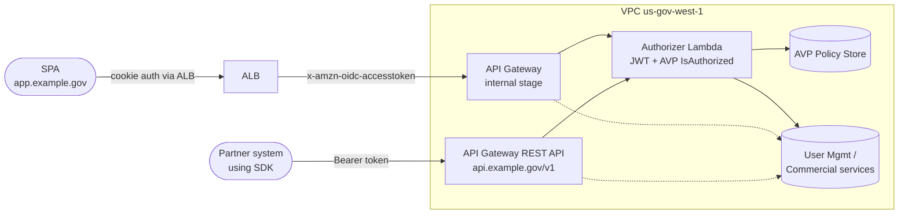
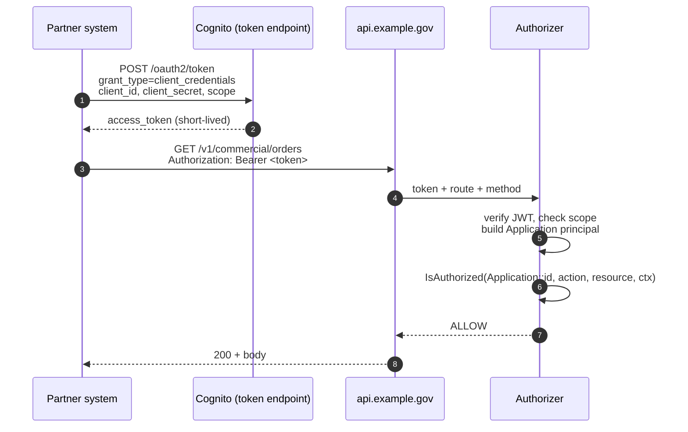

# Partner API

Companion to [index.md](./index.md), [api-router.md](./api-router.md), and [session-management.md](./session-management.md). Covers what changes when the platform's SDK is consumed by external partners, not only the first-party SPA.

## Why this is a separate front door

A partner-consumed API needs traits the first-party `/api/*` path on the ALB doesn't naturally provide:

- A **stable, well-known, versioned public hostname** that partners hard-code into their SDK config.
- **Per-partner identification** for quotas, rate limits, billing, and audit.
- **Bearer-token auth from machine clients**, not browser cookies.
- **Public-API operational hygiene**: status page, dev portal, SLA, deprecation policy.
- **Independent WAF tuning** — partner traffic looks different from browser traffic.

Solution: a second front door on its own domain, **API Gateway REST API directly, no ALB**.

## Topology



- `app.example.gov` keeps the existing ALB-fronted design for browser users.
- `api.example.gov/v1` is new: API Gateway REST API, public endpoint, partner-only.
- **One authorizer Lambda** serves both fronts. It already accepts either token source.
- **One set of backend services.** Partners and the SPA hit the same User Mgmt / Commercial code paths.

## API Gateway: REST API, not HTTP API

For the partner front door specifically. HTTP API can stay on the internal SPA path (cheaper), but the partner side needs:

| Feature | Why it matters | HTTP API | REST API |
|---|---|---|---|
| Usage plans + API keys | Per-partner identification + quotas | No | Yes |
| Per-stage response caching | Cuts cost on hot reads | No | Yes |
| Full request validation | Catch bad partner calls cheaply | Limited | Yes |
| Resource policies | IP/account allowlists per partner | Limited | Yes |
| Custom domain stages | `api.example.gov/v1`, `/v2` cleanly | Yes | Yes |

→ **REST API on `api.example.gov`.** Standardize on REST for both fronts if you want one operational shape instead of two.

## Auth model

### Machine-to-machine (M2M) — day one

OAuth 2.0 **client credentials** grant. Partners get a `client_id` + `client_secret` per Application they register.



- **Token represents an Application**, not a human user.
- SDK includes a built-in credentials provider that handles fetch + refresh — partners don't write token plumbing.
- Cognito user pool's **app client with `client_credentials` enabled** is the issuer (or Okta with M2M apps when swapped).

### 3-legged OAuth — later, only if needed

If partners ever need to act *on behalf of a user* (e.g. read a user's data with their consent), add **authorization code + PKCE** with a partner-facing consent screen. Don't build this day one; many partner integrations don't need it.

## AVP schema additions

Cedar gains an `Application` principal type alongside `User`:

```cedar
namespace Platform {
  entity User {
    sub: String,
    tenant_id: String,
    groups: Set<String>
  };

  entity Application {
    client_id: String,
    partner_id: String,
    scopes: Set<String>
  };

  // Actions stay shared; policies differentiate by principal type.
}
```

Policies then differentiate:

```cedar
// Partners can read orders, but only humans can delete accounts.
permit (
  principal is Platform::Application,
  action in [Action::"commercial:GetOrder", Action::"commercial:ListOrders"],
  resource
) when {
  "commercial:read" in principal.scopes &&
  resource.tenant_id == principal.partner_id
};

permit (
  principal is Platform::User,
  action == Action::"users:DeleteAccount",
  resource
) when {
  resource.owner_sub == principal.sub
};
```

**Scopes** are first-class. Partner tokens are minted with scopes the Application is approved for; AVP enforces `scope in principal.scopes` per action. Least-privilege by construction.

## Versioning

URL versioning, full stop:

```
api.example.gov/v1/commercial/orders
api.example.gov/v2/commercial/orders   ← additive or breaking
```

- Smithy supports versioned namespaces. SDK semver tracks API version: `@platform/api-client@2.x` targets `/v2`.
- **Deprecation policy** published publicly: e.g. *"vN is supported for 18 months after vN+1 GA. Sunset dates announced 12 months in advance. EOL'd versions return 410 Gone."*
- Partners will absolutely ask for this on day one. Pick numbers and publish them.

Avoid header versioning (`Accept: application/vnd.example.v1+json`) — more flexible but less discoverable, and partners get it wrong.

## SDK distribution

The same Smithy model that generates the first-party SDK generates the partner SDK. Differences are in **packaging and config**, not the code shape.

- **Multi-environment presets**: `prod` (`api.example.gov`), `sandbox` (`api-sandbox.example.gov`). Partner picks at client construction.
- **Built-in auth helper**: `new CommercialClient({ clientId, clientSecret, environment: 'prod' })`. SDK fetches and caches tokens, refreshes on expiry, retries 401 once after refresh.
- **Multi-language generation** from Smithy: start with TypeScript, add Python / Go / Java / .NET as partner demand appears. Each language is a separate package on its native registry (npm, PyPI, etc).
- **Public registry or private?** Public is easier (npm install, pip install) and standard for developer ergonomics. Private (artifact registry behind partner auth) if the SDK contains anything restricted — unusual but possible for gov.
- **Versioned semver**: SDK major version matches API major version. Patch releases are SDK-only fixes.

## Operational surface

Running a public API means owning these:

| Surface | What it is | Where it lives |
|---|---|---|
| Sandbox environment | Non-prod stage partners integrate against | `api-sandbox.example.gov/v1`, separate stage |
| Developer portal | Generated docs, getting-started, sample apps | Static site from Smithy/OpenAPI → S3 + ALB (e.g. `developers.example.gov`) |
| Status page | Real-time health of `api.example.gov` | Statuspage.io / Atlassian Statuspage, or self-hosted |
| Onboarding flow | Partner registers Application, gets credentials | Self-serve UI or sales-led — pick based on volume |
| Audit log access | Partner sees their own request history | CloudWatch Logs Insights query exposed via the SDK or portal |
| Webhook signing | HMAC signature on outbound events | Per-application signing secret, rotated independently |
| Client secret rotation | Zero-downtime rollover | Two active secrets per Application; partner rotates on their schedule |
| SLA + on-call | Uptime commitment + alerting | PagerDuty + runbooks; document the SLA |
| Breaking change policy | When and how versions deprecate | Public page; email partners on sunset milestones |

## Security additions

- **Per-application scopes** (above). Tokens are least-privilege.
- **IP allowlisting** per Application — optional, useful for high-trust partners. Configured at API Gateway resource policy level.
- **Webhook HMAC signatures**: every outbound webhook signed with `X-Signature: sha256=...` using a per-application secret. Partners verify before processing.
- **Client secret rotation**: each Application has two active secrets (primary + secondary). Partner rotates without downtime: add new, switch traffic, remove old.
- **Rate limits per Application** via API Gateway usage plans. Default tier + per-partner overrides.
- **Token TTL short** (15–60 min). Reduces blast radius of leaked tokens. SDK refreshes transparently.
- **Audit every partner request** with `application_id`, `scope`, `route`, `method`, `result`. Partners can query their own; you keep all of it for incident response.

## GovCloud-specific

- **FIPS-compliant TLS** on `api.example.gov`. Cognito's GovCloud token endpoint already uses FIPS; API Gateway custom domains in GovCloud support FIPS endpoints. Advertise the supported cipher suites publicly.
- **Partner vetting before credential issuance.** Some data flows (CUI, ITAR) require the partner's *own* infrastructure to be in GovCloud or FedRAMP-authorized. Bake attestation into onboarding — partners declare they meet handling requirements, you record the attestation. Legal/contracts gates this, not architecture.
- **Two GovCloud regions for resilience?** `us-gov-west-1` primary; `us-gov-east-1` as DR is a v2 concern. Document the DR position in the SLA.
- **No commercial-region dependencies** anywhere in the partner data path. The dev portal and docs can live in commercial regions (public content), but the API itself and any partner data must not.

## What stays the same vs. earlier docs

- **Backend services**: unchanged. They get principal context from the authorizer regardless of front door.
- **Authorizer Lambda**: same code, gains `Application` principal handling and scope checks.
- **AVP**: same store, extended schema with `Application`.
- **Smithy model**: same source of truth, now versioned for public consumption.
- **SPA + ALB + cookie session**: unchanged.
- **Frontend support service**: unchanged, still SPA-only.

## Migration sequence

Don't ship all this on day one. Phase it:

1. **Foundation**: lock the Smithy model. Pick versioning convention. Publish v1 internally first.
2. **Partner front door**: stand up `api.example.gov` with API Gateway REST API. Wire to existing services.
3. **M2M auth**: Cognito app client with client_credentials grant. AVP Application principal.
4. **First SDK (TypeScript)**: with auth helper, multi-env config, published to npm or private registry.
5. **Sandbox + dev portal**: parallel to first paying partner integration.
6. **Operational hygiene**: status page, SLA, rotation flow, webhook signing — as partners demand or contracts require.
7. **Multi-language SDKs**: when there's partner demand.
8. **3-legged OAuth**: only when a partner needs it.

## Open questions

1. **One API Gateway or two?** Could put both internal (`app.example.gov/api/*`) and partner (`api.example.gov/v1`) on the same REST API with different stages, or run two API Gateways. Two is more isolation; one is less to operate.
2. **Sandbox = scrubbed prod data or fully synthetic?** Synthetic is safer for gov posture; scrubbed is more realistic for partner testing. Pick early — switching later breaks partners.
3. **API key pricing/tiering?** Are there paid tiers, or is access bundled with the product contract? Affects usage plan structure in API Gateway.
4. **SDK release cadence.** Continuous publication from main, or pinned release windows aligned with the API? Partners prefer predictability.
5. **Public vs gated dev portal.** Anyone can read the docs vs. login-required. Public is standard; gated is sometimes required for gov.
