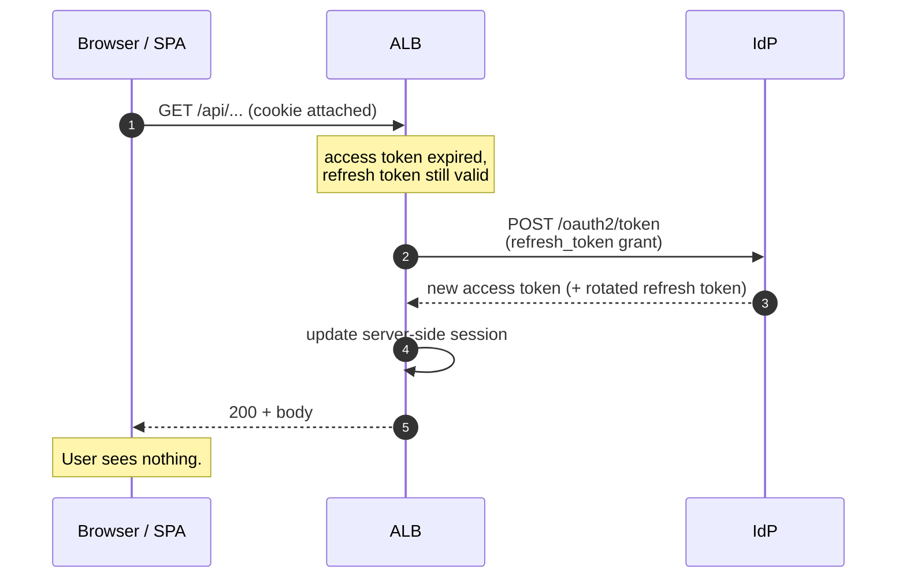
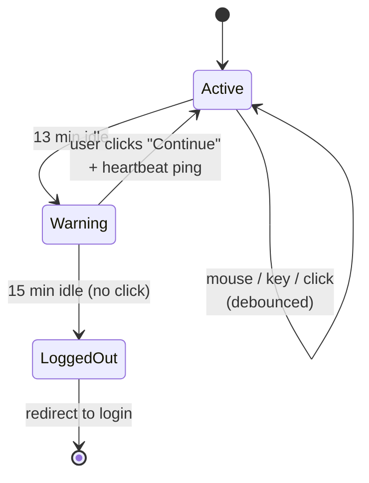

# Session Management

Companion to [index.md](./index.md) and [api-router.md](./api-router.md). Covers what happens between "user logged in" and "user logged out" — the timeout clocks, the silent-refresh path, what the SPA sees when something finally expires, and the pattern to implement.

## The four timeout clocks

There is no single "session timeout." Four independent clocks run at the same time:

| Clock | Default (Cognito) | What it controls | Refreshable? |
|---|---|---|---|
| Access token TTL | 1 hr | "Is this user's API access still good?" | Yes, via refresh token |
| Refresh token TTL | 30 days | "Can we silently re-mint access tokens?" | No — requires re-login |
| ALB session cookie TTL | 7 days (configurable) | "Is the browser's ALB session still valid?" | No — requires re-login |
| IdP-side SSO session | varies | "Should the IdP show login UI or just bounce back?" | N/A |

**Rule of thumb:** align ALB `SessionTimeout` with the refresh token TTL. Otherwise ALB can keep extending a session that the IdP no longer recognizes, leading to confusing refresh failures.

## Happy path — silent refresh

Most of the time the user notices nothing. Sequence:



This covers the typical first ~30 days. The hour-long access token TTL is essentially invisible.

## Unhappy paths — what the user sees

When refresh fails or the ALB cookie expires, behavior splits by request type:

### Full-page navigation

Browser hits ALB without a valid session → 302 to IdP login → managed login page → bounce back → done. **Native browser behavior, works fine.** This is also why `window.location.reload()` is the safe escape hatch from inside an SPA.

### SPA `fetch()` call

This is the awkward one. The fetch hits ALB → 302 to a cross-origin auth domain → **browser CORS blocks following the redirect across origins**. The SPA sees a network error or an opaque response — not a clean signal.

**Fix:** for `/api/*` paths, return a clean 401 instead of redirecting. With the [API Router](./api-router.md) design, the Lambda authorizer naturally does this — it returns 401 with a Smithy-shaped `UnauthorizedException`. The SPA's HTTP client handles it as a typed error.

If `/api/*` is bare-ALB without API Gateway, set the listener rule's `OnUnauthenticatedRequest` to `deny` for API paths (returns a plain 401, not a redirect), and keep `authenticate` for the SPA's `/` path.

## The standard pattern

Two layers, stacked. Every modern SPA does Layer 1; regulated apps add Layer 2.

### Layer 1 — silent refresh + 401-triggered re-login

Baseline. What every SaaS SPA does.

- Tokens refresh transparently. The SPA does not manage them.
- Single global 401 interceptor on the HTTP client.
- On 401: show a "Session expired — sign in again" modal, then `window.location.reload()` on confirm (or auto-redirect after a brief delay).

```ts
// in the generated SDK's HTTP client wrapper
client.interceptors.error.use((e) => {
  if (e instanceof UnauthorizedException) {
    showSessionExpiredModal();
  }
  throw e;
});
```

That's it for the baseline. No timers, no polling — the first failed API call is the signal.

### Layer 2 — idle timeout with warning dialog

Required for FedRAMP / NIST 800-53 workloads (AC-11/AC-12). Typical interpretation: **15-minute idle timeout** for moderate baseline.



Implementation:

- SPA tracks activity via debounced `mousemove`, `keydown`, `click`, `scroll` listeners.
- At T-minus-2-minutes (13 min idle), show a centered modal with a live countdown: *"Your session will expire in 1:30. Continue working?"* and a Continue button.
- Click Continue → hit `GET /api/fe-support/heartbeat` → server bumps `last_activity` → modal dismisses.
- No interaction → at zero, call `/api/auth/logout` and redirect to login.
- Separately enforce an **absolute session lifetime** of 8–12 hours via refresh token TTL + ALB `SessionTimeout`, so users re-auth at least once per workday.

Idle timeout is **not** something ALB does for you. ALB's `SessionTimeout` is absolute (since login), not idle. Idle has to be enforced in the authorizer Lambda by checking a `last_activity` claim on the session and rejecting requests past the threshold.

## Timing dials by app type

Pick a column. For this project use the gov/regulated column.

| Setting | Consumer SaaS | B2B SaaS | Gov / regulated |
|---|---|---|---|
| Access token TTL | 1 hr | 1 hr | 15–60 min |
| Refresh token TTL | 30–90 days | 30 days | 8–24 hours |
| Idle timeout | none / 24 hr | 30–60 min | **15 min** |
| Absolute session | 30 days | 12–24 hr | **8–12 hr** |
| Warning lead time | n/a | optional | 60–120 sec |
| MFA re-prompt | rare | per device | per session for sensitive ops |

## The heartbeat endpoint

A small endpoint serves three jobs:

```
GET /api/fe-support/heartbeat
  → 200 { ok: true, expires_at: "2026-05-12T18:23:00Z" }
  → 401 (if session is dead)
```

- Called by the idle-timer "Continue" button to bump server-side activity.
- Called on a slow interval (every 5–10 min) by the SPA to detect server-side revocation even when the user is idle on the page.
- Cheap, cacheable per-user for ~30s server-side if needed.

## Edge cases worth designing for

### IdP-side logout doesn't kill the ALB cookie

If a user signs out at `auth.example.gov` directly, the ALB cookie on `app.example.gov` is still valid until *it* expires. For proper single-logout:

1. The SPA's logout button hits an app-side `/api/auth/logout` that clears the ALB session.
2. Then redirects to the IdP's `end_session_endpoint` (`/logout` for Cognito) with `logout_uri` set to the SPA's post-logout page.
3. Both sessions are gone.

Doing only step 2 leaves the ALB cookie alive; doing only step 1 leaves IdP SSO alive (so the next "login" silently re-authenticates as the same user).

### In-flight mutations during expiry

A POST that 401s on stale credentials is dangerous to retry: the user may have already changed something. Two options:

- **Idempotency keys** on mutations. The SPA generates a UUID per write; the server dedupes. Safe to retry transparently after re-auth.
- **Hold the request, re-auth, replay.** SPA detects 401, opens login in a popup (or full redirect with state preservation), then replays the failed mutation. Adds complexity; usually only worth it for editors with unsaved work.

For most CRUD apps, idempotency keys are the right answer.

### Pre-expiry save prompt

If the SPA holds unsaved editor state and the refresh token is approaching expiry (T-minus-5-min), prompt the user to save and re-authenticate before they lose work. Independent of the idle-timeout flow — this fires even while the user is actively typing.

### Multiple tabs

The user has the app open in tab A and tab B. Tab A times out and forces re-login. Tab B is still showing stale UI with a dead session.

- Use `BroadcastChannel` or `storage` events so when one tab detects 401, it tells the others to reload.
- Or accept that each tab will discover the dead session on its next API call and handle it independently. Simpler, slightly worse UX.

### Concurrent silent refreshes

If the SPA fires 5 API calls in parallel and all hit ALB at the moment the access token expires, ALB serializes the refresh (one refresh, all 5 requests wait). No SPA-side work needed — this is ALB's behavior, not something to recreate in the client.

## What to log

For audit and FedRAMP evidence:

- Login (with IdP, principal, IP, user-agent).
- Token refresh (silent — useful for forensics).
- Idle warning shown.
- Idle timeout forced logout (vs. user-initiated logout).
- 401 / re-auth events keyed to a session ID.
- Logout (both app-side and IdP-side completion).

Send to CloudWatch with a session correlation ID. Reviewers will look for "we can prove a session was terminated at minute 15 of inactivity."

## What lives where

| Concern | Where |
|---|---|
| Access/refresh token storage | ALB server-side (the SPA never sees tokens) |
| Token refresh | ALB → IdP token endpoint |
| Session cookie issuance | ALB |
| Idle activity tracking (client) | SPA event listeners + debounce |
| Idle enforcement (server) | Authorizer Lambda checks `last_activity` claim |
| Absolute session cap | ALB `SessionTimeout` aligned to refresh token TTL |
| Heartbeat / activity bump | `/api/fe-support/heartbeat` |
| 401 → re-login modal | SPA HTTP client interceptor |
| Single-logout coordination | SPA logout flow hits both app + IdP |

## Open questions

1. **Exact idle threshold.** 15 min is the conservative interpretation of AC-11. If your ATO allows longer, document the negotiated value.
2. **Where to store `last_activity`.** Authorizer-cached (DynamoDB single-table session record) vs. issued as a claim that's re-signed on each heartbeat. DynamoDB is simpler; claim-based is statelesss but more moving parts.
3. **Popup-based silent re-auth.** Avoids losing in-flight SPA state but interacts badly with strict popup blockers. Full-redirect-with-state-preservation is more reliable.
4. **Step-up auth for sensitive actions.** Some operations (delete account, change MFA) should re-prompt for MFA even mid-session. Out of scope here but worth a dedicated doc later.
