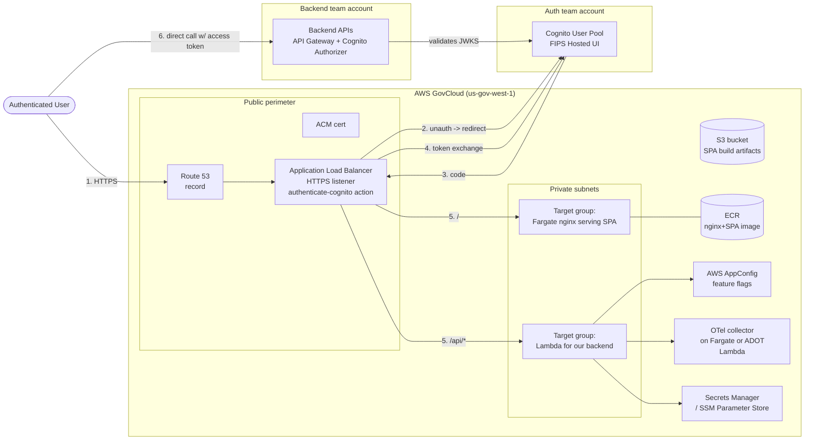
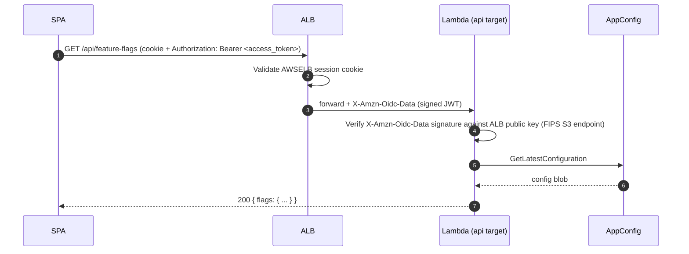
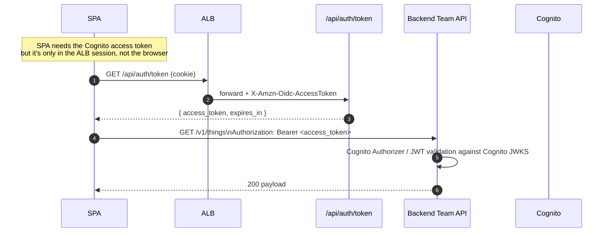

# GovCloud-Compatible React SPA Architecture

## Problem framing

- Static React SPA + small backend (AppConfig feature flags, OTel collector, legal-document endpoints).
- Auth team owns the Cognito user pool. Only authenticated users may fetch frontend assets or call any backend.
- Backend team owns separate APIs that the SPA calls directly with the Cognito access token.
- **Must be GovCloud compatible.**

## GovCloud constraints that shape the design

These constraints rule out the typical commercial-AWS pattern (CloudFront + Lambda@Edge for auth):

| Service | GovCloud status | Impact |
|---|---|---|
| CloudFront | Not available *in* GovCloud; only usable from standard regions pointing at GovCloud origins (cross-partition, treated as public internet) | No native CDN in front of GovCloud workloads |
| Lambda@Edge / CloudFront Functions | Authored only in `us-east-1`, edge runs only on commercial CloudFront | Can't do edge auth on a GovCloud-resident architecture |
| Cognito User Pools | Available, FIPS endpoints (`auth-fips.us-gov-west-1.amazoncognito.com`) | Custom domains **not** supported; new "Managed Login" tiers **not** available — classic Hosted UI only |
| ALB `authenticate-cognito` action | Supported | Becomes the natural auth perimeter |
| API Gateway | Available, regional only (no edge-optimized); FIPS by default | Fine for backend; can't replace a CDN |
| AppConfig | Available (CodePipeline integration unavailable in `us-gov-east-1`) | Use directly |

Sources are listed at the bottom.

## High-level architecture



### Why ALB-centric, not CloudFront-centric

- ALB's built-in `authenticate-cognito` listener action is the cheapest way to enforce *"only authenticated users can fetch frontend assets"* in GovCloud. It handles the OIDC dance, cookie session, and forwards verified user identity to targets via `X-Amzn-Oidc-*` headers.
- A single ALB protects both the SPA and the in-app APIs with one auth boundary; no per-route authorizer code.
- If a CDN is later required, you can layer commercial-region CloudFront in front of the GovCloud ALB as a custom origin (Origin Access Control does **not** work cross-partition; secure with a shared secret header + WAF rule).

### Why Fargate+nginx for the SPA, not Lambda

- ALB → Lambda target group has a **1 MB synchronous response limit**. Even a moderate SPA bundle (hashed JS chunks, source maps, fonts) blows past this.
- Fargate task running nginx with the SPA build baked into the image is simple, scales to zero traffic at minimum task count, and keeps the static path completely free of cold-start risk.
- Build pipeline: `vite build` → copy `dist/` into nginx container → push to ECR → ECS service rolling deploy.

Alternative if you want fully serverless static hosting: keep the SPA in S3 and put a tiny Lambda *or* a small custom origin proxy on Fargate that streams from S3. Not worth the complexity for a small app.

## Cognito integration details (GovCloud-specific)

- The auth team's user pool lives in `us-gov-west-1` (or `us-gov-east-1`). You register a new **app client** for this SPA.
- App client config:
  - **Allowed callback URL**: `https://app.example.gov/oauth2/idpresponse` (the ALB-managed callback path).
  - **Allowed sign-out URL**: `https://app.example.gov/`.
  - **OAuth flows**: Authorization code grant. **Do not** use implicit flow.
  - **Scopes**: `openid`, plus any custom scopes the backend team defines for their APIs.
  - **Client secret**: required for `authenticate-cognito` ALB action; store in Secrets Manager and reference via the ALB action config.
- **Hosted UI**: use the FIPS endpoint (`*.auth-fips.us-gov-west-1.amazoncognito.com`). Custom domains aren't supported in GovCloud, so plan branding around the prefix-domain Hosted UI or build a custom login UI hosted on your ALB and call Cognito's API endpoints directly.
- The ALB sets an `AWSELBAuthSessionCookie-*` cookie after the dance. It also forwards three headers to targets: `X-Amzn-Oidc-Data` (signed JWT of the claims), `X-Amzn-Oidc-AccessToken`, `X-Amzn-Oidc-Identity`.

## Request flows

### Flow 1 — Unauthenticated user visits the app

```mermaid
sequenceDiagram
  autonumber
  participant U as Browser
  participant ALB
  participant C as Cognito Hosted UI
  U->>ALB: GET https://app.example.gov/
  ALB->>ALB: No AWSELB session cookie
  ALB-->>U: 302 to Cognito /authorize?client_id=...&redirect_uri=.../oauth2/idpresponse
  U->>C: GET /authorize
  C-->>U: Hosted UI login page
  U->>C: POST credentials (and MFA)
  C-->>U: 302 back to /oauth2/idpresponse?code=AUTH_CODE
  U->>ALB: GET /oauth2/idpresponse?code=AUTH_CODE
  ALB->>C: POST /oauth2/token (code + client_secret)
  C-->>ALB: id_token, access_token, refresh_token
  ALB->>ALB: Set AWSELBAuthSessionCookie-*; cache tokens server-side
  ALB-->>U: 302 to original URL "/"
  U->>ALB: GET / (now with session cookie)
  ALB->>ALB: Validate cookie, forward
  ALB->>Fargate: GET / + X-Amzn-Oidc-* headers
  Fargate-->>U: index.html (SPA shell)
```

Key point: ALB does **all** the OIDC plumbing. The SPA never sees the auth code or client secret.

### Flow 2 — Authenticated SPA load (warm session)

1. Browser sends request with `AWSELBAuthSessionCookie-0`/`-1` cookies.
2. ALB validates session, refreshes underlying tokens if near expiry.
3. ALB forwards to Fargate static target group.
4. nginx returns hashed asset (`/assets/index-abc123.js`) with a long `Cache-Control: public, max-age=31536000, immutable`.
5. SPA boots in browser. To get the access token for downstream API calls, see Flow 4.

### Flow 3 — SPA calls our backend API (`/api/feature-flags`, `/api/legal/tos`, `/api/otel/v1/traces`)



- The Lambda **must** verify `X-Amzn-Oidc-Data` itself; ALB only attests the session at the listener, but a target receiving the header without verification could be spoofed if anything else can reach the target group. Public keys come from `https://s3-us-gov-west-1.amazonaws.com/aws-elb-public-keys-prod-us-gov-west-1/<key-id>`.
- AppConfig: Lambda extension (`AWS-AppConfig-Extension-Arm64`) caches the config and polls. Keep TTL ≥ 30s to avoid GetLatestConfiguration throttling.
- OTel ingest: prefer running the OTel collector as a sidecar on Fargate or as an ADOT Lambda layer co-located with the API target — don't make it a public OTLP endpoint. The `/api/otel/*` route is just a thin authenticated forwarder.

### Flow 4 — SPA calls the backend team's APIs



This is the central design choice: **the SPA never holds a refresh token**. The browser-side access token is fetched on demand from a same-origin endpoint that reads it out of the ALB-injected `X-Amzn-Oidc-AccessToken` header.

Why this is better than the obvious alternative (SPA does its own PKCE flow):

- One auth perimeter. The ALB is the only place that holds refresh tokens.
- No tokens in localStorage / no XSS exfil risk.
- Logout works by clearing the ALB session cookie + Cognito sign-out URL — no token revocation choreography in the SPA.

Cost: the SPA needs to call `/api/auth/token` whenever its in-memory token is expired. Implement as an interceptor in the API client.

### Flow 5 — Token expiry and refresh

- ALB caches tokens in its session and silently refreshes them using the Cognito refresh token before forwarding requests, as long as the session cookie is valid (default 7 days, configurable on the listener rule via `SessionTimeout`).
- When the ALB session expires, the next request 302s back to Cognito; if the user still has a valid Cognito session, it's a transparent re-auth. Otherwise they see the Hosted UI again.
- The SPA should treat 401 from the backend team's APIs as "fetch a fresh token from `/api/auth/token` and retry once." If that also 401s, do `window.location = '/'` to trigger the ALB → Cognito redirect.

### Flow 6 — Logout

1. SPA links to `https://app.example.gov/logout` (a route owned by the API Lambda).
2. Lambda clears the ALB session cookie (`Set-Cookie: AWSELBAuthSessionCookie-0=; Max-Age=0; Domain=...; Secure; HttpOnly`).
3. Returns 302 to Cognito `/logout?client_id=...&logout_uri=https://app.example.gov/`.
4. Cognito clears its session, redirects back to the app root, ALB sees no cookie → starts Flow 1.

## Authorization model

- **Coarse-grained "is this person allowed in the app?"** → enforced by ALB authenticate-cognito + Cognito group membership claim in the ID token. Use ALB listener rules on `X-Amzn-Oidc-Data` claims (or check in the Lambda) to gate `/admin/*` paths.
- **Fine-grained "can this user call this backend-team endpoint?"** → backend team's responsibility, enforced in their Cognito Authorizer using scopes and groups.
- Don't try to mirror the backend team's authorization in the SPA. SPA just shows/hides UI as a UX hint; the backend rejects unauthorized requests.

## CDK component sketch

```
Stack: NetworkStack
  Vpc (2 AZs, public + private subnets)

Stack: AuthStack
  CognitoAppClient   (added to auth team's pool via cross-account custom resource)
  Secret             (client secret -> SSM/Secrets Manager)

Stack: FrontendStack
  EcrRepository      (nginx-spa)
  FargateService     (1 task min, autoscale on ALBRequestCountPerTarget)
  TargetGroup        (port 80, healthcheck /healthz)

Stack: ApiStack
  Function           (apiHandler, ARM64, AppConfig extension layer)
  TargetGroup        (Lambda target)
  AppConfigApp + Env + Profile
  OtelCollectorService (Fargate sidecar OR ADOT layer)

Stack: EdgeStack
  ApplicationLoadBalancer (HTTPS only, redirect 80->443)
  Listener
    .addAction(authenticateCognito({ userPool, userPoolClient, sessionTimeout: 12h })
       .next(forward(staticTg)))
    .addAction(default rule for /api/* -> apiTg, also wrapped in authenticate-cognito)
  ARecord   (Route53)
  Acm       (DNS-validated cert)
```

## Open questions / risks

- **Cognito custom domain**: not supported in GovCloud. Confirm the FIPS Hosted UI URL is acceptable to security review. If branding is mandatory, build a custom login UI that calls Cognito SRP/USER_PASSWORD flows directly — significantly more work and a security review surface.
- **Cross-account Cognito**: ALB authenticate-cognito works across accounts but the user pool ARN must be referenced and the app client registered in the auth team's account. Coordinate IaC ownership.
- **Refresh token rotation**: confirm the auth team's user pool has refresh token rotation enabled; ALB session lifetime should be ≤ refresh-token validity.
- **OpEx / ORR observability**: the ALB itself emits access logs to S3 — wire those to your OTel pipeline / CloudWatch. Consider AWS WAF on the ALB for rate-limiting login bursts.
- **Backend team API CORS**: their APIs need to allow `Origin: https://app.example.gov` and `Authorization` header.
- **OTel egress**: if the collector forwards traces outside the VPC (e.g., to a SaaS), confirm the SaaS has a GovCloud-eligible offering — most don't. Default to CloudWatch / X-Ray-equivalent ingestion paths inside GovCloud.

## Sources

- [Tips for Setting Up CloudFront — AWS GovCloud (US)](https://docs.aws.amazon.com/govcloud-us/latest/UserGuide/setting-up-cloudfront-tips.html)
- [Amazon Cognito in AWS GovCloud (US)](https://docs.aws.amazon.com/govcloud-us/latest/UserGuide/govcloud-cog.html)
- [AWS AppConfig in AWS GovCloud (US)](https://docs.aws.amazon.com/govcloud-us/latest/UserGuide/govcloud-appc.html)
- [Amazon API Gateway in AWS GovCloud (US)](https://docs.aws.amazon.com/govcloud-us/latest/UserGuide/govcloud-abp.html)
- [Authenticate users using an Application Load Balancer](https://docs.aws.amazon.com/elasticloadbalancing/latest/application/listener-authenticate-users.html)
- [Integrate an ALB with Amazon Cognito to authenticate users (re:Post)](https://repost.aws/knowledge-center/cognito-user-pool-alb-authentication)
- [Restrictions on Lambda@Edge](https://docs.aws.amazon.com/AmazonCloudFront/latest/DeveloperGuide/lambda-at-edge-function-restrictions.html)
