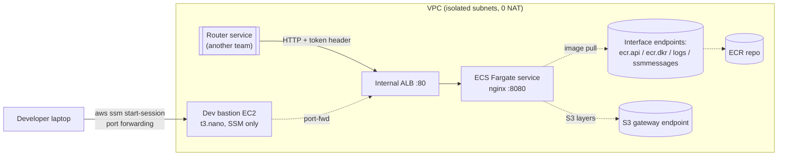
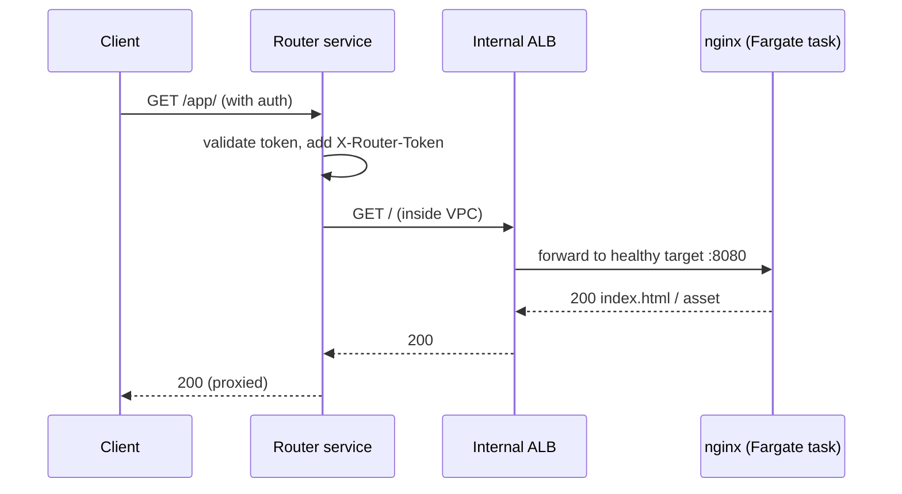
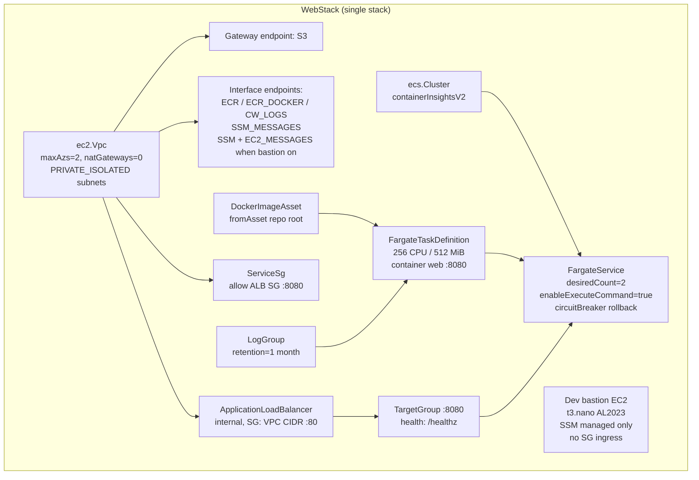
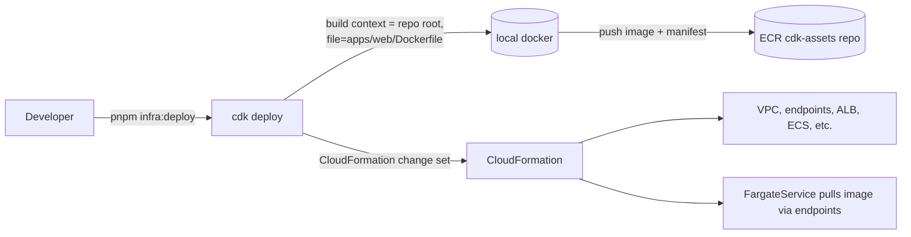
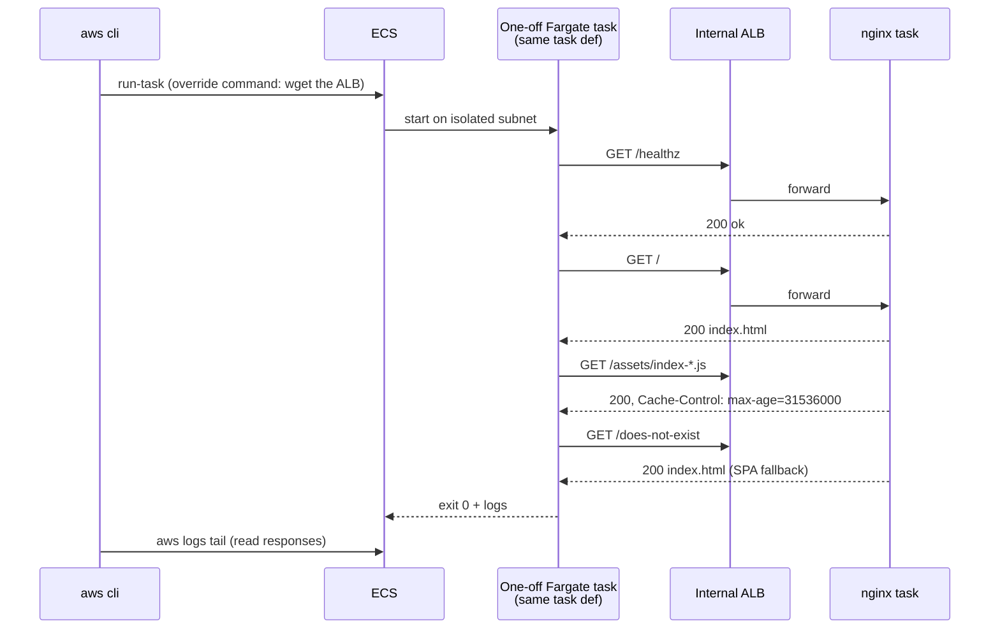
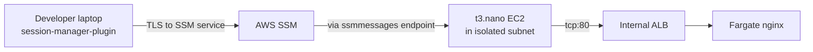
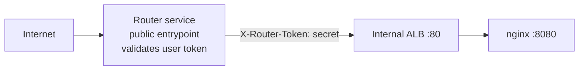

## Context

GovCloud does not have CloudFront, so the standard "S3 static website + CloudFront OAC" pattern doesn't apply. Typical alternative is **internal ALB → ECS Fargate running nginx → static assets baked into the container image**. This pattern also works in any other partition, so we develop and deploy the same stack to `us-east-1` first and later flip the region to `us-gov-west-1` / `us-gov-east-1` without code changes.

Additional constraints we designed around:

- A separate team's **router service** will be the only public ingress. Our ALB stays internal.
- Fargate tasks must pull the image **without a NAT Gateway** (cost + mirrors GovCloud-locked-down networks). Use VPC interface/gateway endpoints instead.
- No secrets in source, no hardcoded physical names, no `any`/`!` TypeScript escape hatches, strict types.

## Architecture



Request path in production:



## Monorepo layout

```
govcloud-frontend/
├── apps/
│   ├── web/                      # React + Vite SPA (the container image)
│   │   ├── src/
│   │   ├── Dockerfile            # multi-stage: pnpm build -> nginx:alpine
│   │   ├── nginx.conf            # SPA fallback, /healthz, asset caching
│   │   └── package.json
│   └── infra/                    # AWS CDK v2
│       ├── bin/app.ts            # composition only
│       ├── lib/stacks/web-stack.ts
│       ├── config/{types,dev}.ts
│       └── test/web-stack.test.ts
├── packages/                     # reserved for shared TS packages
├── pnpm-workspace.yaml
├── tsconfig.base.json            # strict + noUncheckedIndexedAccess
└── package.json
```

## Stack resources

One stack, per CDK rule of thumb ("start with one, split by rate of change").



### Key construct choices

| Decision | Reason |
| --- | --- |
| **Single stack** | ~20 resources; no rate-of-change split is justified yet. |
| **PRIVATE_ISOLATED only, `natGateways: 0`** | No internet path out of the VPC. Matches locked-down GovCloud networks and saves ~$32/mo per AZ. |
| **Interface endpoints for ecr.api / ecr.dkr / logs / ssmmessages** | Required for Fargate in isolated subnets. Without them, tasks stay in `PROVISIONING` forever. |
| **S3 gateway endpoint** | ECR image layers live in S3. Gateway endpoints are free. |
| **Internal ALB** | Only the router service should reach us. No public exposure, no public ACM cert needed. |
| **CDK `ContainerImage.fromDockerImageAsset`** | Image builds and pushes during `cdk deploy`. No separate CI wiring for the first iteration. |
| **`enableExecuteCommand: true`** | Lets us `aws ecs execute-command` into running tasks for debugging. |
| **Circuit breaker with rollback** | Bad image → automatic rollback to the previous task set. |
| **`containerInsightsV2`** | v1 is deprecated; v2 costs the same and ships more metrics. |
| **Config via TypeScript interface + per-env file** | Typed, greppable, no SSM param lookups for non-secrets. |

### Things deliberately **not** in the stack

- No CloudFront, no Route 53 public hosted zone, no ACM public cert — the router owns all public ingress.
- No NAT Gateway — endpoints do the job.
- No WAF on this ALB — the router's public edge is where WAF belongs.
- No autoscaling policy yet — add when real traffic profile exists.

## Container layer

### Dockerfile highlights

- Multi-stage: `node:20-alpine` (pnpm build) → `nginx:1.27-alpine` (runtime).
- Build stage copies only manifests first for layer caching, then `pnpm install --filter @govcloud-frontend/web...` and `pnpm build`.
- Runtime stage runs as the built-in `nginx` user (non-root). Writable nginx temp paths moved to `/tmp` so the root FS can be treated read-only by the image.
- `HEALTHCHECK` uses `wget /healthz` — available in alpine.

### nginx.conf highlights

```nginx
location = /healthz { return 200 "ok\n"; }
location /assets/ {
  expires 1y;
  add_header Cache-Control "public, immutable";
}
location / {
  add_header Cache-Control "no-cache";
  try_files $uri $uri/ /index.html;   # SPA fallback
}
```

`/healthz` is what the ALB target group hits. The `try_files … /index.html` line is what makes any client-side route (`/login`, `/dashboard/42`, …) resolve to the SPA shell.

## How deployment works



Only dependency on the developer's box during deploy is a running Docker daemon (OrbStack / Docker Desktop). Once CI takes over, the same `ContainerImage.fromDockerImageAsset` works in CodeBuild / GitHub Actions.

## Validation

Internal ALB = no browser access from a laptop without a tunnel. The end-to-end tests used ECS `run-task` with a command override to curl the ALB from inside the VPC:



All four paths returned what they should. Target group health also reported `healthy` on both tasks, which by itself proves `/healthz` is working over the full network path.

## Developer access (SSM port forwarding)

ALB is internal, so we provision a **tiny bastion EC2 (t3.nano AL2023, `requireImdsv2`, no inbound rules)** gated behind `config.enableDevBastion`. Access is via SSM Session Manager port forwarding — no SSH, no open ports, no keys.



Command:

```bash
aws ssm start-session \
  --profile dev --region us-east-1 \
  --target <DevBastionInstanceId> \
  --document-name AWS-StartPortForwardingSessionToRemoteHost \
  --parameters 'host="<AlbDnsName>",portNumber="80",localPortNumber="8080"'
# then open http://localhost:8080
```

`enableDevBastion` also conditionally adds the `ssm` and `ec2messages` interface endpoints (both required for SSM agent registration in an isolated VPC).

## Integrating with the router service (future)

Minimal changes required when the team's public router lands:



1. **Network path** — same VPC (cleanest) or VPC peering / Transit Gateway if the router lives elsewhere.
2. **Tighten ALB SG** — swap `ec2.Peer.ipv4(vpc.vpcCidrBlock)` for an SG-to-SG rule from the router's security group only.
3. **Shared-secret header (defense in depth)** — have the router inject `X-Router-Token` and have nginx reject requests missing it:

   ```nginx
   if ($http_x_router_token != "$ROUTER_TOKEN") { return 403; }
   ```
   Secret lives in Secrets Manager → surfaced to the task as an env var via `secrets: { ROUTER_TOKEN: ecs.Secret.fromSecretsManager(…) }`.
4. **Host / path rewriting** — SPA fallback already returns `index.html` for any unknown path, so prefix rewrites "just work".

## Migrating this stack to actual GovCloud

All services used (VPC + endpoints, ECR, ECS Fargate, ALB, CloudWatch Logs, EC2 / SSM) are available in the `aws-us-gov` partition. Concrete deltas:

| Change | Where |
| --- | --- |
| Region | `config/dev.ts` → `us-gov-west-1` or `us-gov-east-1` |
| Bootstrap | Re-run `cdk bootstrap` against the GovCloud account |
| Partition context | `cdk.json` already lists `"aws-us-gov"` in `@aws-cdk/core:target-partitions` |
| Image build machine | Must be able to push to the GovCloud ECR (credentials + region), which is trivial from a CI runner that has GovCloud creds |

No construct-level code changes are required.

## File-level reference

| File | Purpose |
| --- | --- |
| `apps/web/Dockerfile` | Multi-stage pnpm → nginx image |
| `apps/web/nginx.conf` | `/healthz`, SPA fallback, asset cache headers, non-root temp paths |
| `apps/infra/config/types.ts` | `EnvironmentConfig` interface (typed, `readonly`) |
| `apps/infra/config/dev.ts` | Per-env values (account/region from `CDK_DEFAULT_*`) |
| `apps/infra/bin/app.ts` | Stack wiring only — no resources |
| `apps/infra/lib/stacks/web-stack.ts` | VPC + endpoints + ECS + ALB + optional bastion |
| `apps/infra/test/web-stack.test.ts` | Fine-grained assertions for the invariants that would cause an incident if wrong (ALB internal, 0 NAT, required endpoints, no public IP, `/healthz` target) |

## Open decisions / explicit TODOs

- HTTPS: currently HTTP on :80. When the router lands, decide whether ALB-side TLS termination is needed (probably yes, with a private ACM cert issued from ACM Private CA).
- Autoscaling: add `service.autoScaleTaskCount({ minCapacity, maxCapacity })` with a request-per-target target tracking policy once real traffic exists.
- Image CI: move from `cdk deploy`-built assets to a GitHub Actions / CodeBuild pipeline that pushes tagged images to ECR, with the stack referencing them by tag.
- cdk-nag: wire `AwsSolutionsChecks` aspect before promoting beyond dev.
