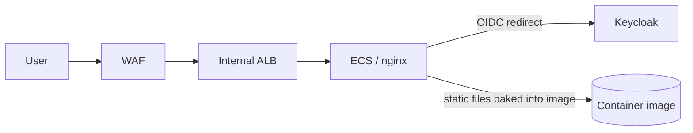
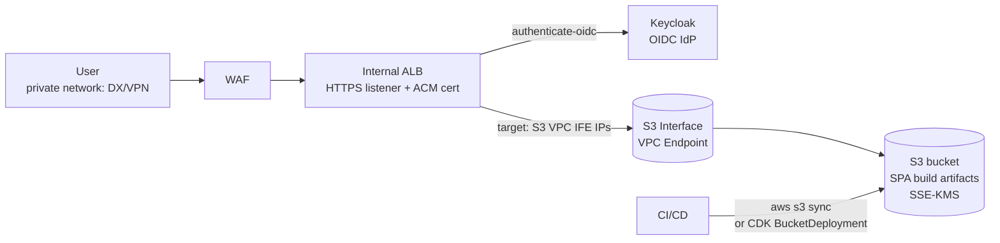

## TL;DR

Rebuilding and redeploying an ECS image for every static asset change is unnecessary. In AWS GovCloud you can keep the WAF + internal ALB and replace the ECS/nginx tier with **S3 (assets) behind an Interface VPC endpoint** plus **ALB `authenticate-oidc` against Keycloak**. CI publishes a new build by running `aws s3 sync` (or CDK `BucketDeployment`) — no image, no task definition rev, no rolling deploy.

CloudFront/Lambda@Edge are **not in GovCloud's authorization boundary**, so the canonical commercial pattern (CloudFront + S3 + Lambda@Edge OIDC) is off the table for ITAR/CUI workloads. The internal-ALB + S3 pattern is the GovCloud-native equivalent.

## Current architecture



Every frontend change = new image build + ECS deploy. nginx is doing two jobs: OIDC gate and static file server.

## What GovCloud allows

| Service | GovCloud (FedRAMP High) | Note |
|---|---|---|
| S3 | Yes | Static assets, SSE-KMS |
| ALB (incl. `authenticate-oidc`) | Yes | Region-specific JWT public-key endpoints `s3-us-gov-west-1` / `s3-us-gov-east-1` exist, confirming the feature is wired for the GovCloud partition |
| ECS / Fargate | Yes | |
| WAF | Yes | |
| **CloudFront** | **No** | Operates only in commercial; using it with GovCloud origins is "analogous to a non-AWS origin." ITAR-controlled data must not transit CloudFront. |
| **Lambda@Edge / CloudFront Functions** | **No** | Same boundary issue |
| Cognito | No (commercial only) | Not relevant — Keycloak is the IdP |

Practical consequence: any pattern that puts auth at the CDN edge (Lambda@Edge OIDC, CloudFront Functions) is unavailable. Auth has to live at the ALB or inside the VPC.

## Recommended architecture

Keep WAF + internal ALB. Drop ECS/nginx. Put assets in S3, reach S3 from the VPC via an Interface endpoint, and let ALB do OIDC against Keycloak natively.



### How requests flow

1. User hits `app.gov.example` over the private network → WAF → internal ALB.
2. ALB checks `AWSELB` session cookie. If absent/expired, redirects browser to the Keycloak `/auth` endpoint (Authorization Code + PKCE handled by ALB).
3. Keycloak authenticates, redirects back to `https://app.gov.example/oauth2/idpresponse` with the code.
4. ALB exchanges code for tokens at the Keycloak token endpoint, sets the session cookie, redirects to original URI.
5. Authenticated request: ALB forwards to the S3-VPCE target group. The target is the **private IPs of the S3 Interface endpoint ENIs**; ALB presents an ACM cert that matches the bucket's regional S3 hostname so the TLS handshake to S3 succeeds.
6. S3 returns the asset.

### Listener-rule details that always bite

These are the gotchas in the AWS reference pattern — write the CDK once and forget:

- **SPA fallback / trailing-slash:** S3's REST endpoint returns XML directory listings for `/`. Add an ALB rule that rewrites `*/` → `*/index.html`, plus a fallback that returns `index.html` for any path that 404s (so React Router deep links work on refresh).
- **Health checks:** S3 rejects ALB health checks (no Host header match) → configure success codes `307,405` instead of `200`.
- **Target type:** S3 VPCE ENI IPs are not stable across endpoint replacement. Either (a) register the IPs and refresh them with a small Lambda on the VPC-endpoint-state-change EventBridge event, or (b) use the now-supported "PrivateLink as ALB target" pattern with the endpoint service.

### Deployment

```bash
# CI pipeline step replacing the ECS image rebuild
aws s3 sync ./dist s3://$BUCKET/ \
  --delete \
  --cache-control "public, max-age=31536000, immutable" \
  --exclude "index.html"

aws s3 cp ./dist/index.html s3://$BUCKET/index.html \
  --cache-control "no-cache, must-revalidate"
```

Or in CDK:

```ts
new BucketDeployment(this, 'SpaAssets', {
  sources: [Source.asset('./dist')],
  destinationBucket: bucket,
  cacheControl: [CacheControl.fromString('public, max-age=31536000, immutable')],
  // index.html gets a separate deployment with no-cache
});
```

The `[contenthash]`-named JS/CSS bundles get cached forever; only `index.html` is short-TTL. No CloudFront invalidation step needed because there is no CloudFront — the bucket is the origin of truth.

## ALB `authenticate-oidc` ↔ Keycloak: things to design around

These limitations don't kill the pattern, but they shape it:

- **Cookie size cap.** ALB shards the auth cookie at 4K and gives up at ~11K total (returns HTTP 500, increments `ELBAuthUserClaimsSizeExceeded`). Keycloak realms with many roles/groups balloon the access token. Mitigation: trim claims via a Keycloak client-scope mapper, or rely on `sub`-only and look up authorization server-side.
- **No CORS headers from ALB.** Cross-origin XHR to a different ALB-OIDC-protected hostname will not work cleanly. Keep the SPA and any same-origin protected calls on one ALB hostname.
- **No `id_token` forwarded.** ALB passes only `x-amzn-oidc-accesstoken` (raw) and `x-amzn-oidc-data` (signed JWT of user claims, ES256). If you need the raw `id_token` (e.g. to drive a Keycloak `/logout?id_token_hint=`), capture it client-side via the Keycloak JS adapter, not via ALB headers.
- **Logout.** ALB has no first-class logout endpoint. Pattern: clear the AWSELB cookie (return `Set-Cookie: AWSELB=; Max-Age=0`) and 302 the browser to Keycloak's `end_session_endpoint`. Test against your Keycloak version — newer Keycloaks (18+) require `id_token_hint` or a registered post-logout URI.
- **15-minute auth completion timeout.** Non-configurable. If a user takes longer at the Keycloak login page they get a 401 and have to retry.
- **IPv4 only to IdP.** ALB resolves the Keycloak hostname over IPv4. For an internal/dual-stack ALB reaching a public Keycloak, route via NAT gateway.
- **SPA XHR after expiry.** With `OnUnauthenticatedRequest=deny`, expired sessions cause AJAX to get HTTP 401 instead of an HTML redirect — easy for the SPA to catch and trigger `window.location.reload()` to re-enter the auth flow.

## Where ALB-OIDC at the edge is *not* enough

ALB OIDC gates **page loads**. If the SPA also calls APIs in the same VPC, you have two options:

1. **Same ALB, separate listener rule, same OIDC session.** API targets receive `x-amzn-oidc-data` and verify the ES256 signature using the GovCloud public-key endpoint (`https://s3-us-gov-west-1.amazonaws.com/aws-elb-public-keys-prod-us-gov-west-1/{kid}`). Use `aws-jwt-verify` — it understands ALB JWTs.
2. **Token-based API auth.** SPA uses a Keycloak JS library (e.g. `oidc-spa` or `keycloak-js`) with Authorization Code + PKCE to obtain a bearer token, and calls APIs with `Authorization: Bearer …`. The API ALB validates the Keycloak-signed JWT directly. This is closer to a typical SPA + IdP architecture and avoids ALB cookie sharding entirely. ALB OIDC stays in front of the asset path only.

Option 2 is cleaner if your APIs are heavy XHR. Option 1 is cleaner if everything is server-rendered fragments behind one host.

## Why this is better than the current setup

| Concern | ECS/nginx today | ALB-OIDC + S3 |
|---|---|---|
| Frontend release | Build image, push to ECR, update task def, rolling deploy | `aws s3 sync` (seconds) |
| OIDC code | nginx auth_request / lua / oauth2-proxy maintained by you | Native ALB feature, no extra charge |
| Compute cost | Always-on Fargate tasks | None for the asset tier |
| Patching | nginx/Linux base image CVEs in your image | None — managed services |
| Rollback | New image | `aws s3 cp` previous build (use bucket versioning) |
| Blast radius of bad deploy | Bad task gets shipped to all replicas | One bucket sync; can be staged with prefix + listener rule swap |
| Compliance surface | You own the OIDC implementation | ALB feature in FedRAMP-High scope |

The only thing the ECS tier was buying you is the OIDC gate, and ALB does that natively.

## What to keep ECS for

- Server-side rendering or any non-static response.
- Backend APIs (this design assumes APIs live in their own service tier — don't fold them into the asset bucket).
- A custom auth flow ALB can't express (e.g. step-up auth, mTLS-then-OIDC, per-route ACL beyond what listener rules support).

If none of those apply to the frontend, retire it.

## Migration sketch

1. Stand up the S3 bucket + KMS key + Interface VPC endpoint in a new CDK stack.
2. Add a second target group on the existing ALB pointed at the S3 endpoint IPs, with the SPA-fallback listener rules — but **don't** route traffic to it yet.
3. Configure `authenticate-oidc` action against Keycloak on a test listener rule (e.g. host header `app-canary.gov.example`). Verify cookie flow, claim size, logout.
4. Deploy a build to the bucket via the new CI step.
5. Cut over by swapping the listener default rule from the ECS target group to the S3 target group. WAF rules unchanged.
6. Decommission the ECS service and image pipeline once the canary is clean.

## Sources

- [Setting Up Amazon CloudFront with Your AWS GovCloud (US) Resources](https://docs.aws.amazon.com/govcloud-us/latest/UserGuide/setting-up-cloudfront.html)
- [AWS Lambda in AWS GovCloud (US)](https://docs.aws.amazon.com/govcloud-us/latest/UserGuide/govcloud-lambda.html)
- [Hosting Internal HTTPS Static Websites with ALB, S3, and PrivateLink](https://aws.amazon.com/blogs/networking-and-content-delivery/hosting-internal-https-static-websites-with-alb-s3-and-privatelink/)
- [Authenticate users using an Application Load Balancer](https://docs.aws.amazon.com/elasticloadbalancing/latest/application/listener-authenticate-users.html)
- [Security best practices when using ALB authentication](https://aws.amazon.com/blogs/networking-and-content-delivery/security-best-practices-when-using-alb-authentication/)
- [Simplify Login with Application Load Balancer Built-in Authentication](https://aws.amazon.com/blogs/aws/built-in-authentication-in-alb/)
- [Quick Steps to Authenticate users with AWS ALB and Keycloak](https://medium.com/@moyo.oyegunle/quick-steps-to-authenticate-users-with-aws-alb-and-keycloak-and-ocp-6514e3be32c2)
- [Host Single Page Applications (SPA) with Tiered TTLs on CloudFront and S3](https://aws.amazon.com/blogs/networking-and-content-delivery/host-single-page-applications-spa-with-tiered-ttls-on-cloudfront-and-s3/)
- [aws-cdk-lib.aws_s3_deployment](https://docs.aws.amazon.com/cdk/api/v2/docs/aws-cdk-lib.aws_s3_deployment-readme.html)
- [aws-jwt-verify](https://github.com/awslabs/aws-jwt-verify)
- [FedRAMP services in scope (AWS)](https://aws.amazon.com/compliance/services-in-scope/FedRAMP/)
- [When an ALB Can Replace Nginx (and When It Can't)](https://yaw.sh/blog/when-alb-replaces-nginx/)
