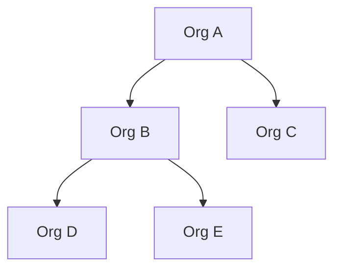

# Hierarchical Multi-Org API Patterns

You have orgs in a tree (A → {B, C}, B → {D, E}). A user in B should see resources from B, D, E (descendants), but not A or C. This note covers how GitLab, GCP, and Azure model this, and the choices you make for API shape, resource placement, and moves.

## TL;DR

- **One owning org per resource.** Store a single `owner_org_id`. Visibility is computed via the org tree, not duplicated on the resource.
- **Active org context drives create.** The user picks (or inherits) an active org from their accessible subtree; that org becomes `owner_org_id`. Don't infer from membership alone — a user in A could mean A, B, C, D, or E.
- **Treat move as a first-class operation** (`POST /resources/{id}:move` or `PATCH` of `owner_org_id`). It's a permission-sensitive transition, not a generic field edit.
- **Scope reads by subtree of the active org**, not by user membership. Active org B → results are B ∪ descendants(B).
- **Use a path-prefix or closure-table representation** of the org tree so "all descendants of X" is one indexed query.

## Modeling the org tree

Three common storage shapes, all viable:

| Approach | Read pattern | Write pattern | Notes |
|---|---|---|---|
| Adjacency list (`parent_id`) | Recursive CTE | Trivial | Fine for shallow trees, slow for deep `descendant_of` queries. |
| Materialized path (Postgres `ltree`) | `path <@ 'a.b'` indexed | Cheap insert, costly subtree move (rewrite paths) | Best fit for "all descendants" scoping. |
| Closure table | Indexed join on `(ancestor, descendant)` | Insert/move rewrites multiple rows | Fastest reads; more write complexity. |

Real systems pick by depth + move frequency. GitLab supports up to 20 levels of nested groups; Azure caps Management Groups at 6 levels under root. Pick a depth limit early — it bounds your worst-case query cost.



## Resource ownership

**Each resource has exactly one `owner_org_id`.** This is how GitLab projects, GCP projects, and Azure subscriptions all work — they live in exactly one parent.

Visibility is *derived*, not stored:

- A user with access at org X can see resources where `owner_org_id IN descendants(X) ∪ {X}`.
- Listing query (with `ltree`):
  ```sql
  SELECT r.* FROM resources r
  JOIN orgs o ON o.id = r.owner_org_id
  WHERE o.path <@ :active_org_path;
  ```
- Permissions inherit *down* the tree: a role granted at A applies to B, C, D, E. This matches GCP IAM ("roles granted on a folder are inherited by all project and folder resources in that folder") and GitLab ("permissions are inherited from the group into all subgroups").

Don't denormalize `visible_org_ids[]` onto each resource — it explodes on org moves and breaks the single-source-of-truth.

## API shape: scoping requests

Three places to put the active org. Most production systems pick one and stick to it:

### 1. Path-scoped (recommended for tenanted resources)
```
GET    /orgs/{orgId}/resources
POST   /orgs/{orgId}/resources
GET    /orgs/{orgId}/resources/{resourceId}
```
Pros: caches cleanly, RESTful, every URL is unambiguous, easy to authorize at the routing layer. GitLab and GitHub both do this for groups/orgs.

Cons: when moving a resource its canonical URL changes (mitigate with a stable global ID redirect: `GET /resources/{id}` → 307 to current path).

### 2. Header / JWT claim
```
GET /resources
X-Org-Id: <uuid>            # or claim in the JWT
```
Pros: cleaner global resource URLs, the active org is per-session UI state.

Cons: GET requests can't be linked or cached without out-of-band context; harder to audit. Azure's guidance explicitly warns custom headers don't survive proxies and break browser GETs.

### 3. Hybrid (common in practice)
- Mutations and listings are path-scoped: `/orgs/{orgId}/resources`.
- Direct fetch by global ID is unscoped: `/resources/{id}` — server resolves the owner and authorizes.
- The UI carries an "active org" in a JWT claim or cookie purely to populate the path on outbound calls.

This is what GCP effectively does: every resource has a global resource name (`projects/123/instances/foo`) but APIs are also addressable through parents.

## Resource creation: where does it live?

The user is in A, with implicit access to {A, B, C, D, E}. When they hit "Create", which org owns the new resource?

**Pattern: active-org-on-create, with a picker fallback.**

1. The UI maintains an **active org** — the one the user is "looking at" right now. The resource is created under it. This is the most common pattern (GitHub org switcher, Slack workspace, Linear workspace, GitLab "create in this group" buttons).
2. On the create form, expose an **org picker** defaulted to the active org, scoped to orgs the user can write to. The user can override.
3. The API requires an explicit owner — never infer.

```http
POST /orgs/{orgId}/resources
Content-Type: application/json

{ "name": "...", ... }
```

or

```http
POST /resources
{ "ownerOrgId": "...", "name": "...", ... }
```

Authorization: the user must hold a role at `ownerOrgId` *or any ancestor of it* that includes `resource:create`. (Inheritance flows down — a role at A authorizes creation in D.)

**Don't make placement implicit from "the user's org".** A user in A has multiple legitimate targets. Picking one for them is a guess; making them choose is one extra dropdown that prevents a class of "why is my resource in the wrong place" tickets.

## Moving resources

Treat move as its own operation, not a field update.

```http
POST /resources/{id}:move
{ "targetOrgId": "..." }
```

or RFC 6902 patch:

```http
PATCH /resources/{id}
{ "ownerOrgId": "..." }
```

Either way, the handler must:

1. **Authorize the source**: caller can `resource:move` at the resource's current owner (or ancestor).
2. **Authorize the target**: caller can `resource:create` at `targetOrgId` (or ancestor).
3. **Re-evaluate inheritance**: any policies/permissions that flowed *into* the resource via its old parent stop applying; the target's policies now apply. Azure docs are explicit about this for subscription moves: "the subscription loses all policies inherited from Management Group A and gains all policies inherited from Management Group B."
4. **Update the materialized path / closure rows** in one transaction. For nested resource trees (resource owns sub-resources), this is a subtree rewrite.
5. **Emit an audit event.** Moves are governance-sensitive.

Caveats worth surfacing in the API contract:

- Visibility may change for some users (anyone whose access was via the *old* parent's ancestors loses it).
- URL changes if you use path-scoped routes (return the new canonical URL or rely on global IDs).
- Reject moves that would create a cycle (target must not be a descendant of the resource's current org if resources can themselves nest).

## Authorization model

For hierarchical orgs, **role-on-org-node + downward inheritance** covers most cases:

- Roles are granted at any org node (`grants(user, org, role)`).
- Effective roles at a node = union of roles granted at that node and at every ancestor.
- Resource access = effective roles at `owner_org_id` of the resource.

If you anticipate cross-cutting access (resources shared with a sibling subtree, or per-resource collaborators), graduate to **ReBAC** (Zanzibar-style: SpiceDB, OpenFGA, Auth0 FGA). The hierarchy becomes one relation among many.

## Edge cases to design for

- **Listing across the whole accessible scope** vs. just the active org. Offer both: `?scope=subtree` (default) vs `?scope=direct`.
- **Cross-subtree sharing.** Single-owner ≠ single-viewer. Add a separate `resource_grants` table if you need to share into a sibling without moving.
- **Deleting an org** with descendants or resources. Either cascade, block, or require a target for re-parenting. Pick one and document it.
- **Creating a sub-org** is the same problem as creating a resource: explicit `parentOrgId` chosen from the user's writable subtree.
- **Quotas and billing usually attach at a specific level** (often the root or a designated "billing org"). Don't conflate with the visibility tree.

## Recommended API surface (concrete)

```
# Org tree
GET    /orgs                                  # orgs the caller can see (their roots + descendants)
POST   /orgs                                  # body: { parentOrgId, name }
GET    /orgs/{orgId}
PATCH  /orgs/{orgId}                          # rename, etc.
POST   /orgs/{orgId}:move                     # body: { newParentOrgId }
DELETE /orgs/{orgId}

# Resources, path-scoped for create + list
GET    /orgs/{orgId}/resources?scope=subtree  # default subtree, opt-in direct
POST   /orgs/{orgId}/resources

# Resources, global by id for fetch + mutate
GET    /resources/{id}
PATCH  /resources/{id}
DELETE /resources/{id}
POST   /resources/{id}:move                   # body: { targetOrgId }

# Membership
POST   /orgs/{orgId}/members                  # role inherits to descendants
GET    /orgs/{orgId}/members?inherited=true|false
```

## References

- [GitLab Subgroups](https://docs.gitlab.com/user/group/subgroups/) — 20-level nesting, inherited membership.
- [GitLab Groups API](https://docs.gitlab.com/api/groups/) — `parent_id` based subgroup creation.
- [GitLab Group access and permissions](https://docs.gitlab.com/user/group/access_and_permissions/) — inheritance flows down.
- [GCP Resource Hierarchy](https://docs.cloud.google.com/resource-manager/docs/cloud-platform-resource-hierarchy) — Org → Folder → Project → Resources.
- [GCP IAM hierarchy access control](https://docs.cloud.google.com/iam/docs/resource-hierarchy-access-control) — effective policy = union of self + ancestors.
- [GCP Manage projects within folders](https://docs.cloud.google.com/resource-manager/docs/manage-projects-within-folder) — moving projects re-evaluates inherited policy.
- [Azure Management Groups overview](https://learn.microsoft.com/en-us/azure/governance/management-groups/overview) — 6-level cap, single parent.
- [Azure Management Groups manage](https://learn.microsoft.com/en-us/azure/governance/management-groups/manage) — REST `PUT` move pattern.
- [Azure: Map requests to tenants](https://learn.microsoft.com/en-us/azure/architecture/guide/multitenant/considerations/map-requests) — path vs header trade-offs.
- [AWS Prescriptive Guidance: Multi-tenant SaaS authz](https://docs.aws.amazon.com/prescriptive-guidance/latest/saas-multitenant-api-access-authorization/introduction.html) — token-claim and ReBAC patterns.
- [Postgres `ltree`](https://www.postgresql.org/docs/current/ltree.html) — materialized-path tree type with subtree operators.
