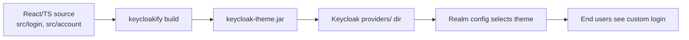
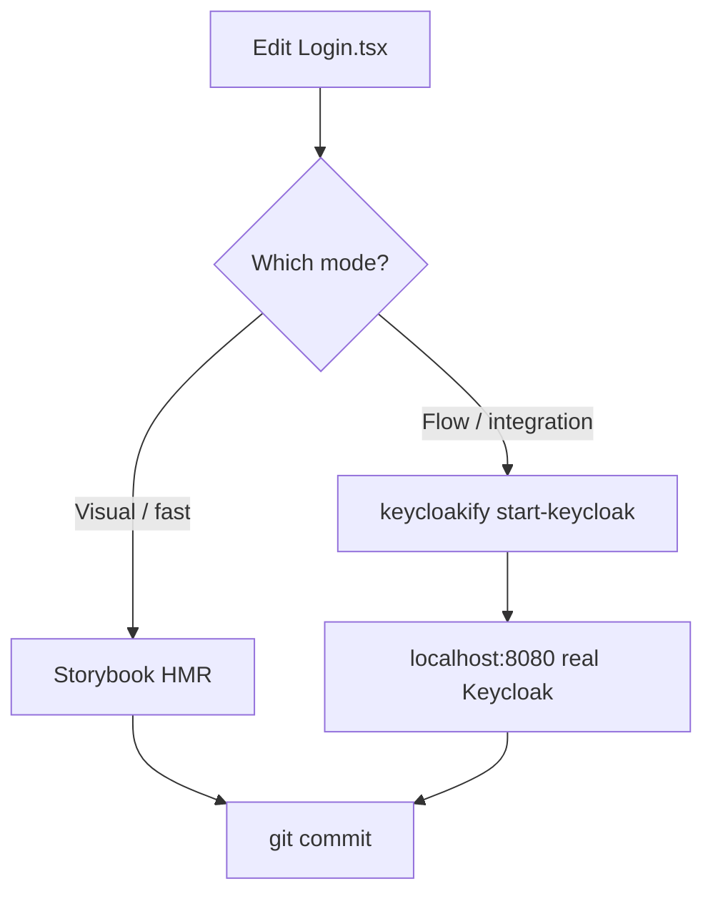
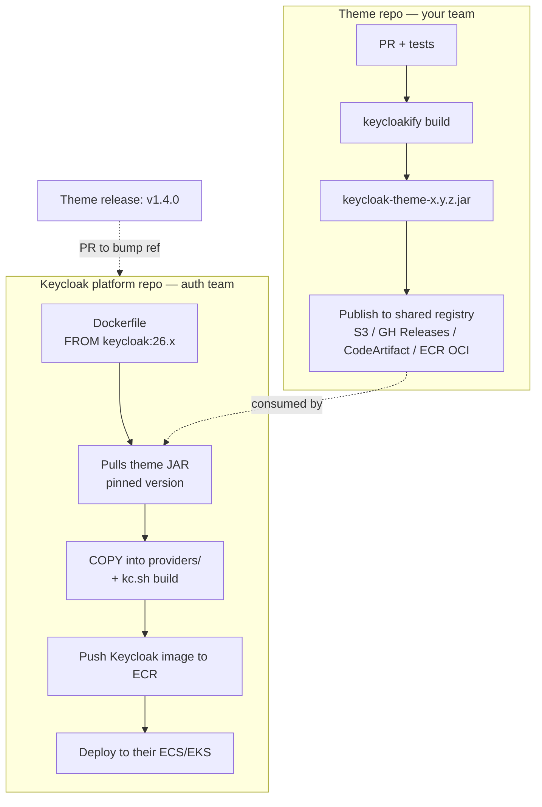
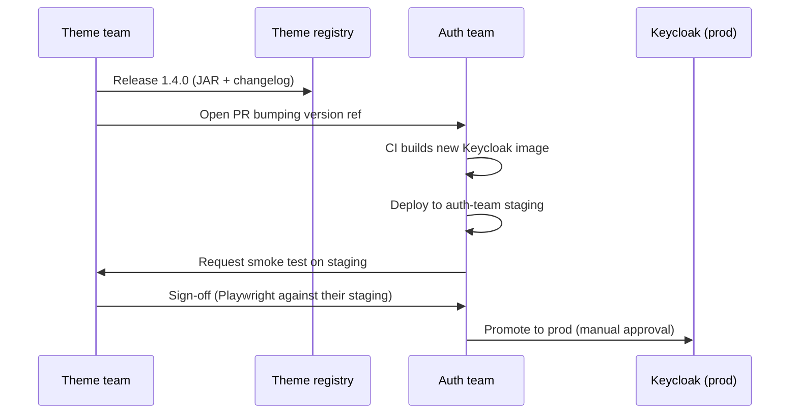

## Is the REST-only assumption correct?

**Mostly yes — for login, you theme it; for everything else, use the Admin REST API.**

Keycloak's login-time flows are rendered server-side from Freemarker templates: login, registration, password reset, MFA/OTP, required actions, consent, identity-provider linking, update-profile, error, account console. The browser must land on Keycloak to complete the OIDC Authorization Code flow so Keycloak can set its session cookie, run brute-force protection, apply authenticator SPIs, honor `required actions`, and mint tokens. There is no REST endpoint that reproduces that flow end-to-end with the same security guarantees.

The one exception is the **Resource Owner Password Credentials** grant (`/token` with `grant_type=password`). Avoid it:

- Deprecated in OAuth 2.1.
- Bypasses MFA, required actions, consent, social login, SSO, and step-up auth.
- Forces your app to handle raw credentials.

So the split you're describing is the idiomatic one:

- **Login surface → Keycloakify theme** (JAR deployed into Keycloak).
- **User/realm/group/role management → Admin REST API** (`/admin/realms/...`) with a service-account client using `realm-management` roles.

## What Keycloakify actually produces

Keycloakify is a build tool. You write React + your own CSS/Tailwind; it transpiles each page into the Freemarker template Keycloak expects, bundles the JS/CSS, and packages everything as a **Keycloak theme JAR**.

The JAR is the only deployable artifact. Keycloak loads it from its `providers/` directory at startup; the theme is then selectable per realm (Login theme, Account theme, Email theme).



## Repo layout

```
keycloak-theme/
├── src/
│   ├── login/              # KcPage.tsx + per-page overrides
│   ├── account/            # optional, only if customizing account console
│   ├── main.tsx            # dev entrypoint
│   └── kc.gen.ts           # generated: messages, page props
├── public/
├── vite.config.ts          # @keycloakify/vite-plugin
├── package.json
└── .storybook/             # per-page stories
```

One repo, one JAR. Keep it separate from your app repo — themes version independently from Keycloak and from the frontends consuming it.

## Local dev loop

Two modes, use both:

1. **Storybook** — fastest. Each page (`Login`, `Register`, `LoginOtp`, `LoginResetPassword`, ...) gets a story with mock `kcContext`. Iterate on styles without touching Keycloak.
2. **`npx keycloakify start-keycloak`** — spins up a real Keycloak container with your theme mounted and hot-reloaded. Use this to verify actual Freemarker rendering, i18n lookups, and flows you can't fake in Storybook (real form POST, error states, required actions).



## Testing strategy

Pyramid, bottom to top:

| Layer | Tool | What it catches |
|---|---|---|
| Unit / visual | Storybook + Chromatic (or Playwright snapshots of stories) | Component regressions, per-page variants (error, loading, social IdPs, remember-me, password policies) |
| Integration | Playwright against `start-keycloak` container | Real form submission, redirects, session cookie, i18n, CSRF tokens rendered correctly |
| E2E | Playwright against a staging Keycloak with a test realm | Full auth code flow from your actual SPA, MFA, password reset email link, IdP broker redirects |
| Smoke (post-deploy) | Playwright, headless, against prod realm with a synthetic user | Theme JAR loaded, no 500s on login page, asset URLs resolve behind CDN/reverse proxy |

Key per-page variants to story/test — easy to forget:

- Login: with/without social IdPs, "remember me", reset-password link, register link, account lockout message, invalid credentials, realm disabled.
- Register: each configured required field, password policy violations, terms acceptance.
- LoginOtp / LoginRecoveryAuthnCodeConfig: TOTP setup, backup codes.
- LoginUpdatePassword / LoginUpdateProfile: required-action flows.
- Error: expired code, cookie not set, identity-provider linking failures.
- Email templates: if you theme these, render them with a tool like `mjml` or the Keycloakify email preview and snapshot.

Keycloakify ships mock `kcContext` fixtures for every page — use them as story args rather than hand-building.

## CI pipeline

```mermaid
flowchart LR
    PR[Pull request] --> Lint[lint + typecheck]
    Lint --> Unit[Storybook build + visual diff]
    Unit --> Build[keycloakify build -> JAR]
    Build --> IT[Playwright vs start-keycloak]
    IT --> Artifact[Publish JAR + SHA + changelog]
    Artifact --> Image[Build Keycloak image<br/>with theme baked in]
    Image --> ECR[Push to ECR with git SHA tag]
    ECR --> Deploy[Deploy to staging]
    Deploy --> Smoke[Playwright smoke tests]
    Smoke --> Promote[Manual approval -> prod]
```



GitHub Actions sketch:

- `pnpm install --frozen-lockfile`
- `pnpm typecheck && pnpm lint`
- `pnpm build-storybook` → visual diff via Chromatic or `@playwright/test` against stories.
- `pnpm keycloakify build` → produces `dist_keycloak/keycloak-theme-<version>.jar`.
- Integration: `npx keycloakify start-keycloak --port 8080` in background, `pnpm playwright test`.
- On merge to `main`: build Docker image `FROM quay.io/keycloak/keycloak:26.x` with the JAR copied into `/opt/keycloak/providers/`, then `kc.sh build` baked at image-build time so startup is fast.
- Push to ECR with both `:sha-<commit>` and `:staging` tags.

## Deployment

The "deploy" step is two independent things, decoupled on purpose:

1. **Ship the theme bits** (the JAR) to wherever Keycloak can load it.
2. **Point a realm at the theme** (realm-level config: `loginTheme`, `accountTheme`, `emailTheme`).

### Shipping the JAR — three patterns

| Pattern | How | When to use |
|---|---|---|
| **Baked image** (recommended) | Dockerfile copies JAR into `/opt/keycloak/providers/`, runs `kc.sh build`. Image tagged by theme SHA. | You control the Keycloak deployment. Immutable, atomic rollback, one artifact per deploy. |
| **Sidecar / init container** | JAR pulled from S3/ECR by init container, volume-mounted into Keycloak pod. | You don't want to rebuild Keycloak image for every theme tweak. Requires Keycloak restart to pick up. |
| **Managed Keycloak** (Cloud-IAM, Phase Two, Red Hat SSO) | Upload theme via their UI/API. | You don't run Keycloak yourself. |

For an AWS-native setup: **baked image → ECR → ECS Fargate (or EKS) service → rolling deploy.** CDK manages the ECS service; the theme repo's CI updates the image tag in a parameter/SSM, and a CDK pipeline picks it up. Or use an ECS task definition update directly from GH Actions.

Important: Keycloak only picks up new theme JARs on **startup**, and `kc.sh build` must run if you're on optimized/production mode. Baking into the image sidesteps both issues — a new image = a new rollout.

### Pointing the realm at the theme

Two ways, both automatable:

- **Terraform `mrparkers/keycloak` provider** — `keycloak_realm` resource has `login_theme`, `account_theme`, `email_theme` fields. Run in the same pipeline that deploys the image, after the image is live.
- **`keycloak-config-cli`** — declarative YAML/JSON config applied at deploy time against the Admin API.

Don't set theme via the admin UI in prod — it drifts.

### Rollback

Because the theme name is a string ref, rollback is two cheap options:

- **Image rollback** — redeploy previous ECS task definition. Theme name unchanged, JAR version reverts.
- **Theme switch** — if you version theme names (`mycorp-v3`, `mycorp-v4`) and bake both into the image, flip the realm's `loginTheme` back via Terraform. Slower, but zero container churn.

I'd pick image rollback for speed and keep a single theme name.

## Can it be fully automated?

Yes, end-to-end:

- **Build + test + JAR + image + ECR push** → GitHub Actions on merge to main.
- **Image deploy** → ECS service update (CDK pipeline or direct `aws ecs update-service`).
- **Realm theme ref** → Terraform apply in the same pipeline, only needed when you rename the theme or add a new realm.
- **Post-deploy verification** → Playwright smoke hitting the login URL with a synthetic user.

The one place to keep manual: **promotion from staging to prod**. Login is a blast-radius-of-everyone surface — a broken login locks out your whole user base, including admins. Gate prod on a manual approval in the pipeline, and keep the previous image tag pinned for one-click rollback.

## Two pipelines: theme team vs auth team

When the auth team owns the Keycloak instance, the theme repo becomes a **library producer** and the auth team's pipeline is the **consumer**. The JAR is the contract.



### What to publish from the theme pipeline

Pick one artifact store and stick to it. Options, in order of how well they fit an AWS-native org:

- **CodeArtifact (Maven repo)** — Keycloak themes are JARs; this is the native Java way and supports version ranges, IAM auth, replication. Best fit if the auth team already treats Keycloak providers as Maven deps.
- **ECR as an OCI artifact** — `oras push` the JAR. Same auth model as their Keycloak image. Good if the auth team's Dockerfile uses a multi-stage `COPY --from=...` pattern.
- **S3 bucket with versioned paths** — simplest. `s3://acme-keycloak-themes/login/1.4.0/keycloak-theme.jar`. Cross-account read via bucket policy. Good enough for most orgs.
- **GitHub Releases** — fine if both teams are in GitHub and no air-gap concerns.

Publish with `:sha-<commit>`, `:1.4.0`, and `:latest-stable` tags. Never have the auth team consume `latest` — always a pinned version.

### The contract between the pipelines

Make these explicit so you don't break each other:

| Contract | Owner | Broken when |
|---|---|---|
| Theme **name** in JAR (`META-INF/keycloak-themes.json`) | Theme team | Renaming the theme → auth team's realm config still points at old name → login unstyled. |
| **Keycloak version** compatibility range | Both | Auth team upgrades Keycloak major faster than theme bumps Keycloakify. |
| **Page coverage** (which `pageId`s are implemented) | Theme team | Auth team adds an authenticator that renders a new page → theme falls back to unstyled Freemarker default. (See next section.) |
| **Asset path assumptions** (CDN, reverse proxy headers) | Auth team | They change `KC_HOSTNAME` or proxy setup → theme's CSS/JS 404s. |
| **i18n keys** required | Theme team | Theme expects `${msg('selectTenant')}` but auth team's new authenticator doesn't register the message bundle. |

Put the contract in a `COMPATIBILITY.md` in the theme repo. Each theme release lists: min/max Keycloak version, Keycloakify version, list of pages covered.

### Promotion flow across both pipelines



Two pipelines, one promotion gate. The theme team doesn't push to prod Keycloak directly — they hand an artifact to the auth team and sign off on the staging rollout.

### Testing across the seam

- Theme repo CI still runs `keycloakify start-keycloak` in isolation — fast signal.
- Add a **contract test**: auth team's pipeline, on PR, runs a minimal Playwright suite (provided as an npm package by the theme team) against their staging Keycloak. Catches "their Keycloak config broke our theme."
- Theme team maintains a **reference realm export** (`realm-export.json`) that Keycloakify's `start-keycloak` imports. It mirrors the auth team's prod realm shape: same authenticator flows, same IdPs enabled, same required actions. Update this whenever the auth team changes flow config.

### Dev ergonomics when you don't own Keycloak

You still iterate locally with `start-keycloak` — it spins up a disposable container with your theme. You do **not** need access to the auth team's Keycloak to develop. The only thing you need from them is an up-to-date realm export that reflects their flow config (for the reference realm above).

## Custom login steps (new authenticators)

Yes, Keycloakify supports this — but the work splits cleanly between the two teams, and the coordination point is the **Freemarker template name**.

### How Keycloak extends login flows

Keycloak's authentication flow is a sequence of **authenticators**. Stock ones: "Username Password Form", "OTP Form", "Cookie", etc. Adding a new step (e.g., "select a tenant", "accept updated terms", "answer security question") means the auth team writes a custom **Authenticator SPI** in Java:

- A class implementing `org.keycloak.authentication.Authenticator` — decides whether to prompt, renders a Freemarker template, processes the POST.
- A `AuthenticatorFactory` that registers it with an ID.
- Packaged as its own JAR, deployed to Keycloak's `providers/` (same place as the theme JAR, different artifact).
- Configured into the flow via Admin UI or Terraform (`keycloak_authentication_flow` + `keycloak_authentication_execution`).

The JWT is only minted **after** every authenticator in the browser flow returns `SUCCESS`. Until then, the user is on an intermediate page backed by an authenticator — which means you need a themed page for each one.

### Where Keycloakify fits

The authenticator renders a Freemarker template, e.g., `select-tenant.ftl`. Keycloakify lets you register that template as a **custom page** — out-of-the-box Keycloakify only styles the base set (`login.ftl`, `register.ftl`, `login-otp.ftl`, ...), but custom pages hook into the same theming pipeline:

1. Add the template name to `KcContextExtensionPerPage` so TypeScript knows the `pageId`.
2. Declare the typed shape of whatever the authenticator puts on `kcContext` (custom form fields, dropdown options, errors).
3. Write a React component branded `pageId: "select-tenant.ftl"` and route it in your `KcPage.tsx` switch.
4. Rebuild the theme JAR — Keycloakify emits a matching Freemarker template the authenticator will find.

Sketch (shape matches what Keycloakify docs specify):

```ts
// KcContext.ts — theme repo
export type KcContextExtensionPerPage = {
  "select-tenant.ftl": {
    auth: { attemptedUsername: string };
    url: { loginAction: string; loginRestartFlowUrl: string };
    tenants: Array<{ id: string; displayName: string }>;
  };
};
```

```tsx
// pages/SelectTenant.tsx
export default function SelectTenant(
  props: PageProps<Extract<KcContext, { pageId: "select-tenant.ftl" }>, I18n>
) {
  const { kcContext, i18n, Template } = props;
  const { url, tenants } = kcContext;
  return (
    <Template {...props} headerNode={i18n.msg("selectTenantTitle")}>
      <form action={url.loginAction} method="post">
        {/* render tenants, submit selection */}
      </form>
    </Template>
  );
}
```

### Who does what

| Step | Team | Artifact |
|---|---|---|
| Write authenticator Java SPI | Auth team | `tenant-selector-spi-x.y.z.jar` |
| Register authenticator in flow (Terraform/`keycloak-config-cli`) | Auth team | Realm config |
| Define template name contract (`select-tenant.ftl`) | Both — agreed in a design doc | — |
| Provide mock `kcContext` fixture for local dev | Auth team → theme team | JSON fixture + Storybook story |
| Implement themed React page | Theme team | Updated theme JAR |
| i18n keys (`selectTenantTitle`, etc.) | Theme team (messages) + auth team (references in Java) | Both JARs |
| Playwright E2E covering the new step | Shared — theme team writes, runs in both pipelines | — |

The auth team must give the theme team:

- The **template filename** (`select-tenant.ftl`).
- The **shape of the data** the authenticator will put on `FormMessage` / `AuthenticationFlowContext.form()` — every field you'll read from `kcContext`.
- A **mock JSON fixture** matching that shape so the theme team can build against Storybook without needing the SPI JAR deployed.
- A **staging Keycloak** with the authenticator already wired into a test flow, so Playwright can exercise the real path.

### Integration timing

The risk here is version skew: auth team ships the SPI JAR before theme has the page, or vice versa. Mitigations:

- **Fallback template**: auth team can ship a minimal default `select-tenant.ftl` in their SPI JAR so Keycloak doesn't 500 if the theme hasn't caught up. Keycloak resolves theme templates first, but falls back to provider-bundled ones.
- **Feature flag the authenticator**: keep it out of the active flow until both JARs are in prod. Toggle via Terraform realm config.
- **Same-release coordination**: for flows where fallback is ugly, cut both releases together — theme v1.5.0 + SPI v0.3.0 in the same change window.

### Things that are *not* possible this way

- **Fully custom non-Keycloak UI for the extra step** — e.g., hosting the tenant selector in your own SPA and then resuming the Keycloak flow. Technically doable via `ACTION_TOKEN` and custom required actions, but it's a lot of machinery and loses Keycloak's CSRF/session protections mid-flow. Don't go here unless you have a strong reason.
- **Client-side-only steps** — anything that must influence token claims has to run server-side in the authenticator. JS in the Keycloakify page can enhance UX but can't be trusted for authz decisions.

## Gotchas

- **Asset URLs behind CDN/reverse proxy**: Keycloak emits asset paths based on `KC_HOSTNAME` / `KC_PROXY_HEADERS`. Get these wrong and your theme's CSS/JS 404s only in staging/prod. Test with production-equivalent ingress in at least one pre-prod env.
- **`kc.sh build` in optimized mode**: if you run Keycloak with `--optimized`, you must rebuild after adding a provider JAR. Bake it in.
- **Freemarker escape**: Keycloakify handles this, but any string you render from `kcContext` inside `dangerouslySetInnerHTML` is a footgun. Don't.
- **i18n**: message bundles live in `src/login/i18n.ts`. Missing keys fall back to Keycloak defaults, which look out of place. Add a test that fails on missing keys for your supported locales.
- **Version coupling**: Keycloakify releases track Keycloak majors. Upgrading Keycloak → upgrade Keycloakify → regenerate `kc.gen.ts` → re-test every page. Don't skip majors.
- **Account console v2/v3**: Keycloak 24+ ships a React-based account console. If you're customizing that, it's a different Keycloakify entrypoint than login — check which version your Keycloak runs.
