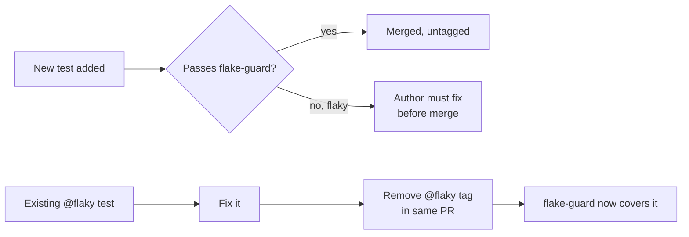

## Goal

- Block PRs that introduce flaky tests.
- Keep the existing (already-flaky) suite passing while you clean it up — opt-in, not opt-out.

## The building blocks

Playwright ships everything needed:

| Flag / option            | Effect                                                                 |
| ------------------------ | ---------------------------------------------------------------------- |
| `--repeat-each=N`        | Runs each matching test N times in the same invocation.                |
| `--retries=0`            | Disables retries so a single failure surfaces the flake.               |
| `--fail-on-flaky-tests`  | Exits non-zero if any test needed a retry to pass (belt-and-braces).   |
| `--grep-invert=@flaky`   | Skips tests annotated with the `@flaky` tag.                           |
| `test(..., { tag })`     | First-class tag metadata on tests — greppable without filename tricks. |

Combine `--repeat-each` with `--retries=0` and you get a pure flake detector: the test must pass N times in a row with zero retries.

## Recommended approach: tag-based allowlist

Tag known-flaky tests with `@flaky`. The stress job skips them via `--grep-invert`. Everything else must pass N consecutive runs.

### 1. Tag existing flakes

```ts
import { test, expect } from '@playwright/test';

test('checkout happy path', { tag: '@flaky' }, async ({ page }) => {
  // ...
});
```

Tags live on the test itself — no separate JSON file, no drift between code and allowlist, and `git blame` tells you who allowlisted it and when.

For a whole file, use `test.describe(..., { tag: '@flaky' }, () => { ... })`.

### 2. Add a stress npm script

```json
{
  "scripts": {
    "test:e2e": "playwright test",
    "test:e2e:stress": "playwright test --repeat-each=10 --retries=0 --fail-on-flaky-tests --grep-invert=@flaky"
  }
}
```

`--repeat-each=10` is a reasonable starting point. Bump to 20–50 for high-value suites; drop to 5 if runtime is painful. Each repeat runs in the same worker pool so wall time scales sub-linearly.

### 3. GitHub Actions job

```yaml
# .github/workflows/pr.yml
name: PR checks

on:
  pull_request:

jobs:
  e2e:
    runs-on: ubuntu-latest
    steps:
      - uses: actions/checkout@v4
      - uses: actions/setup-node@v4
        with: { node-version: 20, cache: pnpm }
      - uses: pnpm/action-setup@v4
      - run: pnpm install --frozen-lockfile
      - run: pnpm exec playwright install --with-deps
      - run: pnpm test:e2e

  flake-guard:
    runs-on: ubuntu-latest
    steps:
      - uses: actions/checkout@v4
      - uses: actions/setup-node@v4
        with: { node-version: 20, cache: pnpm }
      - uses: pnpm/action-setup@v4
      - run: pnpm install --frozen-lockfile
      - run: pnpm exec playwright install --with-deps
      - run: pnpm test:e2e:stress
      - uses: actions/upload-artifact@v4
        if: failure()
        with:
          name: flake-guard-report
          path: playwright-report/
          retention-days: 14
```

Make `flake-guard` a required check in branch protection. The regular `e2e` job keeps running with your normal retry policy so you still catch hard failures.

## How the allowlist shrinks



- New tests are un-tagged by default, so they face the stress check automatically.
- To retire a flake from the allowlist, fix the root cause and delete the `@flaky` tag in the same PR. If flake-guard passes, you're done.
- Reviewers can grep for `@flaky` in the diff — adding the tag is a visible, reviewable action, not a silent config change.

## Why not the obvious alternatives

**A separate "stress" Playwright project in `playwright.config.ts` with `testIgnore`.**
Works, but the ignore list lives far from the tests. Tags co-locate the metadata with the test.

**A JSON/YAML allowlist file checked in separately.**
Drifts from reality. Renames and deletes break it silently. Tags travel with the test through refactors.

**`test.fixme` or `test.skip` on the flakes.**
Skipped tests stop running in the normal suite too — you lose the signal and the regression cover. The `@flaky` tag keeps them running in `test:e2e` (with retries) and only excludes them from `flake-guard`.

**Running `--repeat-each` on the whole suite with retries enabled.**
Retries mask the thing you are trying to detect. `--retries=0` is the point.

## Tuning knobs

- **Runtime blowup.** `--repeat-each=10` roughly 10× the suite. Shard across runners (`--shard=1/4`, `--shard=2/4`, …) as matrix jobs if it gets slow.
- **Only run flake-guard on changed tests.** Use `--only-changed` (compares against the base ref) to stress only tests touched in the PR. Cheaper, and aligns incentives: you're responsible for the tests you ship.
  ```
  playwright test --only-changed=origin/main --repeat-each=20 --retries=0 --fail-on-flaky-tests
  ```
- **Nightly deep run.** Keep a scheduled workflow that runs `--repeat-each=50` on the full suite (including `@flaky` tests) and opens issues for regressions. This is how the allowlist actually shrinks over time.
- **Trace on failure.** Add `trace: 'retain-on-failure'` in the stress project's `use` block — the artifact upload above will have the trace for whichever repeat failed.

## Minimum viable rollout

1. Add `{ tag: '@flaky' }` to every currently-flaky test (one PR, mechanical).
2. Add the `test:e2e:stress` script and the `flake-guard` job.
3. Make `flake-guard` a required check.
4. Track `@flaky` tag count over time — that's your debt metric.

Sources:
- [Playwright — Command line](https://playwright.dev/docs/test-cli) (`--repeat-each`, `--fail-on-flaky-tests`, `--only-changed`)
- [Playwright — Retries](https://playwright.dev/docs/test-retries)
- [Playwright — Annotations & tags](https://playwright.dev/docs/test-annotations)
- [Playwright TestConfig — `failOnFlakyTests`](https://playwright.dev/docs/api/class-testconfig#test-config-fail-on-flaky-tests)
