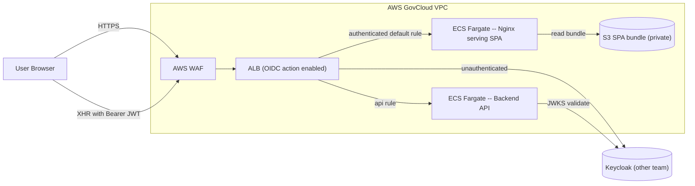
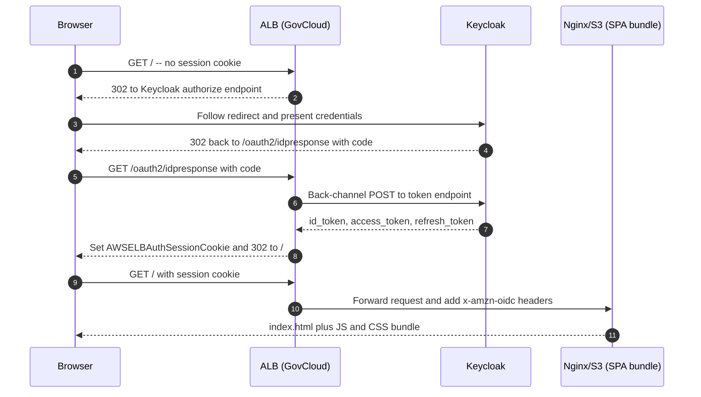
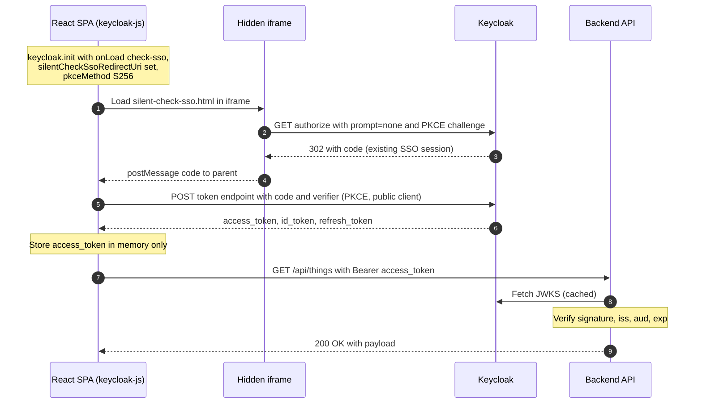
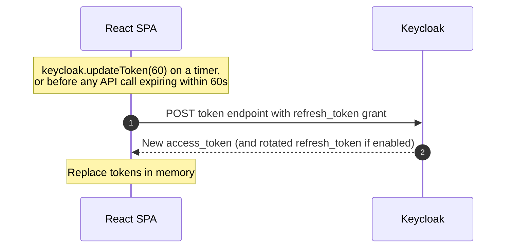
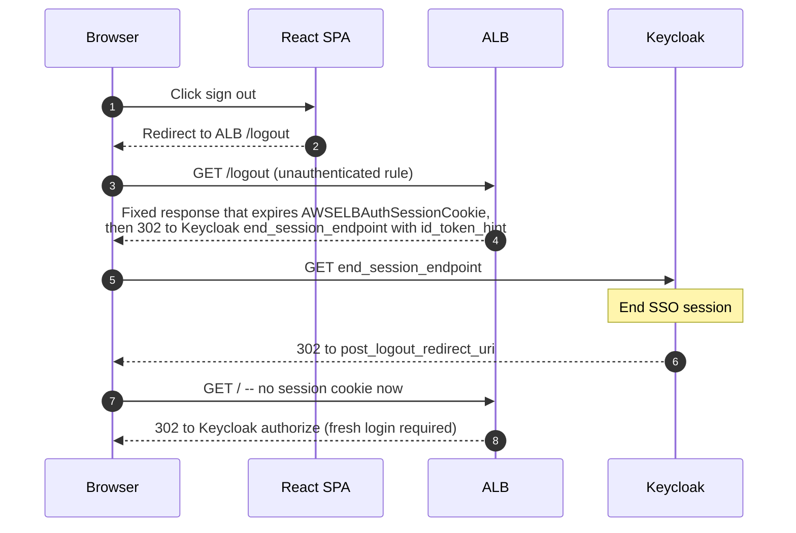
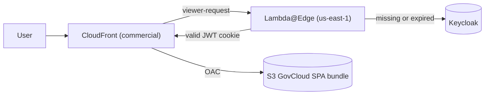

## Summary

Recommended architecture: **ALB (GovCloud) with built-in OIDC action → Nginx/S3 origin behind it → React SPA uses `keycloak-js` silent SSO to obtain its own access token for backend API calls.**

Two factors drive this choice over the more common "CloudFront + Lambda@Edge" pattern:

1. **CloudFront is not available inside GovCloud regions** and is **only authorized at FedRAMP Moderate, not High**. Using it with GovCloud origins is possible but requires explicit Authorizing Official sign-off as a shared-responsibility deviation. ([AWS re:Post — CloudFront availability via GovCloud](https://repost.aws/questions/QU29eRXyDwQnWdDOL9APEucQ/cloudfront-availability-via-govcloud), [cloud.gov CDN deprecation note](https://docs.cloud.gov/platform/services/cdn-route/))
2. **ALB has native OIDC `authenticate-oidc` action**, runs entirely inside GovCloud, is FedRAMP High in scope, and supports any OIDC-compliant IdP including Keycloak. ([AWS ELB docs — Authenticate users using an ALB](https://docs.aws.amazon.com/elasticloadbalancing/latest/application/listener-authenticate-users.html))

A CloudFront + Lambda@Edge variant is documented at the bottom for the case where the agency permits it and global edge caching is required.

## GovCloud / FedRAMP constraints (decision drivers)

| Component | Available in GovCloud? | FedRAMP High? | Notes |
|---|---|---|---|
| ALB | Yes | Yes | Native OIDC `authenticate-oidc` listener action |
| S3 | Yes | Yes | Origin for SPA bundle (private, accessed via VPC endpoint) |
| ECS Fargate / Nginx | Yes | Yes | Lightweight static-file server in front of S3, target of ALB |
| CloudFront | **Service runs in commercial only** | **Moderate only** | Can point at GovCloud origins via OAC, but is outside the FedRAMP High boundary |
| Lambda@Edge | us-east-1 commercial only | Moderate only | Same boundary issue as CloudFront |
| WAF on ALB (AWS WAFv2) | Yes | Yes | Add for OWASP Top-10, rate limiting |

Sources: [AWS GovCloud — Setting up CloudFront](https://docs.aws.amazon.com/govcloud-us/latest/UserGuide/setting-up-cloudfront.html), [AWS FedRAMP services in scope](https://aws.amazon.com/compliance/services-in-scope/FedRAMP/), [Lambda@Edge restrictions](https://docs.aws.amazon.com/AmazonCloudFront/latest/DeveloperGuide/lambda-at-edge-function-restrictions.html).

## High-level architecture

Notes:
- ALB has two listener rules on the same HTTPS listener:
  - `/api/*` → backend target group, **no `authenticate-oidc` action** (the SPA attaches its own bearer token; backend validates the JWT against Keycloak's JWKS).
  - default `/*` → frontend target group, **`authenticate-oidc` action first**. Unauthenticated requests get 302'd to Keycloak.
- ALB stores its OIDC session in an `AWSELBAuthSessionCookie-*` cookie (HttpOnly, Secure, encrypted).
- Backend validates JWTs out-of-band via Keycloak's JWKS endpoint (cached); ALB does not pass tokens to the API target group on the API rule because that rule has no auth action.
- WAFv2 enforces OWASP Top 10, IP reputation, rate limiting in front of the ALB.

### Why not just rely on the ALB session for API calls?

ALB's OIDC integration places the access token and claims into request headers (`x-amzn-oidc-accesstoken`, `x-amzn-oidc-data`) **only on rules that have the `authenticate-oidc` action**. It does **not** forward the ID token, and the access token rotates with the ALB session, not the Keycloak refresh-token lifecycle. ([AWS docs](https://docs.aws.amazon.com/elasticloadbalancing/latest/application/listener-authenticate-users.html))

For a proper SPA → API model where the backend treats the user's Keycloak access token as the credential, we want the SPA to hold (in memory) a Keycloak-issued access token that it attaches as `Authorization: Bearer <jwt>`. This keeps the API stateless and lets it federate with non-browser clients later.

## Sequence — first load (unauthenticated)

Once `index.html` is in the browser, the SPA boots and immediately initializes Keycloak (next diagram).

## Sequence — SPA obtains its own access token (silent SSO)

The user already has a Keycloak SSO session from the ALB redirect, so the in-app login is invisible.

Library choice: **`keycloak-js`** (official, well-supported with Keycloak server) or **`oidc-spa`** (newer, opinionated, handles tab-sync / silent renew quirks more thoroughly). Both implement Authorization Code + PKCE with `S256`. Avoid Implicit flow — it is deprecated by [IETF OAuth 2.0 for Browser-Based Apps](https://datatracker.ietf.org/doc/html/draft-ietf-oauth-browser-based-apps). Sources: [keycloak-js adapter](https://www.keycloak.org/securing-apps/javascript-adapter), [oidc-spa](https://www.oidc-spa.dev/).

Keycloak client config for the SPA:
- `Client type: OpenID Connect`
- `Client authentication: Off` (public client)
- `Standard flow: On`, `Implicit flow: Off`, `Direct access grants: Off`
- `Proof Key for Code Exchange: S256`
- Valid redirect URIs and Web origins restricted to the app's domain

## Sequence — silent token refresh

Keycloak supports refresh-token rotation (recommended for SPA public clients). Combined with short access-token TTLs (e.g. 5–15 min) this gives reasonable defense in depth even though tokens live in JS memory. ([Curity SPA best practices](https://curity.io/resources/learn/spa-best-practices/), [Ping — RT rotation in SPAs](https://www.pingidentity.com/en/resources/blog/post/refresh-token-rotation-spa.html))

## Sequence — logout

**Gotcha** documented by Keycloak community: ALB does not surface a logout endpoint of its own, so a full sign-out requires both (a) clearing the `AWSELBAuthSessionCookie-*` cookies and (b) Keycloak RP-initiated logout. Implement an unauthenticated `/logout` listener rule that returns a fixed response with `Set-Cookie` headers expiring the ALB cookies plus a 302 to Keycloak's `end_session_endpoint` with `id_token_hint`. The SPA must therefore stash the `id_token` (or pass it on the redirect URL) so this works. ([Keycloak GH discussion #15884](https://github.com/keycloak/keycloak/discussions/15884))

## Token storage decision

| Option | Verdict | Reason |
|---|---|---|
| `localStorage` / `sessionStorage` | ❌ | Readable by any XSS, persists across reloads |
| In-memory variable (closure) | ✅ for access token | Standard recommendation in [IETF OAuth 2.0 for Browser-Based Apps](https://datatracker.ietf.org/doc/html/draft-ietf-oauth-browser-based-apps) |
| HttpOnly Secure cookie | ✅ for refresh token (if BFF) | Only safe if a BFF is the OAuth client |
| BFF holds all tokens | ✅✅ strongest | Recommended by [OWASP OAuth2 Cheat Sheet](https://cheatsheetseries.owasp.org/cheatsheets/OAuth2_Cheat_Sheet.html) and [Curity](https://curity.io/resources/learn/spa-best-practices/) |

For this design we chose **in-memory access token + Keycloak refresh-token rotation + short TTLs**, on the basis that the SPA is the OAuth client. If the threat model demands stronger XSS containment, evolve to a true BFF: replace direct `keycloak-js` token calls with a backend-for-frontend service that holds tokens server-side and exposes a same-origin cookie-authenticated session to the SPA. This is a bigger lift and adds an always-on backend on the auth path.

## Variant — CloudFront + Lambda@Edge (only if AO approves)

If the agency Authorizing Official accepts CloudFront in the system boundary (as a FedRAMP Moderate component fronting a FedRAMP High origin) and you need true global edge caching:

The Lambda@Edge function on `viewer-request`:
- inspects a JWT cookie set by an earlier `/callback`
- if missing/expired, 302s to Keycloak `/auth` with state
- on `/callback`, exchanges code for tokens, sets HttpOnly `Secure` cookie, redirects to original URL
- otherwise validates JWT signature against Keycloak's published JWKS (JWKS fetched at cold-start; cached)

Reference implementations: [aws-samples/cloudfront-authorization-at-edge](https://github.com/aws-samples/cloudfront-authorization-at-edge) (Cognito; adaptable), [aws-samples/lambdaedge-openidconnect-samples](https://github.com/aws-samples/lambdaedge-openidconnect-samples), [Bernhard Thüsch — Authorization@Edge with Keycloak](https://medium.com/@bernhardjt/authorization-edge-with-keycloak-30b6873d27e3), [AWS blog — Securing CloudFront with OIDC](https://aws.amazon.com/blogs/networking-and-content-delivery/securing-cloudfront-distributions-using-openid-connect-and-aws-secrets-manager/).

Lambda@Edge constraints to plan around: 5 s viewer-request timeout, 128 MB max memory, 1 MB compressed bundle, no env vars (use Secrets Manager + replicated secret), publish must be in `us-east-1`. ([AWS Lambda@Edge restrictions](https://docs.aws.amazon.com/AmazonCloudFront/latest/DeveloperGuide/lambda-at-edge-function-restrictions.html))

## Open questions to resolve with the Keycloak team

1. Realm and client setup: who owns realm config? We need a public PKCE client for the SPA **and** a confidential client for the ALB OIDC action (ALB requires `client_secret`).
2. Refresh-token rotation: enabled? Rotation interval and reuse-detection policy.
3. Token TTLs: agree on access token (5–15 min) and SSO session idle/max.
4. CORS / `Web Origins` whitelisting in the SPA client to allow XHR from app domain to Keycloak `/token`.
5. JWKS caching SLA: how often does Keycloak rotate signing keys, and what is the JWKS endpoint URL we should hard-code into backend config?
6. Logout: is RP-initiated logout (`end_session_endpoint`) enabled? Back-channel logout supported?
7. mTLS or network path between GovCloud VPC and Keycloak — VPC peering, PrivateLink, or public internet over TLS?

## Sources

- [AWS re:Post — CloudFront availability via GovCloud](https://repost.aws/questions/QU29eRXyDwQnWdDOL9APEucQ/cloudfront-availability-via-govcloud)
- [AWS GovCloud docs — Setting up CloudFront with GovCloud resources](https://docs.aws.amazon.com/govcloud-us/latest/UserGuide/setting-up-cloudfront.html)
- [AWS — FedRAMP services in scope](https://aws.amazon.com/compliance/services-in-scope/FedRAMP/)
- [AWS ELB docs — Authenticate users using an Application Load Balancer](https://docs.aws.amazon.com/elasticloadbalancing/latest/application/listener-authenticate-users.html)
- [Quick steps to authenticate users with AWS ALB and Keycloak](https://medium.com/@moyo.oyegunle/quick-steps-to-authenticate-users-with-aws-alb-and-keycloak-and-ocp-6514e3be32c2)
- [Keycloak — JavaScript adapter (`keycloak-js`)](https://www.keycloak.org/securing-apps/javascript-adapter)
- [Keycloak — Securing applications with OIDC](https://www.keycloak.org/securing-apps/oidc-layers)
- [oidc-spa](https://www.oidc-spa.dev/)
- [IETF — OAuth 2.0 for Browser-Based Applications](https://datatracker.ietf.org/doc/html/draft-ietf-oauth-browser-based-apps)
- [OWASP — OAuth2 Cheat Sheet](https://cheatsheetseries.owasp.org/cheatsheets/OAuth2_Cheat_Sheet.html)
- [Curity — Best practices for OAuth in SPAs](https://curity.io/resources/learn/spa-best-practices/)
- [Ping Identity — Refresh token rotation in SPAs](https://www.pingidentity.com/en/resources/blog/post/refresh-token-rotation-spa.html)
- [Duende — BFF pattern for SPAs](https://duendesoftware.com/blog/20210326-bff)
- [AWS Networking Blog — Securing CloudFront with OIDC + Secrets Manager](https://aws.amazon.com/blogs/networking-and-content-delivery/securing-cloudfront-distributions-using-openid-connect-and-aws-secrets-manager/)
- [AWS Networking Blog — Authorization@Edge with Lambda@Edge and JWTs](https://aws.amazon.com/blogs/networking-and-content-delivery/authorizationedge-how-to-use-lambdaedge-and-json-web-tokens-to-enhance-web-application-security/)
- [aws-samples/cloudfront-authorization-at-edge](https://github.com/aws-samples/cloudfront-authorization-at-edge)
- [aws-samples/lambdaedge-openidconnect-samples](https://github.com/aws-samples/lambdaedge-openidconnect-samples)
- [Bernhard Thüsch — Authorization@Edge with Keycloak](https://medium.com/@bernhardjt/authorization-edge-with-keycloak-30b6873d27e3)
- [Keycloak GH discussion #15884 — Logout with AWS ALB](https://github.com/keycloak/keycloak/discussions/15884)
- [Lambda@Edge restrictions](https://docs.aws.amazon.com/AmazonCloudFront/latest/DeveloperGuide/lambda-at-edge-function-restrictions.html)
