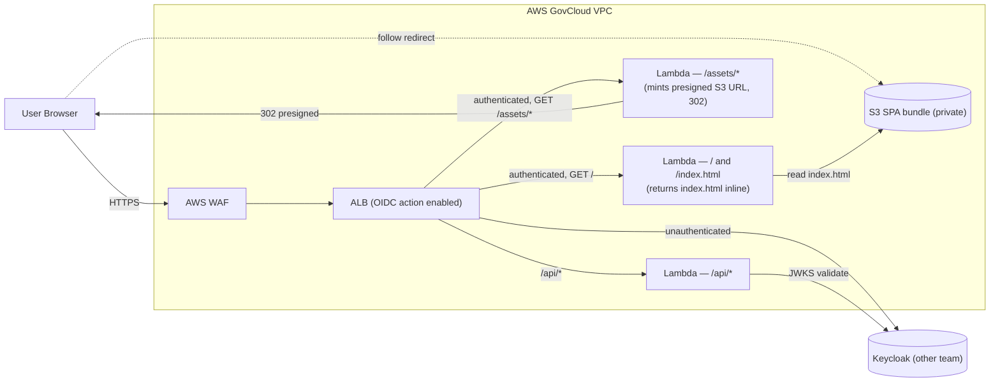
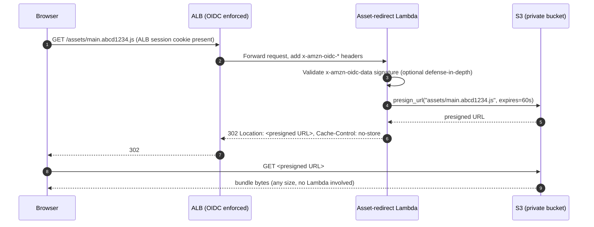

## Summary

Variant of the [baseline ALB + Fargate design](./index.md) that drops both Fargate target groups in favour of **Lambda target groups** behind the same ALB. Pay-per-request, zero idle compute, no container fleet — but constrained by the **1 MB ALB→Lambda response cap** ([AWS ELB docs](https://docs.aws.amazon.com/elasticloadbalancing/latest/application/lambda-functions.html)).

The OIDC enforcement layer **must stay on the ALB**. ALB is the only FedRAMP-High-in-GovCloud service that performs the OIDC `authenticate-oidc` 302 redirect dance at the edge. API Gateway has Cognito and JWT authorizers but no equivalent IdP-redirect listener action, so it cannot replace the ALB as the front-door auth enforcer in this design.

## High-level architecture

Listener rules on the same HTTPS listener:

| Rule | Path | Auth action | Target |
|---|---|---|---|
| 1 | `/api/*` | none (SPA attaches its own bearer JWT) | API Lambda target group |
| 2 | `/assets/*` | `authenticate-oidc` | Asset-redirect Lambda target group |
| 3 | `/oauth2/idpresponse` | (handled by ALB internally) | — |
| 4 | `/logout` | none | Fixed-response listener rule (clears `AWSELBAuthSessionCookie-*`, 302 to Keycloak `end_session_endpoint`) |
| 5 | default `/*` | `authenticate-oidc` | Index Lambda target group |

## What changes from the baseline

| Layer | Baseline (Fargate) | Serverless variant |
|---|---|---|
| Frontend serving | ECS Fargate Nginx, always-on, ≥1 task per AZ | Two Lambdas: tiny `index.html` server + presigned-URL redirector for `/assets/*` |
| Backend API | ECS Fargate API, always-on | Lambda functions (one router or one per route group) |
| Idle cost | Fargate task-hours per AZ + ALB | ALB only; Lambda has $0 idle |
| Cold start | None | 100–800 ms cold start; mitigate with provisioned concurrency on the index Lambda |
| Bundle delivery limit | None | 1 MB ALB→Lambda response cap |
| Deploy unit | Container image + task-definition revision | Lambda alias (faster rollback) |

The four sequence diagrams in the [baseline doc](./index.md) (first load, silent SSO, refresh, logout) are **unchanged**. The SPA still bootstraps `keycloak-js`, still uses Authorization Code + PKCE, still attaches `Authorization: Bearer <jwt>` to API calls. Only the box behind the ALB changed.

## The 1 MB limit and how to live with it

ALB-invoked Lambda is hard-capped at **1 MB request body and 1 MB response body** ([AWS ELB Lambda functions docs](https://docs.aws.amazon.com/elasticloadbalancing/latest/application/lambda-functions.html#lambda-functions)). For binary content the response is base64-encoded, which inflates payloads ~33% before the cap is checked. That is fine for `index.html` and small JSON API responses but breaks for typical SPA vendor bundles, fonts, and source maps.

Two patterns considered:

1. **Lambda redirector + S3 presigned URLs (recommended).** The `/assets/*` listener rule routes to a small Lambda that:
   - confirms the ALB session header (`x-amzn-oidc-data`) is present (defense in depth — ALB only forwards on authenticated rules anyway),
   - mints a 60-second presigned `GetObject` URL for the requested key,
   - returns a `302` to that URL.

   The browser then fetches the bytes directly from S3. The asset bucket stays private (`BlockPublicAcls`, no website hosting); the only way to obtain a presigned URL is to have already authenticated through the ALB. This satisfies the "auth required before any frontend asset is served" requirement — an unauthenticated user has no path to a URL.

2. **Lambda response streaming** — not viable. `awslambda.streamifyResponse` is **only supported through Lambda Function URLs**, not ALB targets ([AWS docs](https://docs.aws.amazon.com/lambda/latest/dg/configuration-response-streaming.html)). Function URLs lack OIDC enforcement, defeating the design goal.

### Asset-redirect Lambda — sequence

## Tradeoffs

**Wins**

- Zero idle compute cost; pay-per-request fits a low-volume internal gov app.
- No container image lifecycle, no task-definition revisions, no Fargate platform-version upgrades, no per-AZ minimum capacity.
- Smaller blast-radius unit of deploy (one Lambda alias) — easier to roll back than a Fargate service.

**Losses / risks**

- Cold starts on the `/index.html` Lambda are user-visible on first hit. Mitigation: provisioned concurrency = 1 (cheap) or warm via a 5-minute EventBridge ping.
- The presigned-URL hop adds one round-trip per asset. HTTP/2 multiplexing on the S3 endpoint absorbs most of it, but Lighthouse TTFB will look worse than serving from Nginx.
- 1 MB cap forces the redirect pattern. Teams that expect to drop a large WASM blob, source-map, or `.tar.gz` through a Lambda will hit walls — document this clearly for app teams.
- Lambda inside a VPC adds ENI attachment time on cold start (~100 ms with [Hyperplane ENIs](https://aws.amazon.com/blogs/compute/announcing-improved-vpc-networking-for-aws-lambda-functions/), occasionally more).
- API Lambdas inherit the 1 MB request cap — file uploads through `/api/*` need a presigned-PUT pattern (browser → S3 directly), not multipart through the API.

## When NOT to pick this variant

- If the API has long-running requests (>29 s ALB idle timeout default, or >15 min Lambda max), keep Fargate.
- If you need WebSocket or server-sent events for the API — ALB→Lambda explicitly does not support WebSocket upgrades ([ELB docs](https://docs.aws.amazon.com/elasticloadbalancing/latest/application/lambda-functions.html)).
- If the agency security posture forbids S3 presigned URLs (some do).
- If the SPA bundle's individual chunks routinely exceed ~700 KB gzipped *and* you cannot introduce code-splitting boundaries.

## Open questions specific to this variant

1. **Provisioned concurrency** on the index Lambda — yes/no, and what concurrency value? Trades a small monthly bill for predictable first-hit latency.
2. **Presigned URL TTL** — 60 s is conservative; some agencies require shorter or forbid presigned URLs entirely.
3. **VPC vs non-VPC Lambda** — the API Lambda needs VPC if it talks to private resources (RDS, internal services, Keycloak over PrivateLink). The two frontend Lambdas only need S3, so they can be non-VPC and skip ENI cold-start cost.
4. **CloudWatch log retention** — Lambda creates per-function log groups; set retention at provisioning time or pay forever.
5. **S3 access path from Lambda** — Gateway VPC Endpoint (free) for S3 if the Lambda runs in VPC; nothing extra otherwise.

## Sources

- [AWS ELB docs — Lambda functions as ALB targets (1 MB request/response cap)](https://docs.aws.amazon.com/elasticloadbalancing/latest/application/lambda-functions.html)
- [AWS Lambda — Configuring response streaming (Function URLs only, not ALB)](https://docs.aws.amazon.com/lambda/latest/dg/configuration-response-streaming.html)
- [AWS Compute Blog — Improved VPC networking for Lambda (Hyperplane ENI)](https://aws.amazon.com/blogs/compute/announcing-improved-vpc-networking-for-aws-lambda-functions/)
- [AWS S3 — Sharing objects with presigned URLs](https://docs.aws.amazon.com/AmazonS3/latest/userguide/ShareObjectPreSignedURL.html)
- [AWS ELB docs — Authenticate users using an Application Load Balancer](https://docs.aws.amazon.com/elasticloadbalancing/latest/application/listener-authenticate-users.html)
- [AWS — FedRAMP services in scope](https://aws.amazon.com/compliance/services-in-scope/FedRAMP/)
