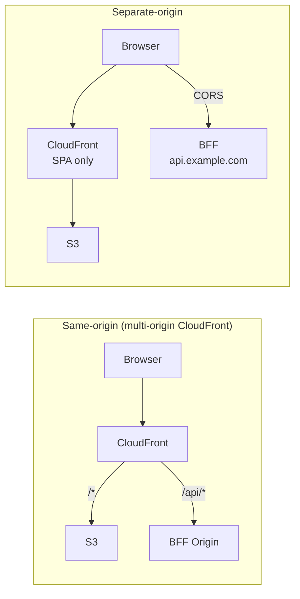
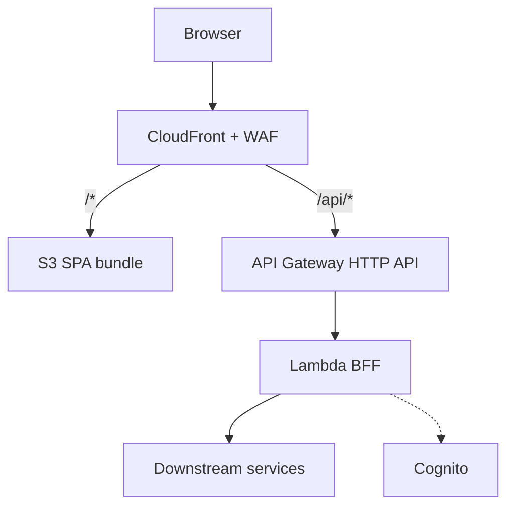
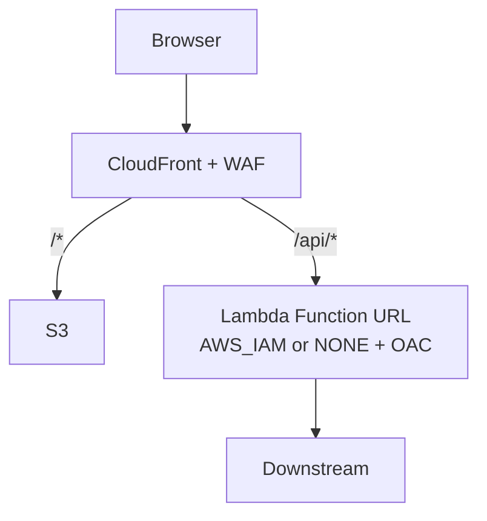
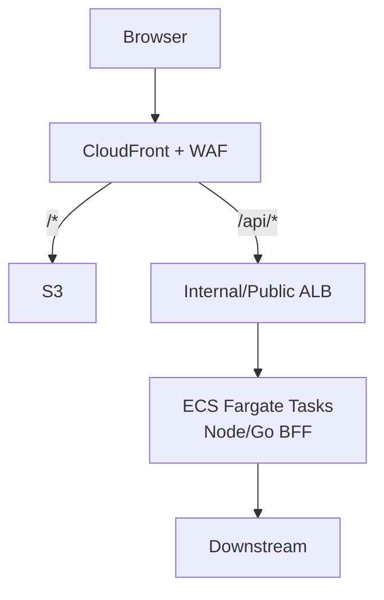
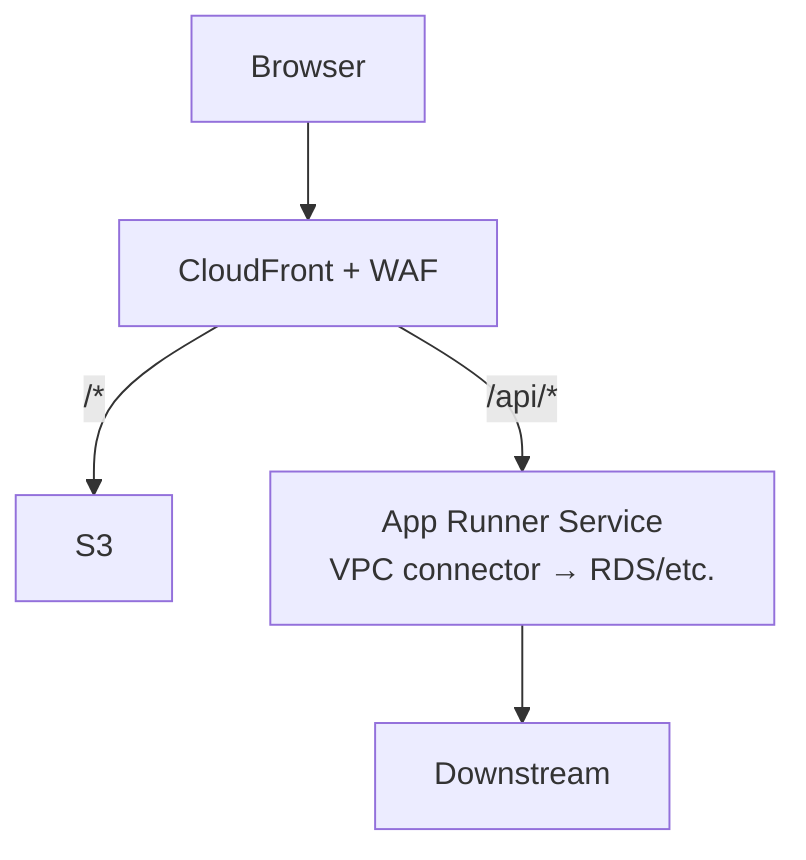
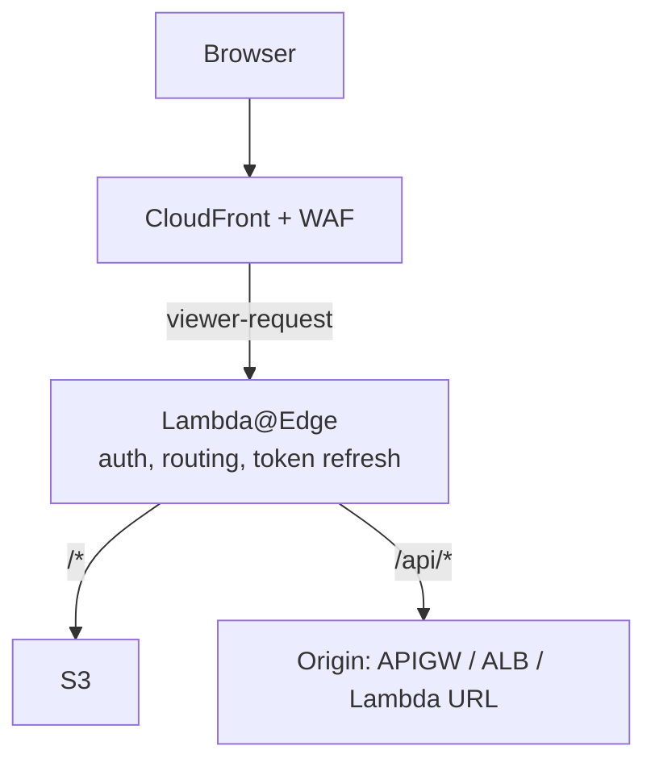
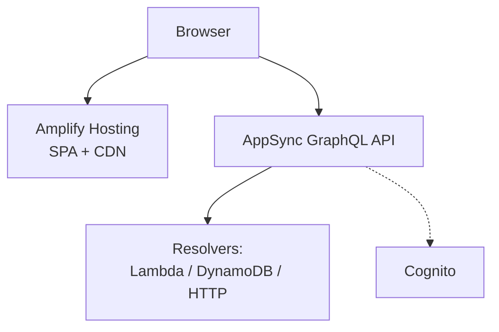
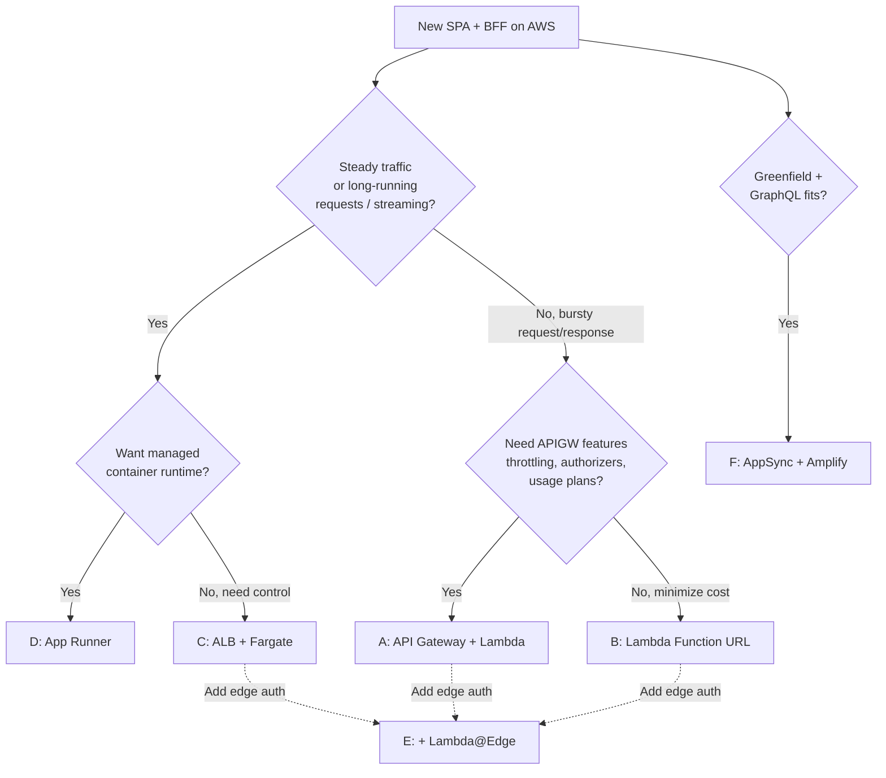

# SPA + BFF Architectures on AWS

A **BFF** sits between the SPA and downstream services. Typical responsibilities:

- Session management (cookie ↔ OAuth/OIDC token exchange, refresh)
- API aggregation / shaping (fan-out, trim payloads for the client)
- Server-side secrets (never ship API keys to the browser)
- Backend adapter (shield SPA from downstream churn, versioning)
- Cross-cutting: authz, rate limiting, caching, request signing (e.g. SigV4 to internal services)

This note compares AWS-native topologies. Compute for the BFF is the primary axis; **routing topology** (same-origin vs separate-origin) is the secondary axis.

## Cross-Cutting Decisions

### Same-origin vs separate-origin

| | Same-origin | Separate-origin |
|---|---|---|
| CORS | None needed | Required; preflights add latency |
| Cookies | `SameSite=Strict` works; no third-party cookie risk | `SameSite=None; Secure` required |
| WAF | One WebACL covers both | Two WebACLs (or one regional + one CloudFront) |
| Caching | Unified CloudFront behaviors | SPA cached; API usually isn't |
| Complexity | One distribution, path-based routing | Simpler per-component, but two surfaces |

**Default: same-origin.** Avoids CORS entirely, lets cookies be `Strict`, and puts WAF/logging/edge auth in one place.

### Session transport

- **Cookie-based** (HttpOnly, Secure, SameSite=Strict): tokens never touch JS. Requires same-origin or `SameSite=None`. Best default.
- **Bearer token in memory**: SPA holds access token in JS, attaches `Authorization` header. Simpler BFF; larger XSS blast radius.

## Architecture Options

### A. CloudFront + S3 + API Gateway + Lambda (same-origin)

**Pros**
- Fully serverless, scale-to-zero, pay-per-request
- HTTP API is cheap (~$1/M vs REST API ~$3.50/M)
- IAM, WAF, throttling, usage plans built in
- Native Cognito/Lambda authorizer support

**Cons**
- Lambda cold starts (100–800ms typical for Node; worse with heavy deps)
- 10MB request / 6MB response payload limits
- 29s hard timeout at API Gateway
- Layered billing (CloudFront + APIGW + Lambda + data transfer)

**Best for**: bursty traffic, small teams, standard request/response BFFs.

### B. CloudFront + S3 + Lambda Function URL (same-origin)

**Pros**
- Cheaper than APIGW (no per-request APIGW charge)
- Simpler IaC, one less hop
- CloudFront OAC can sign requests → Function URL set to `AWS_IAM` to lock out direct access
- Same cold-start profile as A

**Cons**
- No built-in throttling, usage plans, request validation, or Cognito authorizer — roll your own in the Lambda
- Single Lambda per URL; routing lives in code (or fan out with multiple URLs)
- No API-level request/response transforms

**Best for**: when APIGW features aren't needed; cost-sensitive workloads.

### C. CloudFront + S3 + ALB + ECS Fargate

**Pros**
- No cold starts — steady p99 latency
- Long-lived connections (WebSockets, SSE, streaming) trivial
- Full framework freedom (Fastify, NestJS, Hono, Echo, etc.)
- Long-running requests > 29s
- Better for CPU-heavy aggregation/transforms

**Cons**
- Pay for idle capacity (min 1 task); ALB ~$22/mo floor
- You own patching base images, task autoscaling, deploys (blue/green via CodeDeploy)
- More operational surface (task health, ECS events, capacity providers)

**Best for**: steady traffic, streaming, strict latency SLOs, teams comfortable with containers.

### D. CloudFront + S3 + App Runner

**Pros**
- Managed container runtime: no ALB, no ECS cluster, no task defs
- Autoscaling + scale-to-configured-min built in
- HTTPS, deploys from ECR or source repo out of the box

**Cons**
- Less knobs than ECS (no custom load balancer, limited networking)
- Pricier per vCPU-hour than Fargate Spot / well-packed ECS
- Smaller ecosystem, fewer CDK/Terraform patterns, less community tooling
- No scale-to-zero (min 1 instance billed)

**Best for**: container BFF without the ECS/ALB ceremony; small teams that want "Fargate lite."

### E. Lambda@Edge / CloudFront Functions as BFF

**Pros**
- Auth and light shaping at the edge → lower latency for global users
- Offloads work from the regional BFF (or eliminates it for thin use cases)
- Same-origin by construction

**Cons**
- L@E: 128MB–10GB memory, 5s viewer / 30s origin timeout, no VPC, replication lag on deploy (~minutes)
- CloudFront Functions: 2ms CPU budget, no network, no async — only header/URL rewrites
- Debugging is painful (logs per edge region)
- **Not a general-purpose BFF** — use it *alongside* A–D for edge-terminated auth / routing only

**Best for**: session validation, header injection, A/B routing. Matches the Cognito-at-edge pattern you already run.

### F. Amplify Hosting + AppSync (GraphQL BFF)

**Pros**
- GraphQL gives the SPA exactly what it needs → BFF-by-design (no hand-rolled aggregation)
- AppSync handles auth (Cognito/IAM/OIDC), subscriptions, caching, rate limits
- Amplify Hosting wraps CI/CD, PR previews, branch deploys

**Cons**
- Cross-origin by default (Amplify domain ≠ AppSync domain) — CORS/cookies awkward
- GraphQL learning curve; schema governance needed
- Amplify Hosting is opinionated; escape hatches are limited vs raw CloudFront
- Resolver VTL / JS templates are their own thing
- Harder to lift-and-shift off later

**Best for**: greenfield apps where GraphQL fits, teams wanting managed everything.

## Comparison Matrix

| Dimension | A: APIGW+Lambda | B: Lambda URL | C: ALB+Fargate | D: App Runner | E: L@E | F: AppSync |
|---|---|---|---|---|---|---|
| Cold start | Yes | Yes | No | Low | Yes | N/A (managed) |
| Scale-to-zero | ✅ | ✅ | ❌ | ❌ | ✅ | ✅ |
| Idle cost | ~$0 | ~$0 | $20–50/mo | $10–30/mo | ~$0 | ~$0 |
| Timeout ceiling | 29s | 15m | unlimited | 2min | 30s origin | varies |
| Streaming / WebSocket | Limited (APIGW WS) | Response streaming | ✅ Native | ✅ | ❌ | ✅ Subscriptions |
| Framework freedom | Handler-shaped | Handler-shaped | ✅ Any | ✅ Any | Severely limited | Resolvers |
| Built-in authz | Cognito/Lambda authz | DIY | DIY / ALB+OIDC | DIY | DIY | Cognito/IAM/OIDC |
| Ops burden | Low | Lowest | Medium-high | Low-medium | Medium (debug) | Low |
| Vendor lock-in | Medium | Medium | Low | Medium | High | High |
| Global latency | Regional | Regional | Regional | Regional | Edge | Regional (+ edge cache) |

## Decision Guide

## Practical Notes

- **Start with A (APIGW + Lambda) unless you have a reason not to.** It's the cheapest to build, cheapest to run at low scale, and easiest to migrate away from (Lambda handlers port to Fargate via an adapter like `@codegenie/serverless-express` or Hono's adapters).
- **Migrate to C (Fargate) when** cold starts bite p99, you need streaming/WebSockets, or a single request runs > 29s.
- **Add E (Lambda@Edge) on top** for session validation close to the user — this is the pattern already in use for CloudFront + Cognito auth in the current project. Keep the edge layer *thin*; put business logic in the regional BFF.
- **Avoid F (Amplify+AppSync) if** you'll need to escape the managed box later, or if the team doesn't want GraphQL.
- **CloudFront OAC + Lambda Function URL with `AWS_IAM`** is an underused combo — locks the BFF to CloudFront-only access without needing APIGW or a custom authorizer.
- **Observability**: all options emit to CloudWatch natively; X-Ray works across APIGW/Lambda/ALB/Fargate. AppSync has its own logging mode that's CloudWatch-based but schema-aware.
