# SPA + BFF Architectures on AWS

A **BFF** sits between the SPA and downstream services. Typical responsibilities:

- Session management (cookie ↔ OAuth/OIDC token exchange, refresh)
- API aggregation / shaping (fan-out, trim payloads for the client)
- Server-side secrets (never ship API keys to the browser)
- Backend adapter (shield SPA from downstream churn, versioning)
- Cross-cutting: authz, rate limiting, caching, request signing (e.g. SigV4 to internal services)

This note compares AWS-native topologies. Compute for the BFF is the primary axis; **routing topology** (same-origin vs separate-origin) is the secondary axis.

## Cross-Cutting Decisions

### Same-origin vs separate-origin

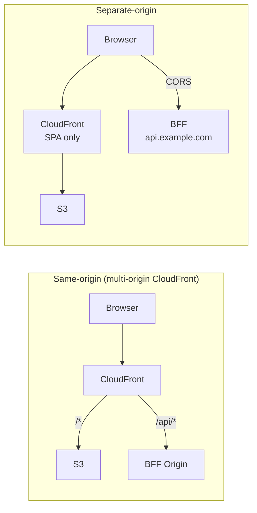

| | Same-origin | Separate-origin |
|---|---|---|
| CORS | None needed | Required; preflights add latency |
| Cookies | `SameSite=Strict` works; no third-party cookie risk | `SameSite=None; Secure` required |
| WAF | One WebACL covers both | Two WebACLs (or one regional + one CloudFront) |
| Caching | Unified CloudFront behaviors | SPA cached; API usually isn't |
| Complexity | One distribution, path-based routing | Simpler per-component, but two surfaces |

**Default: same-origin.** Avoids CORS entirely, lets cookies be `Strict`, and puts WAF/logging/edge auth in one place.

### Session transport

- **Cookie-based** (HttpOnly, Secure, SameSite=Strict): tokens never touch JS. Requires same-origin or `SameSite=None`. Best default.
- **Bearer token in memory**: SPA holds access token in JS, attaches `Authorization` header. Simpler BFF; larger XSS blast radius.

## Architecture Options

### A. CloudFront + S3 + API Gateway + Lambda (same-origin)

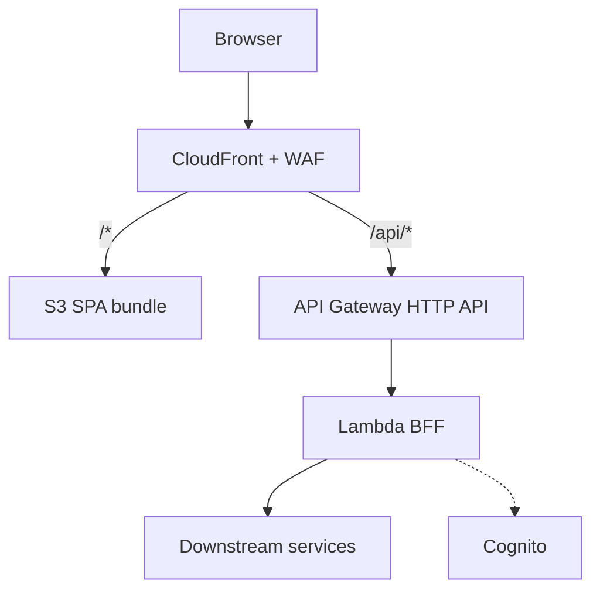

**Pros**
- Fully serverless, scale-to-zero, pay-per-request
- HTTP API is cheap (~$1/M vs REST API ~$3.50/M)
- IAM, WAF, throttling, usage plans built in
- Native Cognito/Lambda authorizer support

**Cons**
- Lambda cold starts (100–800ms typical for Node; worse with heavy deps)
- 10MB request / 6MB response payload limits
- 29s hard timeout at API Gateway
- Layered billing (CloudFront + APIGW + Lambda + data transfer)

**Best for**: bursty traffic, small teams, standard request/response BFFs.

### B. CloudFront + S3 + Lambda Function URL (same-origin)

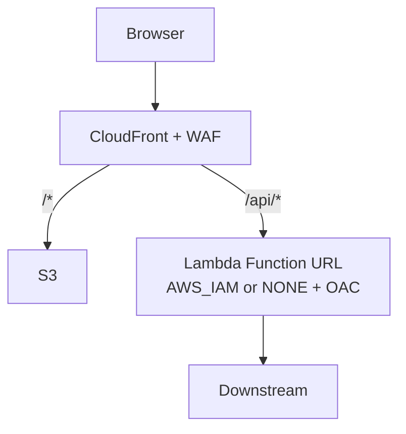

**Pros**
- Cheaper than APIGW (no per-request APIGW charge)
- Simpler IaC, one less hop
- CloudFront OAC can sign requests → Function URL set to `AWS_IAM` to lock out direct access
- Same cold-start profile as A

**Cons**
- No built-in throttling, usage plans, request validation, or Cognito authorizer — roll your own in the Lambda
- Single Lambda per URL; routing lives in code (or fan out with multiple URLs)
- No API-level request/response transforms

**Best for**: when APIGW features aren't needed; cost-sensitive workloads.

### C. CloudFront + S3 + ALB + ECS Fargate

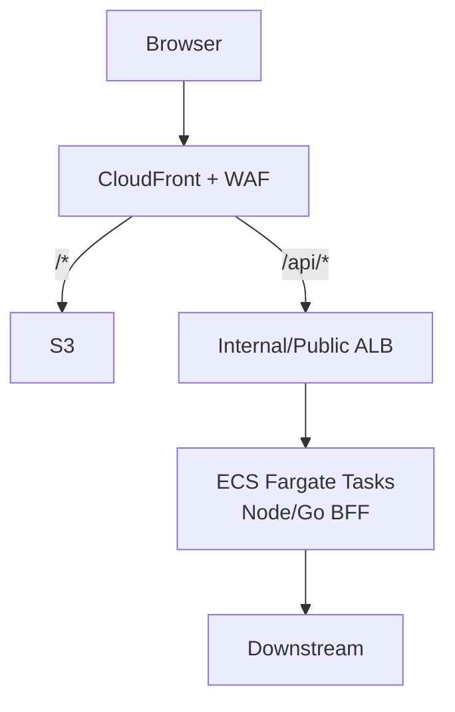

**Pros**
- No cold starts — steady p99 latency
- Long-lived connections (WebSockets, SSE, streaming) trivial
- Full framework freedom (Fastify, NestJS, Hono, Echo, etc.)
- Long-running requests > 29s
- Better for CPU-heavy aggregation/transforms

**Cons**
- Pay for idle capacity (min 1 task); ALB ~$22/mo floor
- You own patching base images, task autoscaling, deploys (blue/green via CodeDeploy)
- More operational surface (task health, ECS events, capacity providers)

**Best for**: steady traffic, streaming, strict latency SLOs, teams comfortable with containers.

### D. CloudFront + S3 + App Runner

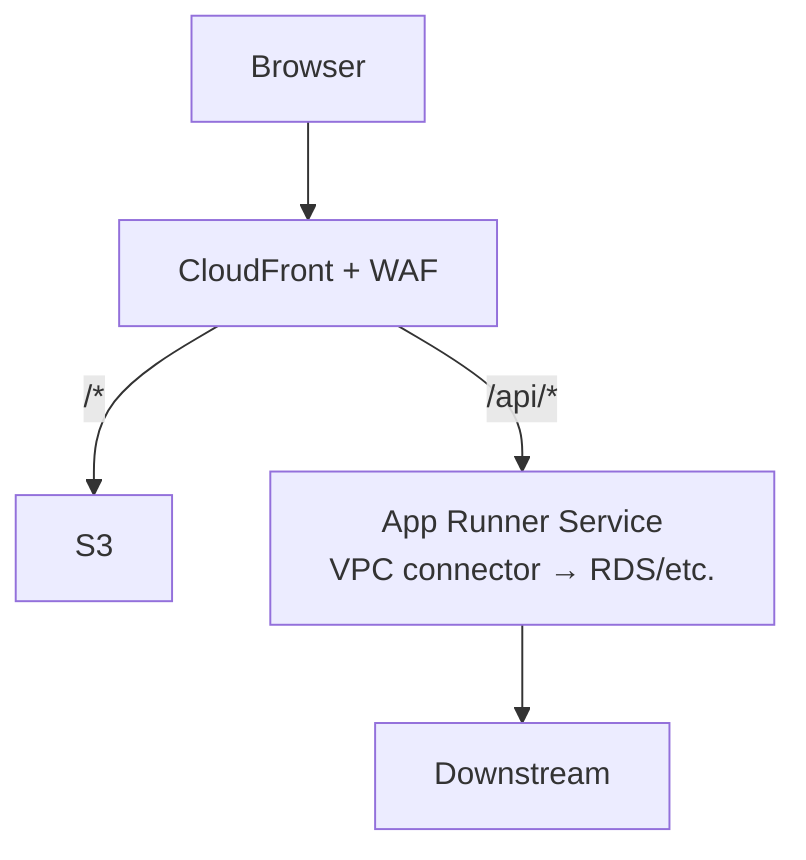

**Pros**
- Managed container runtime: no ALB, no ECS cluster, no task defs
- Autoscaling + scale-to-configured-min built in
- HTTPS, deploys from ECR or source repo out of the box

**Cons**
- Less knobs than ECS (no custom load balancer, limited networking)
- Pricier per vCPU-hour than Fargate Spot / well-packed ECS
- Smaller ecosystem, fewer CDK/Terraform patterns, less community tooling
- No scale-to-zero (min 1 instance billed)

**Best for**: container BFF without the ECS/ALB ceremony; small teams that want "Fargate lite."

### E. Lambda@Edge / CloudFront Functions as BFF

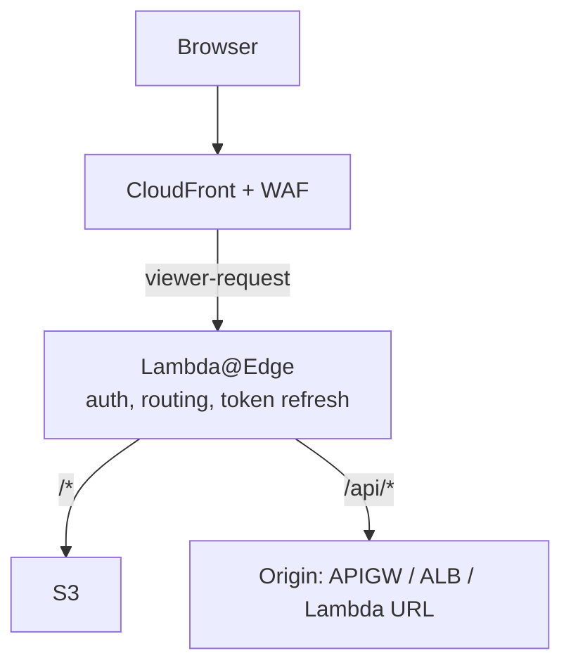

**Pros**
- Auth and light shaping at the edge → lower latency for global users
- Offloads work from the regional BFF (or eliminates it for thin use cases)
- Same-origin by construction

**Cons**
- L@E: 128MB–10GB memory, 5s viewer / 30s origin timeout, no VPC, replication lag on deploy (~minutes)
- CloudFront Functions: 2ms CPU budget, no network, no async — only header/URL rewrites
- Debugging is painful (logs per edge region)
- **Not a general-purpose BFF** — use it *alongside* A–D for edge-terminated auth / routing only

**Best for**: session validation, header injection, A/B routing. Matches the Cognito-at-edge pattern you already run.

### F. Amplify Hosting + AppSync (GraphQL BFF)

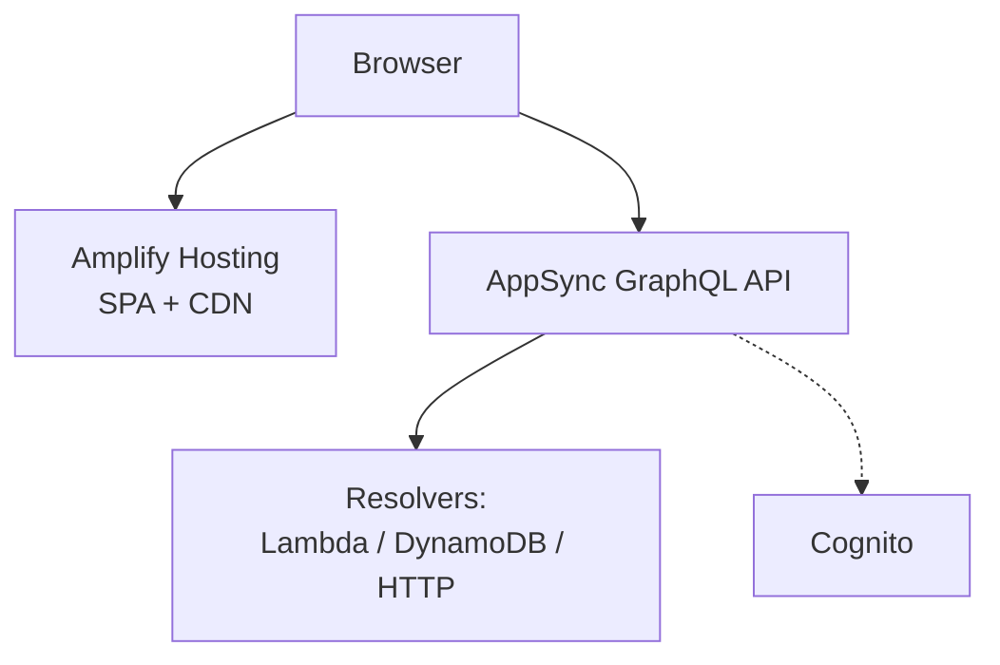

**Pros**
- GraphQL gives the SPA exactly what it needs → BFF-by-design (no hand-rolled aggregation)
- AppSync handles auth (Cognito/IAM/OIDC), subscriptions, caching, rate limits
- Amplify Hosting wraps CI/CD, PR previews, branch deploys

**Cons**
- Cross-origin by default (Amplify domain ≠ AppSync domain) — CORS/cookies awkward
- GraphQL learning curve; schema governance needed
- Amplify Hosting is opinionated; escape hatches are limited vs raw CloudFront
- Resolver VTL / JS templates are their own thing
- Harder to lift-and-shift off later

**Best for**: greenfield apps where GraphQL fits, teams wanting managed everything.

## Comparison Matrix

| Dimension | A: APIGW+Lambda | B: Lambda URL | C: ALB+Fargate | D: App Runner | E: L@E | F: AppSync |
|---|---|---|---|---|---|---|
| Cold start | Yes | Yes | No | Low | Yes | N/A (managed) |
| Scale-to-zero | ✅ | ✅ | ❌ | ❌ | ✅ | ✅ |
| Idle cost | ~$0 | ~$0 | $20–50/mo | $10–30/mo | ~$0 | ~$0 |
| Timeout ceiling | 29s | 15m | unlimited | 2min | 30s origin | varies |
| Streaming / WebSocket | Limited (APIGW WS) | Response streaming | ✅ Native | ✅ | ❌ | ✅ Subscriptions |
| Framework freedom | Handler-shaped | Handler-shaped | ✅ Any | ✅ Any | Severely limited | Resolvers |
| Built-in authz | Cognito/Lambda authz | DIY | DIY / ALB+OIDC | DIY | DIY | Cognito/IAM/OIDC |
| Ops burden | Low | Lowest | Medium-high | Low-medium | Medium (debug) | Low |
| Vendor lock-in | Medium | Medium | Low | Medium | High | High |
| Global latency | Regional | Regional | Regional | Regional | Edge | Regional (+ edge cache) |

## Decision Guide

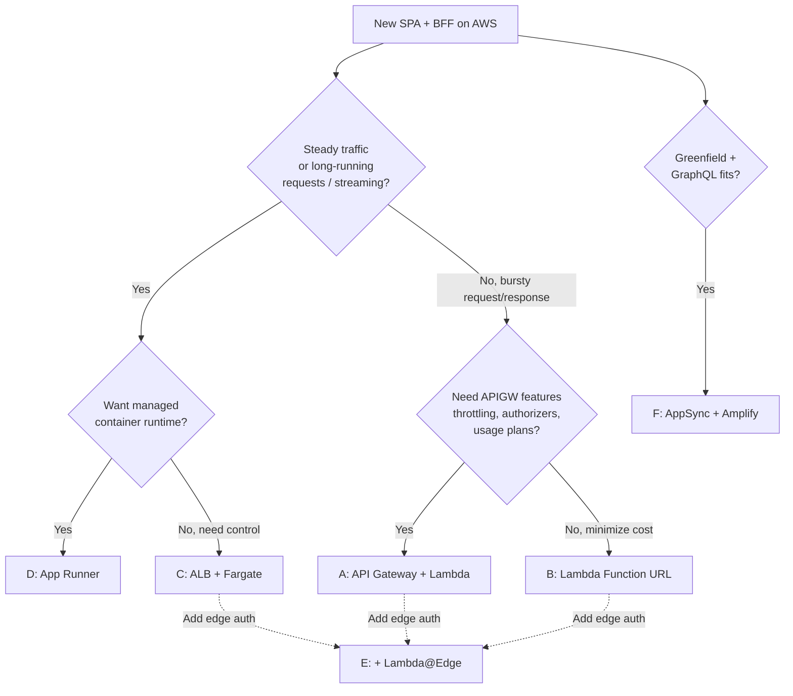

## Practical Notes

- **Start with A (APIGW + Lambda) unless you have a reason not to.** It's the cheapest to build, cheapest to run at low scale, and easiest to migrate away from (Lambda handlers port to Fargate via an adapter like `@codegenie/serverless-express` or Hono's adapters).
- **Migrate to C (Fargate) when** cold starts bite p99, you need streaming/WebSockets, or a single request runs > 29s.
- **Add E (Lambda@Edge) on top** for session validation close to the user — this is the pattern already in use for CloudFront + Cognito auth in the current project. Keep the edge layer *thin*; put business logic in the regional BFF.
- **Avoid F (Amplify+AppSync) if** you'll need to escape the managed box later, or if the team doesn't want GraphQL.
- **CloudFront OAC + Lambda Function URL with `AWS_IAM`** is an underused combo — locks the BFF to CloudFront-only access without needing APIGW or a custom authorizer.
- **Observability**: all options emit to CloudWatch natively; X-Ray works across APIGW/Lambda/ALB/Fargate. AppSync has its own logging mode that's CloudWatch-based but schema-aware.

## Partition & Compliance Considerations

Service availability and accreditation shift the architecture calculus significantly. Verify against the current [AWS Services in Scope](https://aws.amazon.com/compliance/services-in-scope/) page before committing.

### FedRAMP High (Commercial Partition)

Most services used in A–F are FedRAMP High accredited. The exceptions matter:

| Service | FedRAMP High | Impact |
|---|---|---|
| CloudFront | ✅ | — |
| Lambda, Lambda@Edge | ✅ | — |
| CloudFront Functions | ✅ (under CloudFront) | — |
| S3, API Gateway, ALB, ECS, Fargate | ✅ | — |
| Cognito User Pools | ✅ | — |
| AppSync | ✅ | — |
| WAF, KMS, ACM | ✅ | — |
| **App Runner** | ❌ Moderate only | **Rules out D** |
| **Amplify Hosting** | ❌ Moderate only | **Rules out F** (AppSync itself is High — use raw APIGW/CloudFront hosting) |

Additional constraints:

- Use FIPS 140-3 endpoints for AWS API calls (`*.api.aws` FIPS endpoints or service-specific FIPS endpoints)
- Enable FIPS on ALB / CloudFront (TLS 1.2+ with FIPS ciphers)
- Customer-managed KMS keys for S3, Secrets Manager, logs
- VPC Flow Logs, CloudTrail org-trail, Config, GuardDuty, Security Hub all expected for the ATO package
- **Lambda@Edge in a FedRAMP boundary**: edge execution crosses many regions and complicates boundary diagrams. Several programs choose to keep edge compute out of the authorization boundary and put all business logic in a regional BFF. Keep L@E thin (auth/routing) or avoid entirely.

**Recommended for FedRAMP High**: A (APIGW + Lambda) or C (ALB + Fargate). Use E sparingly.

### GovCloud (us-gov-west-1 / us-gov-east-1)

The killer constraint: **CloudFront is not native to the GovCloud partition**, and neither are Lambda@Edge or CloudFront Functions. This eliminates every architecture that centers on CloudFront for same-origin routing.

Service availability snapshot:

| Service | GovCloud | Notes |
|---|---|---|
| S3, Lambda, API Gateway (REST + HTTP), ALB, ECS, Fargate | ✅ | Core building blocks present |
| Cognito (User + Identity Pools) | ✅ | Both regions |
| WAF (Regional) | ✅ | No CloudFront WAF since no CloudFront |
| AppSync | ⚠️ | us-gov-west-1 yes; verify us-gov-east-1 |
| KMS, ACM, Secrets Manager | ✅ | — |
| **CloudFront** | ❌ | Not in partition |
| **Lambda@Edge / CloudFront Functions** | ❌ | Tied to CloudFront |
| **App Runner** | ❌ | — |
| **Amplify Hosting** | ❌ | — |

GovCloud regions are FedRAMP High by baseline (and support DoD IL4/IL5) — compliance alignment comes with the partition rather than per-service gymnastics.

#### GovCloud SPA + BFF pattern

The pragmatic shape: **ALB + Fargate serving both the SPA bundle and the BFF routes**, behind Regional WAF.

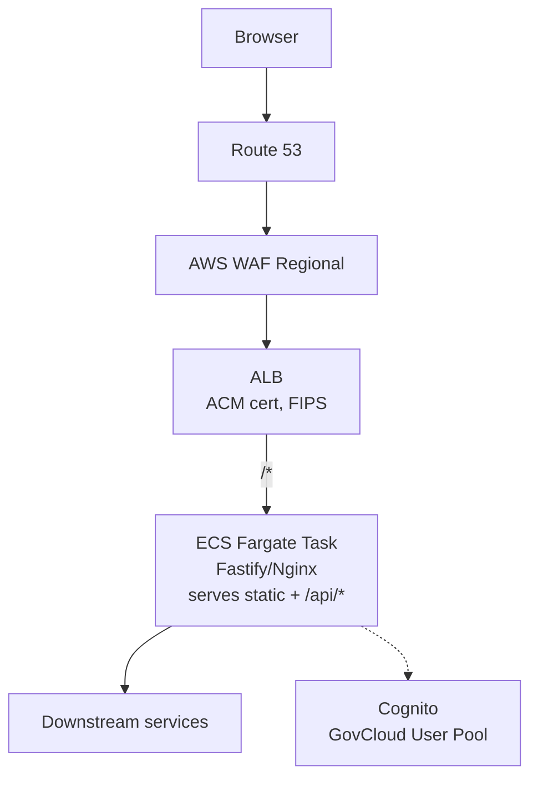

Why this shape:

- **Same-origin by construction** — SPA assets and API share host/port/scheme. No CORS, cookies can be `SameSite=Strict`.
- **One TLS termination** on the ALB with ACM-issued cert; FIPS policy enabled.
- **Regional WAF** attaches to ALB (CloudFront WAF isn't available).
- **Fargate serves `/*` from a static dir** (nginx sidecar or the Node process) and `/api/*` from the BFF handler. Single image, single deploy.
- **No global CDN**. Users see region-RTT for assets. If low-latency-global matters and clearance rules allow, put a commercial CDN in front of a GovCloud-hosted backend (rare; usually blocked by boundary rules).

#### Alternative: S3 + API Gateway (no Fargate)

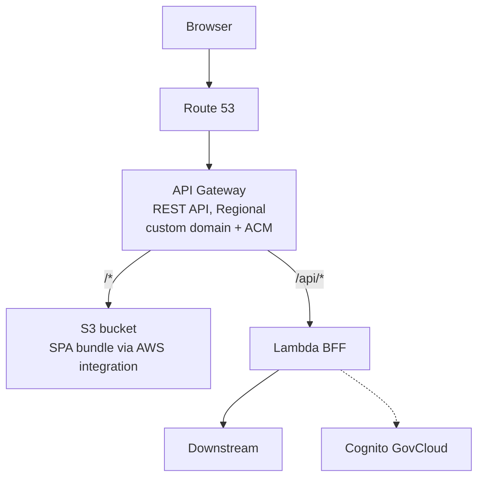

- APIGW proxies SPA fetches to S3 via an AWS service integration. Adds per-asset APIGW cost; no CDN caching.
- Payload limits (10MB response) bite on large bundles — code-split aggressively.
- Works without running always-on Fargate; scale-to-zero friendly.

#### What changes vs commercial

- **Drop architectures B, D, and Amplify-flavored F** (no L@E, no CloudFront, no App Runner, no Amplify).
- **Architecture C becomes the default**, not a fallback.
- **Architecture A** still works but requires the S3+APIGW pattern above (no CloudFront fronting S3).
- **Route 53** in GovCloud is its own hosted zone; commercial and GovCloud DNS are separate.
- **ACM certs** must be issued in the same GovCloud region as the ALB/APIGW.
- **ECR** images live in GovCloud ECR; no cross-partition image pulls.

### Quick Cross-Partition Matrix

| Architecture | Commercial | Commercial + FedRAMP High | GovCloud |
|---|---|---|---|
| A: CF + APIGW + Lambda | ✅ | ✅ | ⚠️ No CF → S3+APIGW variant only |
| B: CF + Lambda Function URL | ✅ | ✅ | ❌ No CloudFront |
| C: CF + ALB + Fargate | ✅ | ✅ | ✅ Drop CF, use ALB + Fargate direct (the default GovCloud pattern) |
| D: CF + App Runner | ✅ | ❌ App Runner not High | ❌ No App Runner |
| E: Lambda@Edge layer | ✅ | ⚠️ Boundary complexity | ❌ No L@E |
| F: Amplify + AppSync | ✅ | ⚠️ Amplify Hosting Moderate only | ❌ No Amplify Hosting |

## Authentication & Authorization

Auth splits into three concerns: **who the user is** (authN), **what they can do** (authZ), and **how the session is carried** to the BFF (transport — covered in Cross-Cutting Decisions).

### Decision axes

- **Workforce vs customer**: employees/contractors (workforce) often need SSO into an existing IdP; customers/citizens get their own user directory or federated consumer IdPs.
- **PIV / CAC required?** Federal civilian agencies require PIV; DoD requires CAC. Forces mTLS or a federation broker that validates smart cards.
- **Internal-only vs public**: internal apps can use IAM Identity Center; public apps need a user-facing OIDC/OAuth provider.
- **Session duration & revocation**: short-lived JWTs are simple but harder to revoke; server-side sessions (BFF-managed cookie → Redis/DynamoDB) revoke instantly.

### AuthN options across partitions

| Option | Commercial | FedRAMP High (Commercial) | GovCloud |
|---|---|---|---|
| **Cognito User Pools** (native directory) | ✅ | ✅ | ✅ both regions |
| **Cognito federated** to SAML/OIDC IdP | ✅ | ✅ | ✅ |
| **IAM Identity Center** (workforce SSO) | ✅ | ✅ | ✅ |
| **Login.gov** (citizen-facing federal) | N/A | ✅ (FedRAMP High) | N/A (consumed from commercial) |
| **ICAM / agency IdP** (PIV/CAC via SAML) | ⚠️ rare | ⚠️ agency-dependent | ✅ standard |
| **Okta / Entra ID / Ping / Auth0** | ✅ | ⚠️ pick FedRAMP-High SKU (Okta Gov, Entra Gov) | ⚠️ commercial-hosted only — boundary concern |
| **Keycloak self-hosted on ECS** | ✅ | ✅ (you own the ATO) | ✅ |
| **ALB mTLS** (PIV/CAC client cert) | ✅ | ✅ | ✅ |
| **APIGW mTLS** (custom domain) | ✅ | ✅ | ✅ |
| **Lambda@Edge Cognito pattern** (edge auth) | ✅ | ⚠️ boundary complexity | ❌ no L@E |

### AuthZ options

| Option | Notes | Partition coverage |
|---|---|---|
| **Cognito groups + ID token claims** | Coarse-grained; easy; stale until token refresh | Everywhere Cognito runs |
| **OAuth scopes / custom JWT claims** | Standard; BFF enforces; claim drift risk | All |
| **Amazon Verified Permissions** (Cedar) | Managed policy engine, fine-grained, audit trail | Commercial ✅ (check FedRAMP status); **not in GovCloud** |
| **OPA / Cedar self-hosted** | Portable, partition-agnostic; you run it | All |
| **Custom in BFF** | Most flexible; hardest to audit | All |
| **IAM policies** (for IAM-authed calls: AppSync IAM, S3 pre-signed, SigV4) | Tight integration with AWS services | All |

### Session transport to the BFF

Reiterating the earlier section in auth terms:

- **BFF-managed session cookie** (HttpOnly, Secure, SameSite=Strict): SPA never holds tokens. BFF does the OIDC code exchange, stores refresh token server-side (encrypted, DynamoDB/ElastiCache), returns an opaque session ID. **Strongly preferred for FedRAMP / GovCloud** — minimizes token exposure, supports instant revocation.
- **Bearer token in JS memory**: SPA holds access token, attaches `Authorization` header. Simpler BFF but bigger XSS blast radius and no server-side revocation.
- **Never** store tokens in `localStorage` or non-HttpOnly cookies.

### Recommended shapes

#### Commercial (customer-facing)

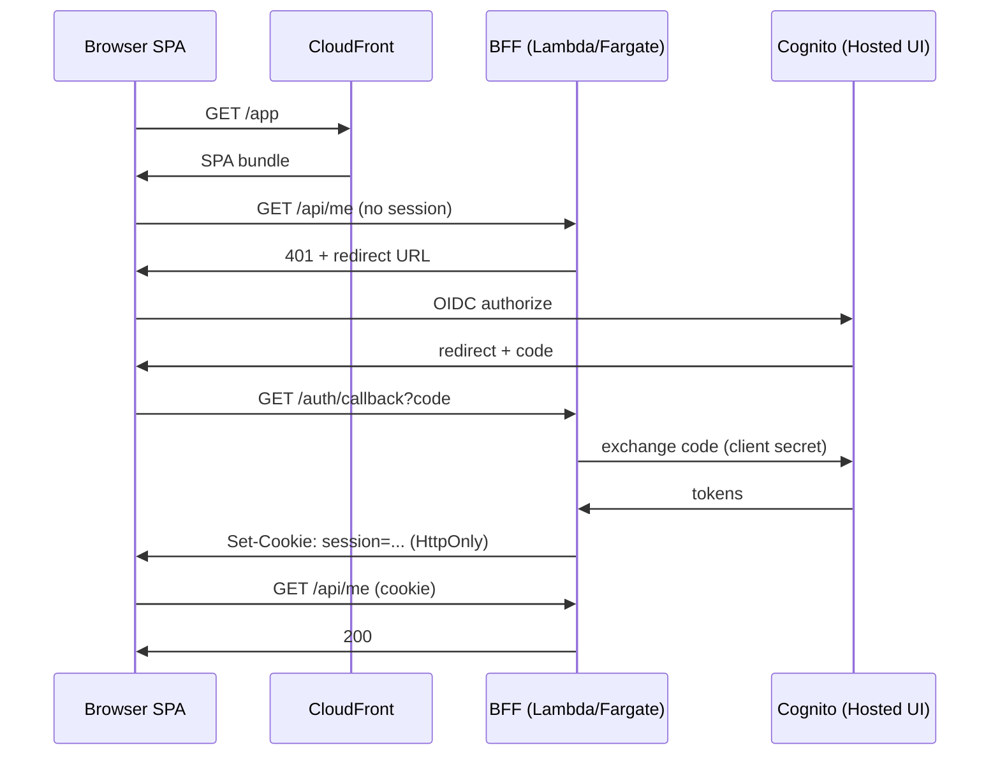

- Cognito User Pool as directory, Hosted UI for login.
- Federate to social IdPs (Google/Apple) or enterprise (SAML) as needed.
- Verified Permissions for fine-grained authZ if the policy graph grows.

#### FedRAMP High (workforce)

- **IAM Identity Center** fronting the app (OIDC app assignment) → Cognito federated identity, OR direct OIDC to ALB/APIGW.
- Enforce hardware MFA (FIDO2) via the upstream IdP.
- Use **ALB `authenticate-oidc`** action if BFF runs on Fargate — ALB handles the OIDC dance, forwards identity headers (`x-amzn-oidc-identity`, `x-amzn-oidc-data` JWT) to the task.
- Keep Lambda@Edge out of the authorization boundary; do auth at the regional BFF.
- Verified Permissions currently FedRAMP Moderate — verify High status before relying on it; otherwise Cedar self-hosted or OPA.

#### GovCloud (PIV/CAC or agency IdP)

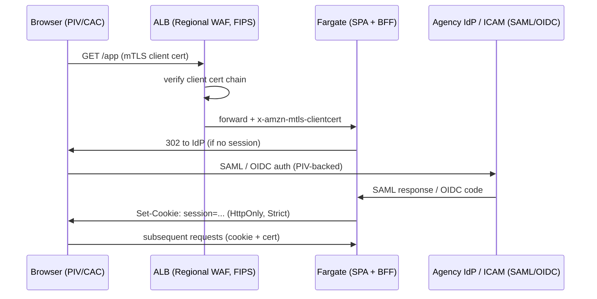

Key points:

- **ALB mTLS** terminates the client cert (PIV/CAC). Two modes: *passthrough* (forward cert to BFF for validation) or *verify* (ALB checks against trust store — uploaded CA bundle in S3). Prefer *verify* + forward for defense in depth.
- **Cognito in GovCloud** works as an identity broker — federate to agency IdP via SAML, map PIV identifiers (EDIPI for DoD, UUID for civilian) to Cognito user attributes.
- **No Lambda@Edge / no CloudFront Functions** — all auth logic lives on ALB or in the Fargate BFF.
- **Login.gov** is not usable from GovCloud-hosted apps directly (Login.gov is a commercial-partition service consuming commercial CloudFront). For citizen-facing GovCloud apps, federation happens through approved FICAM TFS providers or agency IdP.
- **Session store** (refresh tokens, server sessions): DynamoDB or ElastiCache in GovCloud; encrypt with customer-managed KMS keys.

### Partition cheat sheet

| Need | Commercial | FedRAMP High | GovCloud |
|---|---|---|---|
| Citizen/consumer login | Cognito + social / Login.gov | Cognito + Login.gov | Cognito + FICAM broker |
| Workforce SSO | IAM Identity Center | IAM Identity Center + FIDO2 | IAM Identity Center or agency IdP |
| PIV / CAC | Rare | ALB mTLS + SAML broker | ALB mTLS + ICAM / agency IdP |
| Fine-grained authZ | Verified Permissions | Cedar self-hosted (until VP reaches High) | Cedar / OPA self-hosted |
| Edge auth | Lambda@Edge OK | Avoid in boundary | Not available |
| Session transport | BFF cookie preferred | BFF cookie required | BFF cookie required |
