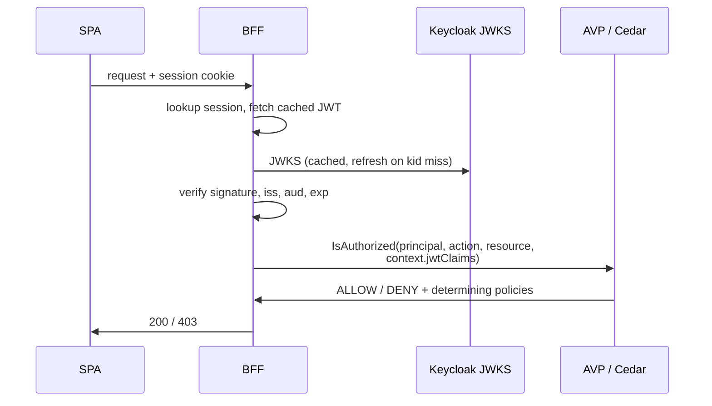
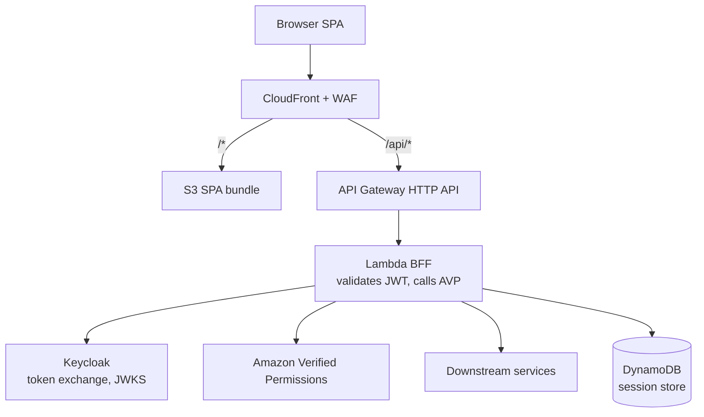
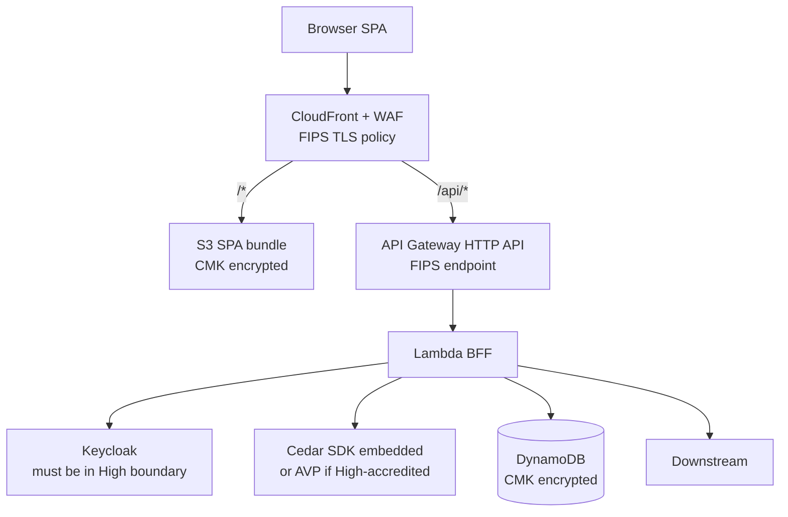
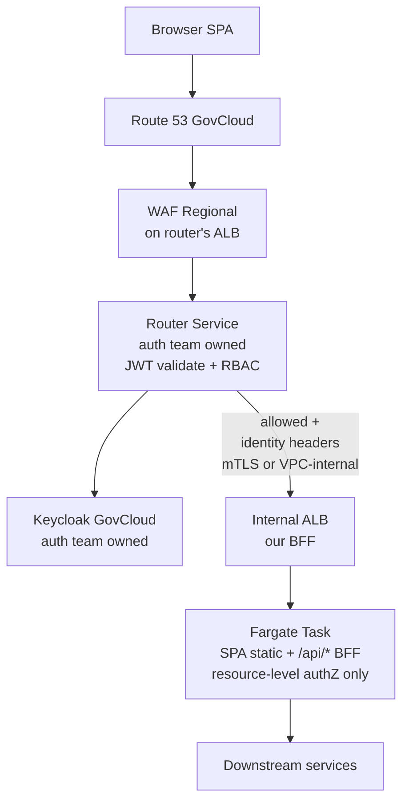
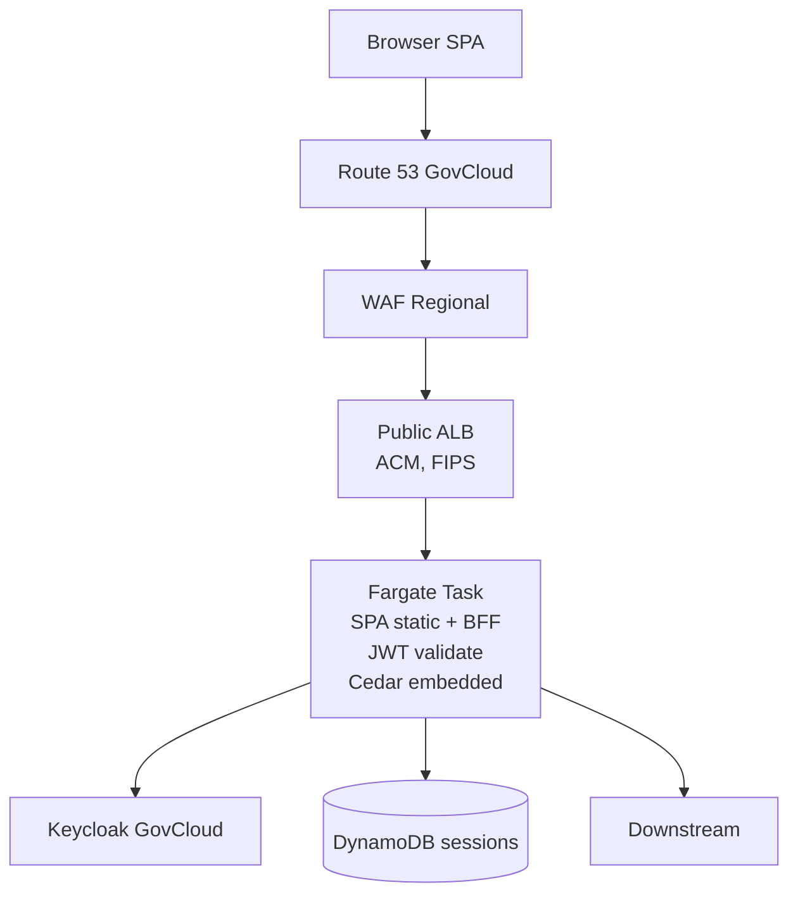

# SPA + BFF with Keycloak AuthN and AVP AuthZ

## Scenario

- **Identity** (authN): Keycloak, operated by a **different team**. OIDC-compliant. We don't control the IdP — we consume it.
- **Authorization** (authZ): **Amazon Verified Permissions (AVP)** with custom Cedar policies. Input is the user's JWT claims plus the resource/action being requested.
- **Scope of this note**: what the *frontend* (SPA + BFF) looks like in commercial, FedRAMP High (commercial partition), and GovCloud.

Assumptions:

- Keycloak exposes standard OIDC endpoints (`/.well-known/openid-configuration`, JWKS, token, authorize).
- The Keycloak team can add custom claims (groups, tenant, attributes) via claim mappers when we coordinate.
- We own SPA bundle, BFF service, and all Cedar policies / schema in AVP.

## What Must Work

1. **Login flow** — redirect to Keycloak, return with an auth code, exchange for tokens.
2. **JWT validation** — signature via Keycloak JWKS, `iss`, `aud`, `exp`, `nbf`.
3. **Session transport** — cookie or bearer from SPA to BFF.
4. **Authorization check** — every protected API call: `avp.IsAuthorized({principal, action, resource, context: {jwtClaims}})` (or self-hosted Cedar equivalent).
5. **Token refresh** — silent refresh when access token expires.
6. **Logout** — local session teardown + Keycloak end-session redirect.

## Cross-Cutting Decisions

### Where does Keycloak live?

This is the single biggest constraint and often out of your control.

| Keycloak location | Commercial app | FedRAMP High app | GovCloud app |
|---|---|---|---|
| Commercial (internet) | ✅ | ⚠️ Keycloak must be in the High boundary too | ❌ Almost always blocked by ATO — cross-partition IdP not acceptable |
| FedRAMP High commercial | ✅ | ✅ | ❌ Partition crossing |
| GovCloud | ✅ (reachable via internet) | ⚠️ boundary review | ✅ |
| Self-hosted by your team | — | — | — (outside this scenario) |

**Confirm with the Keycloak team which partition(s) they operate in before picking a frontend architecture.** If their Keycloak is commercial-only and you need a GovCloud app, escalate; you're likely blocked.

### Token handling: BFF-managed cookie vs SPA bearer

Both work, but with Keycloak as an external IdP and AVP calls on every request, the **BFF-managed session cookie** pattern is strongly preferred:

- SPA never handles tokens → smaller XSS surface
- Refresh token stays server-side (encrypted in DynamoDB/ElastiCache)
- BFF can short-circuit AVP on cache hit (principal + action + resource permission cached for N seconds)
- Cookie + same-origin means no CORS on `/api/*`

The rest of this note assumes BFF-managed sessions.

### AVP in the request path

Cache the JWKS response and AVP decisions aggressively — AVP pricing is per-call, and p99 latency matters on every request.

## Commercial Partition

### Recommended: Architecture A with AVP

CloudFront + S3 + API Gateway HTTP API + Lambda BFF, same-origin. AVP called from the Lambda BFF.

**Why it fits**

- AVP is a regional AWS service reachable from Lambda with standard IAM — simplest integration.
- JWT-claim-based Cedar policies are a natural fit: pass the decoded JWT as `context.jwtClaims` in the `IsAuthorized` call, reference `context.jwtClaims.groups` etc. in Cedar.
- Cognito is absent from this scenario (Keycloak replaces it) — no APIGW Cognito authorizer. Use a **Lambda authorizer** at APIGW OR validate in the BFF handler directly.

**Implementation notes**

- Lambda authorizer vs in-handler validation: authorizer caches per identity for up to 1 hour (`authorizerResultTtlInSeconds`), saving downstream Lambda invocations on anonymous rate-limit rejections. In-handler is simpler and gives per-request AVP context.
- Cache JWKS with `Cache-Control: max-age=3600` semantics; invalidate on `kid` miss and retry once.
- AVP policy store — one per environment. Schema references Keycloak claim names (`groups`, `tenant_id`, etc.).
- Session store: DynamoDB with TTL, encrypt with customer-managed KMS key.

### Alternative: Architecture C (Fargate) with AVP

Pick when cold starts are unacceptable or AVP call volume is high enough that BFF-level decision caching matters (in-process LRU beats DynamoDB-backed cache).

Same shape as commercial Architecture C from `index.md`, but the BFF container makes AVP calls via the AWS SDK.

## FedRAMP High (Commercial Partition)

### The AVP accreditation catch

**AVP is currently FedRAMP Moderate, not High.** Verify against the [AWS Services in Scope](https://aws.amazon.com/compliance/services-in-scope/) page before committing. If AVP has not reached High by the time you need an ATO:

- **Option 1**: Run Cedar self-hosted. The Cedar policy engine is open source (`@cedar-policy/cedar-wasm`, `cedar-policy` Rust crate, Java SDK). Embed in the Lambda / Fargate BFF. Loses managed policy store, audit trail, and AWS console tooling — gains partition freedom.
- **Option 2**: Wait for AVP to reach High. Ship with a Cedar self-hosted implementation that you can swap to AVP later — the policy language is identical, only the enforcement point changes.
- **Option 3**: Get an agency-specific exception if AVP is listed as "in process."

### Architecture

Same shape as commercial Architecture A or C, with two deltas:

**FedRAMP-specific constraints**

- Keycloak must be inside the authorization boundary. If operated by another team, their Keycloak needs its own High accreditation or an inherited ATO.
- Use FIPS 140-3 endpoints for all AWS SDK calls (`*.us-east-1.amazonaws.com` → FIPS variants).
- TLS 1.2+ with FIPS ciphers on CloudFront; enable FIPS on ALB if using C.
- Customer-managed KMS keys for S3, DynamoDB, Lambda env vars, Secrets Manager.
- **Avoid Lambda@Edge** for session validation — keep auth at the regional BFF to simplify boundary diagrams.
- CloudTrail org-trail, VPC Flow Logs, Config, GuardDuty, Security Hub expected for the ATO.

### Why not D or F

- **D (App Runner)**: not FedRAMP High. Rules out.
- **F (AppSync + Amplify)**: Amplify Hosting not High; AppSync itself is High but then you need raw CloudFront hosting anyway — which collapses back to A or C.

## GovCloud (us-gov-west-1 / us-gov-east-1)

### Hard constraints

- **No AVP in GovCloud.** Authorization must use Cedar self-hosted or delegated to an external service.
- **No CloudFront in partition.** Drop CloudFront-centric architectures.
- **No Lambda@Edge / CloudFront Functions.**
- **Keycloak must be in GovCloud** (run by the other team on GovCloud) — or you're almost certainly blocked by boundary rules.
- **An upstream "router service" built by the auth / backend team handles authN and RBAC in GovCloud.** Every request to our BFF transits the router, which validates the Keycloak JWT and enforces role-based access before traffic reaches us. This changes the frontend architecture significantly — see below.

### Router service: what changes

With a centralized router owning authN + RBAC:

- **Our BFF no longer validates JWTs** — it trusts the identity headers the router injects (`x-user-id`, `x-user-roles`, `x-user-tenant`, etc.).
- **Our BFF no longer does RBAC** — role checks already happened upstream. Denies never reach us.
- **Our BFF no longer calls Keycloak** — no JWKS fetch, no token exchange, no session cookie issuance (likely — confirm with the router team).
- **Our BFF still owns resource-level authZ** — "user X owns document Y", tenant scoping, record-level filters. This is fine-grained stuff the router's RBAC rules can't express.
- **Our BFF must not be directly reachable** from the internet. Only the router is public-facing; our BFF sits behind it (private ALB / Cloud Map / service mesh / VPC-only networking).
- **Trust establishment** between router and BFF: mTLS, signed headers, or VPC-internal-only are the normal choices. Don't take identity headers on faith from an untrusted network.

### Recommended: Router-fronted ALB + Fargate

**What our team owns**

- Internal ALB + Fargate task (or Lambda behind internal APIGW — Fargate still preferred for same-origin SPA delivery).
- SPA bundle served as static `/*`; business APIs under `/api/*`.
- Resource-level authorization logic (ownership, tenant scoping, record filters) driven by identity headers.
- Whatever session continuity our SPA needs beyond what the router provides (usually minimal — the router typically issues the session cookie).

**What changes vs the non-router pattern**

| Concern | Non-router GovCloud | Router-fronted GovCloud |
|---|---|---|
| JWT validation | Our BFF | Router |
| JWKS / Keycloak client | Our BFF | Router |
| RBAC | Cedar embedded in our BFF | Router |
| Session cookie | Our BFF | Router (typically) |
| Resource authZ | Our BFF (Cedar) | Our BFF (still ours) |
| Public ingress | ALB we own | Router's ALB |
| Our ingress | Public ALB | Internal (behind router) |
| Cedar policy store | We operate | Not needed (or only for resource authZ) |

**Router integration questions** (resolve with the auth team):

1. **How does the router reach our BFF?** VPC-internal only (PrivateLink / shared VPC / VPC peering), or public + mTLS? Private-only is stronger.
2. **What identity headers does it inject?** Exact header names, shape (raw JWT vs parsed claims), and signing method.
3. **Can the router be spoofed?** If any path reaches our BFF without transiting the router, identity headers can be forged. Lock ingress down; verify with `scout` / network reachability analyzer.
4. **Who issues the session cookie?** Router or us. Affects how our SPA handles login/logout.
5. **What happens on router outage?** Fail-closed (all traffic blocked) or fail-open to a backup path? Plan for both.
6. **Resource-level authZ inputs** — which identity attributes the router forwards that our Cedar / custom checks can reference.
7. **Request tracing** — does the router propagate trace IDs? Our CloudWatch / X-Ray setup depends on it.

### Alternative: No router (fallback if plans change)

If the router service isn't available or we're building ahead of it, fall back to the BFF-owned pattern from the original draft:

Same constraints as before — Cedar self-hosted for RBAC, BFF handles JWT/session. Use this only if the router path is delayed or scoped out.

### GovCloud-specific constraints (both patterns)

- Route 53, ACM, ECR, Secrets Manager all GovCloud-regional — no cross-partition artifacts.
- No CloudFront → no global edge cache; SPA served from region.
- Regional WAF only.
- Customer-managed KMS keys for DynamoDB, S3, Secrets, logs.
- FIPS TLS policy on every ALB (ours and the router's).

## Summary

| | Commercial | FedRAMP High | GovCloud (router-fronted) |
|---|---|---|---|
| SPA hosting | S3 behind CloudFront | S3 behind CloudFront (FIPS) | Fargate static behind router |
| BFF compute | Lambda (A) or Fargate (C) | Lambda or Fargate | Fargate (private, behind router) |
| Ingress | CloudFront | CloudFront | Router's ALB (not ours) |
| Keycloak client | Our BFF | Our BFF | **Router** (not our concern) |
| JWT validation | Our BFF | Our BFF | **Router** (trust identity headers) |
| RBAC | **AVP** | AVP if High; else Cedar self-hosted | **Router** (not our concern) |
| Resource-level authZ | Ours | Ours | Ours (Cedar or custom) |
| Session cookie | Our BFF | Our BFF | Router (typically) |
| TLS | Standard | FIPS | FIPS + mTLS to router |
| Biggest risk | AVP latency on hot paths | AVP accreditation status | Router contract drift / spoofable ingress |

## Open Questions to Resolve Early

1. Which partition is the Keycloak team's deployment in? Get this answer before designing further.
2. Can the Keycloak team add the custom claims our policies need (groups, tenant_id, clearance, etc.)? In the GovCloud router model, this question moves to the router team — they're the ones reading claims.
3. Current AVP FedRAMP status — Moderate or High by the time we need ATO?
4. Policy store governance for commercial/FedRAMP — who owns Cedar policies, how are they reviewed, where do they live?
5. **Router contract (GovCloud only)**: header shape, trust mechanism (mTLS / VPC-internal), failure mode, session ownership, identity attribute set forwarded for resource-level authZ.
6. **Router availability SLO (GovCloud)**: our app inherits it. What's the fallback plan if the router is down?
