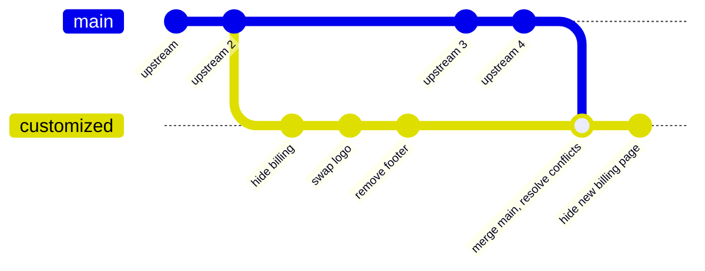
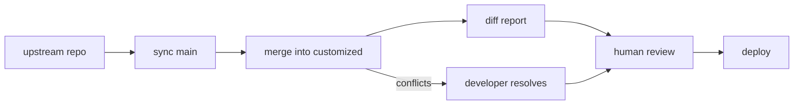

# Upstream Fork Strategy: Modifying Another Team's Frontend Codebase

## Problem

We need to modify a frontend Vite codebase owned by a separate team and redeploy it. We cannot make modifications to the actual source code repository itself. Changes range from small tweaks (swap an API URL) to large replacements (entire flows/pages).

## Recommended Approach: Fork + Automated Upstream Sync

Fork the upstream repo, maintain a `customized` branch with our changes, and automate upstream syncing with a human review gate.

### Why Not Patches?

Patches (subtree + `.patch` files, quilt-style) are used by Linux distros, Android, and browser forks. They make sense when you have:

- 500+ independent modifications
- Multiple base versions maintained simultaneously
- Multiple consumers picking different subsets of patches
- Patches submitted back upstream
- Changes that must be independently reorderable/droppable

We have one team, one set of changes, one upstream version, one deployment. A branch is the right abstraction. If that ever changes, [migration is trivial](#switching-between-approaches).

### Why Not Vite Plugin Overrides?

Using `resolve.alias` to redirect imports to replacement modules works for swapping entire components, but:

- **Entire file replacement only** — changing 2 lines in a 500-line component means duplicating 498 lines that silently drift from upstream
- Tightly coupled to upstream's import structure
- No good story for small, surgical changes (strings, config values, feature flags)

The fork approach gives you line-level precision for small changes AND full file replacement for large ones, all with normal git tooling.

---

## Branch Structure



Two branches:

- **`main`** — pristine mirror of upstream. Never commit your changes here.
- **`customized`** — branched from `main`, contains only your modifications. This is what you deploy.

---

## Initial Setup

```bash
# 1. Fork their repo via GitHub UI or CLI
gh repo fork <upstream-org>/<repo-name> --clone

# 2. Add upstream remote
git remote add upstream https://github.com/<upstream-org>/<repo-name>.git

# 3. Create your customized branch
git checkout -b customized main

# 4. Make your modifications, one logical change per commit
git commit -m "hide billing page from navigation"
git commit -m "replace onboarding flow with custom implementation"
git commit -m "swap API base URL to our backend"

# 5. Push
git push origin customized
```

---

## Day-to-Day Workflows

### Making a new modification

```bash
git checkout customized
# edit files
git commit -m "remove footer links to upstream marketing site"
git push origin customized
```

For larger changes, branch off `customized`, open a PR back into `customized` for team review.

### Seeing exactly what we've changed vs upstream

```bash
git diff main...customized
```

This always shows your clean delta — nothing else.

### Seeing a specific change in isolation

```bash
# Each commit is a discrete, reviewable unit
git log main...customized --oneline
git show <commit-hash>
```

### Dropping a change

```bash
git revert <commit-hash>
```

---

## Upstream Sync Process

### What happens



### Automated sync (CI runs on schedule)

```bash
# Sync main with upstream (no conflicts possible — it's a mirror)
git fetch upstream
git checkout main
git merge upstream/main
git push origin main

# Attempt merge into customized
git checkout customized
git merge main
```

The merge into `customized` either succeeds cleanly or produces conflicts for a developer to resolve.

### Review gate with watchlist

Not all upstream changes matter to us. A watchlist focuses human attention on changes that could break our intent (e.g., upstream adds a new billing page we haven't patched out).

#### Watch configuration

```yaml
# .upstream-review/watch.yaml
watch:
  - pattern: "src/pages/billing/**"
    reason: "We hide billing — new pages need to be removed"
  - pattern: "src/components/nav/**"
    reason: "We modify nav to remove billing links"
  - pattern: "src/routes.*"
    reason: "New routes may expose features we've removed"
  - pattern: "package.json"
    reason: "Dependency changes may affect our build"
```

#### CI behavior on upstream sync

| Scenario | CI action |
|---|---|
| No conflicts, no watched files changed | Opens PR, minimal review needed |
| No conflicts, watched files changed | Opens PR, flags for careful review |
| Conflicts | Opens draft PR, assigns developer to resolve |

#### What the review PR looks like

> **Upstream sync: abc123..def456 (12 commits)**
>
> **Requires review (matched watch patterns):**
> - `src/pages/billing/UpgradePage.tsx` — NEW FILE — *"We hide billing"*
> - `src/routes.ts` — MODIFIED (added `/billing/upgrade` route) — *"New routes may expose features we've removed"*
>
> **Patches applied cleanly: all commits merged**
>
> **Unmatched changes (low risk):** 47 files in `src/components/dashboard/`, `src/utils/`, ...

A developer reviews, makes additional modifications if needed (e.g., hide the new billing page), and merges.

---

## Commit Hygiene

The single most important practice: **one logical change per commit, with a clear message**.

Good:
```
hide billing page from navigation
replace onboarding flow with custom implementation
swap API base URL to our backend
remove footer links to upstream marketing site
add our analytics script to index.html
replace entire settings page with custom version
```

Bad:
```
updates
fix stuff
WIP
more changes
```

This matters because:

- Each commit is independently revertable
- `git log main...customized --oneline` gives an instant inventory of all your modifications
- If you ever need to migrate to a patch-based workflow, `git format-patch` produces clean patches from clean commits

---

## Switching Between Approaches

Neither approach is a one-way door.

### Branch to Patches

```bash
git format-patch main...customized
# Produces:
#   0001-hide-billing-from-nav.patch
#   0002-replace-onboarding-flow.patch
#   0003-swap-api-base-url.patch
```

Your commits are already a patch series. `git format-patch` extracts them.

### Patches to Branch

```bash
git checkout -b customized main
git am patches/*.patch
```

Apply in order, now you have a branch.

### When to consider switching to patches

- Merge conflicts become a weekly chore (~50+ modifications)
- You need to toggle changes on/off per environment
- Multiple deployments need different subsets of your changes
- Your changes conflict with each other during upstream merges and you can't untangle them

---

## GitHub Actions: Automated Upstream Sync

```yaml
# .github/workflows/upstream-sync.yaml
name: Upstream Sync

on:
  schedule:
    - cron: '0 9 * * 1-5' # Weekdays at 9 AM
  workflow_dispatch: # Manual trigger

jobs:
  sync:
    runs-on: ubuntu-latest
    steps:
      - uses: actions/checkout@v4
        with:
          fetch-depth: 0
          token: ${{ secrets.GITHUB_TOKEN }}

      - name: Configure git
        run: |
          git config user.name "github-actions[bot]"
          git config user.email "github-actions[bot]@users.noreply.github.com"

      - name: Fetch upstream
        run: |
          git remote add upstream https://github.com/<upstream-org>/<repo>.git
          git fetch upstream

      - name: Sync main
        run: |
          git checkout main
          git merge upstream/main
          git push origin main

      - name: Attempt merge into customized
        id: merge
        run: |
          git checkout customized
          git merge main --no-commit --no-ff || true

          if git diff --cached --quiet; then
            echo "status=no-changes" >> "$GITHUB_OUTPUT"
          elif git diff --name-only --diff-filter=U | head -1 | grep -q .; then
            git merge --abort
            echo "status=conflicts" >> "$GITHUB_OUTPUT"
          else
            git merge --abort
            echo "status=clean" >> "$GITHUB_OUTPUT"
          fi

      - name: Check watched files
        if: steps.merge.outputs.status == 'clean'
        id: watch
        run: |
          CHANGED=$(git diff main...upstream/main --name-only)
          WATCHED=""

          while IFS= read -r pattern; do
            MATCHES=$(echo "$CHANGED" | grep -E "$pattern" || true)
            if [ -n "$MATCHES" ]; then
              WATCHED="$WATCHED$MATCHES"$'\n'
            fi
          done < <(yq '.watch[].pattern' .upstream-review/watch.yaml)

          if [ -n "$WATCHED" ]; then
            echo "watched_changes<<EOF" >> "$GITHUB_OUTPUT"
            echo "$WATCHED" >> "$GITHUB_OUTPUT"
            echo "EOF" >> "$GITHUB_OUTPUT"
            echo "has_watched=true" >> "$GITHUB_OUTPUT"
          else
            echo "has_watched=false" >> "$GITHUB_OUTPUT"
          fi

      - name: Create sync branch and PR
        if: steps.merge.outputs.status != 'no-changes'
        env:
          GH_TOKEN: ${{ secrets.GITHUB_TOKEN }}
          MERGE_STATUS: ${{ steps.merge.outputs.status }}
          HAS_WATCHED: ${{ steps.watch.outputs.has_watched }}
          WATCHED_CHANGES: ${{ steps.watch.outputs.watched_changes }}
        run: |
          BRANCH="upstream-sync/$(date +%Y-%m-%d)"
          git checkout customized
          git checkout -b "$BRANCH"
          git merge main || true
          git push origin "$BRANCH"

          if [ "$MERGE_STATUS" = "conflicts" ]; then
            TITLE="[CONFLICTS] Upstream sync $(date +%Y-%m-%d)"
            BODY="## Merge conflicts — manual resolution required"
            DRAFT="--draft"
          elif [ "$HAS_WATCHED" = "true" ]; then
            TITLE="[REVIEW] Upstream sync $(date +%Y-%m-%d)"
            BODY="## Watched files changed — review required

          **Changed watched files:**
          \`\`\`
          $WATCHED_CHANGES
          \`\`\`

          Check if new modifications are needed (e.g., new billing pages to hide)."
            DRAFT=""
          else
            TITLE="Upstream sync $(date +%Y-%m-%d)"
            BODY="## Clean sync — no watched files affected

          Low-risk merge. Upstream changes don't touch areas we've modified."
            DRAFT=""
          fi

          gh pr create \
            --base customized \
            --head "$BRANCH" \
            --title "$TITLE" \
            --body "$BODY" \
            $DRAFT
```

---

## Summary

| What | How |
|---|---|
| Our changes live on | `customized` branch |
| Upstream is tracked on | `main` branch (pristine mirror) |
| See our full delta | `git diff main...customized` |
| Upstream sync | CI merges `main` into `customized`, opens PR |
| Review gate | Watchlist flags changes in sensitive areas |
| Deploy from | `customized` branch |
| Drop a change | `git revert <commit>` |
| Escape hatch | `git format-patch` to migrate to patch-based workflow |
